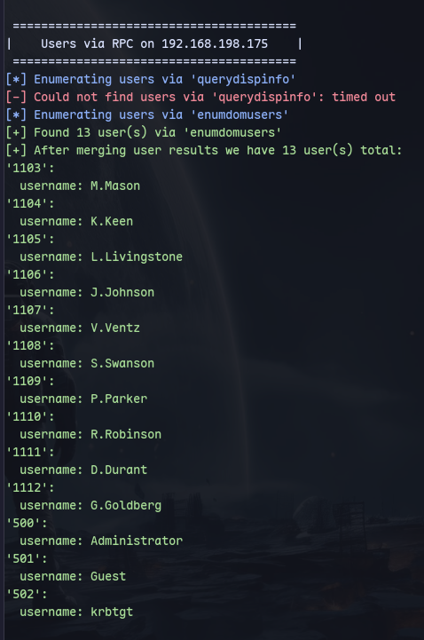
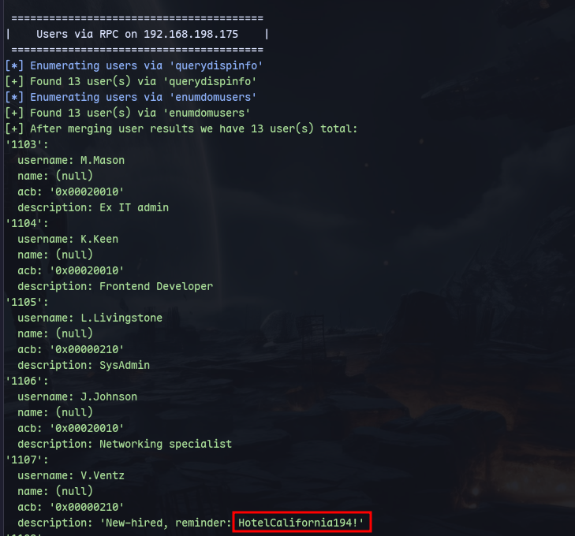

# Host:
```
192.168.198.175
```

# Nmap
```
PORT      STATE SERVICE       REASON          VERSION
53/tcp    open  domain        syn-ack ttl 125 Simple DNS Plus
88/tcp    open  kerberos-sec  syn-ack ttl 125 Microsoft Windows Kerberos (server time: 2024-08-18 13:12:39Z)
135/tcp   open  msrpc         syn-ack ttl 125 Microsoft Windows RPC
139/tcp   open  netbios-ssn   syn-ack ttl 125 Microsoft Windows netbios-ssn
389/tcp   open  ldap          syn-ack ttl 125 Microsoft Windows Active Directory LDAP (Domain: heist.offsec0., Site: Default-First-Site-Name)
445/tcp   open  microsoft-ds? syn-ack ttl 125
464/tcp   open  kpasswd5?     syn-ack ttl 125
593/tcp   open  ncacn_http    syn-ack ttl 125 Microsoft Windows RPC over HTTP 1.0
636/tcp   open  tcpwrapped    syn-ack ttl 125
3268/tcp  open  ldap          syn-ack ttl 125 Microsoft Windows Active Directory LDAP (Domain: heist.offsec0., Site: Default-First-Site-Name)
3269/tcp  open  tcpwrapped    syn-ack ttl 125
3389/tcp  open  ms-wbt-server syn-ack ttl 125 Microsoft Terminal Services
| rdp-ntlm-info: 
|   Target_Name: HEIST
|   NetBIOS_Domain_Name: HEIST
|   NetBIOS_Computer_Name: DC01
|   DNS_Domain_Name: heist.offsec
|   DNS_Computer_Name: DC01.heist.offsec
|   DNS_Tree_Name: heist.offsec
|   Product_Version: 10.0.17763
|_  System_Time: 2024-08-18T13:13:45+00:00
| ssl-cert: Subject: commonName=DC01.heist.offsec
| Issuer: commonName=DC01.heist.offsec
| Public Key type: rsa
| Public Key bits: 2048
| Signature Algorithm: sha256WithRSAEncryption
| Not valid before: 2024-08-01T02:11:20
| Not valid after:  2025-01-31T02:11:20
| MD5:   d21e:bcb3:be86:d91b:be0b:c060:07ad:d2b8
| SHA-1: 3382:8916:c531:b74e:efea:c01d:b1d6:882b:1a40:448b
| -----BEGIN CERTIFICATE-----
| MIIC5jCCAc6gAwIBAgIQUz2mBhcMrKtPtdA9Z/X34TANBgkqhkiG9w0BAQsFADAc
| MRowGAYDVQQDExFEQzAxLmhlaXN0Lm9mZnNlYzAeFw0yNDA4MDEwMjExMjBaFw0y
| NTAxMzEwMjExMjBaMBwxGjAYBgNVBAMTEURDMDEuaGVpc3Qub2Zmc2VjMIIBIjAN
| BgkqhkiG9w0BAQEFAAOCAQ8AMIIBCgKCAQEAuWajbcHvHf4k/G9vbQ+W0pqeGfTq
| NhD7Z2UjKj75BaQFDT+ZlMas5hMDmWX6HMkLjZERxzBzV1g/rnsO/jHUwk0PPFYi
| PUbBPwRZ21ZXnlo7+sHY1gzVinPfHKoLYhhDrYHns0Ft7nRY5RdBK8jn/NLkADaB
| 4cP2OvXUzLA8PTRsCzNpMrdGd+kmbub2loSjDQxg30JX+KXNqhMBPBZzcSapZdbP
| HxeebtL6w3o4pPsdbd5nGhmDqSg9aHhxAg7coOsxqamYa/7yLPIkUgI5izPL6vl2
| JCHmT8LllBCzSlh7kcsqfdiBb3EcTMFvhhRxse96tDA7weyiDPzJpvcF+QIDAQAB
| oyQwIjATBgNVHSUEDDAKBggrBgEFBQcDATALBgNVHQ8EBAMCBDAwDQYJKoZIhvcN
| AQELBQADggEBAIvCbI7239PjxIuUwoPlLJKdn77dlUze6MORDSZmVgNK47v0HOwI
| W1BrxeK0utwxf9aonUzMcYMe0FA2Y0ttiJJ1tnK1SQh5Xs+a9e0DlVeEstBINuKi
| CmeqzU9gvbjLUfM0ec+kxFkPe4zXPLHhvedfzTZY98jjs4jYNfL9rX4oDGP5mX5z
| kpS1Brp/D7/cDtEVwPJa+uwVHDLgdvfVVXoAc56JviQvlUGlDATJnltGakhGhFsE
| W/hsr0gCM8MbDtK/Nuo8UBVvVmgIdkfx++a3L+aK2J8j0gPUlY2L1APFeob+JX09
| XeDC7Cj1s8ApCykezF4TfzX5ZpVCHXd0dzY=
|_-----END CERTIFICATE-----
|_ssl-date: 2024-08-18T13:14:25+00:00; 0s from scanner time.
5985/tcp  open  http          syn-ack ttl 125 Microsoft HTTPAPI httpd 2.0 (SSDP/UPnP)
|_http-title: Not Found
|_http-server-header: Microsoft-HTTPAPI/2.0
8080/tcp  open  http          syn-ack ttl 125 Werkzeug httpd 2.0.1 (Python 3.9.0)
|_http-server-header: Werkzeug/2.0.1 Python/3.9.0
|_http-title: Super Secure Web Browser
| http-methods: 
|_  Supported Methods: GET HEAD OPTIONS
9389/tcp  open  mc-nmf        syn-ack ttl 125 .NET Message Framing
49666/tcp open  msrpc         syn-ack ttl 125 Microsoft Windows RPC
49667/tcp open  msrpc         syn-ack ttl 125 Microsoft Windows RPC
49673/tcp open  ncacn_http    syn-ack ttl 125 Microsoft Windows RPC over HTTP 1.0
49674/tcp open  msrpc         syn-ack ttl 125 Microsoft Windows RPC
49677/tcp open  msrpc         syn-ack ttl 125 Microsoft Windows RPC
49707/tcp open  msrpc         syn-ack ttl 125 Microsoft Windows RPC
49775/tcp open  msrpc         syn-ack ttl 125 Microsoft Windows RPC
Warning: OSScan results may be unreliable because we could not find at least 1 open and 1 closed port
```
UDP?
Running enum4linux-ng:

We get users.

We also get descriptions of the users:

We have a password for V.ventz.

