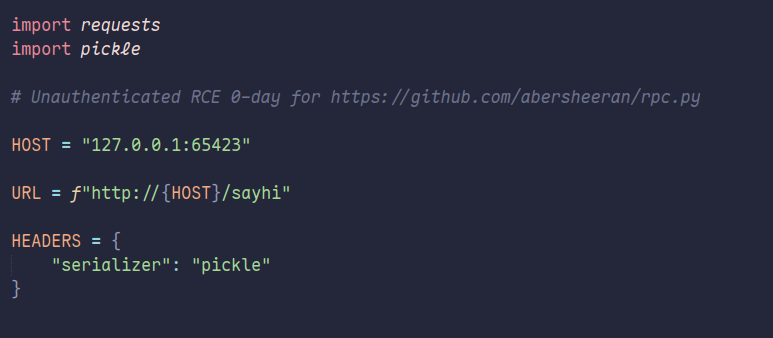
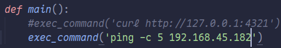
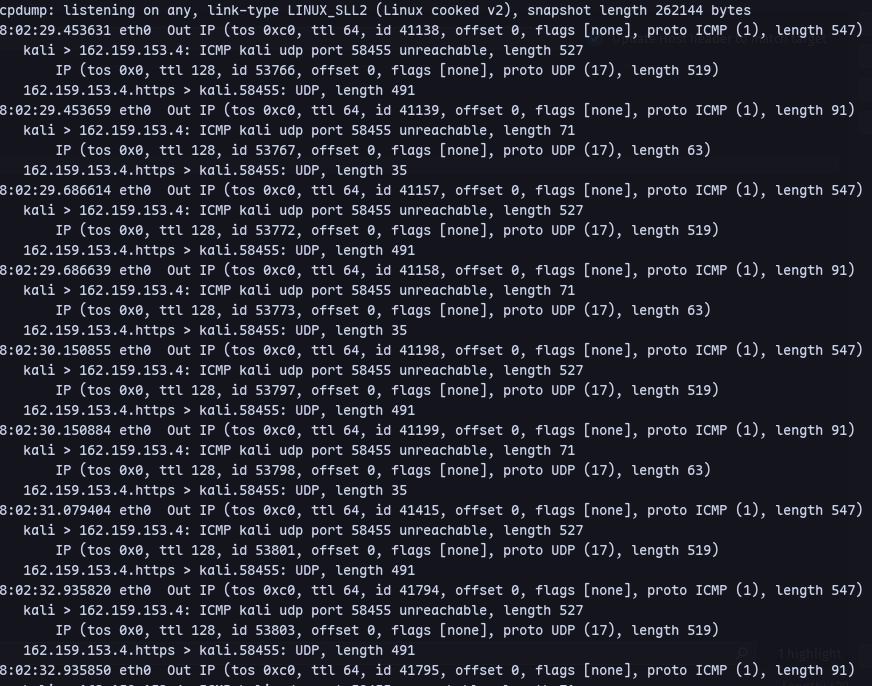
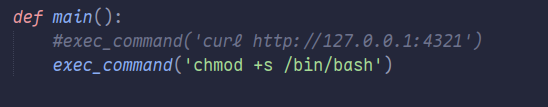
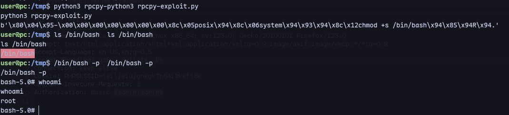
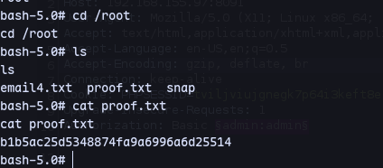

We found an exploit:
https://github.com/ehtec/rpcpy-exploit

Modifying the port.
Test payload:


Now running tcpdump:
```
sudo tcpdump -i any -v icmp
```
We can execute the exploit:
```
python3 rpcpy-exploit.py
```


Making the bash binary a SUID binary:

Now transfer the exploit and run.

We are root.

