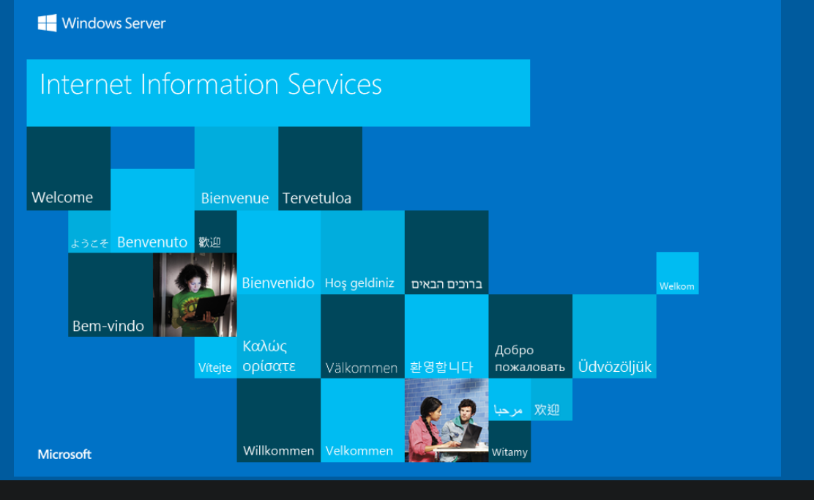
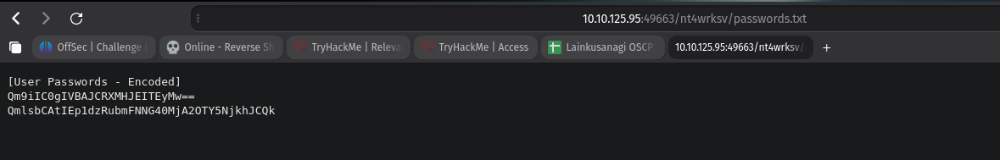
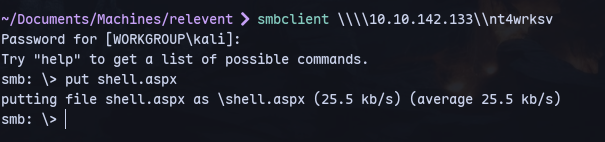
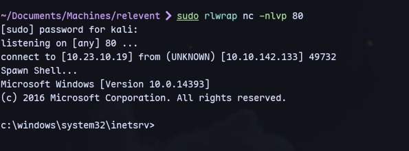
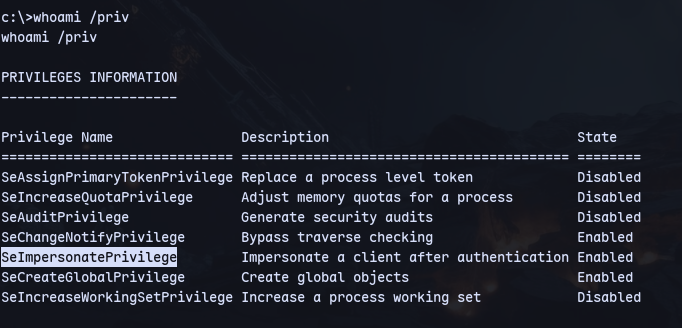
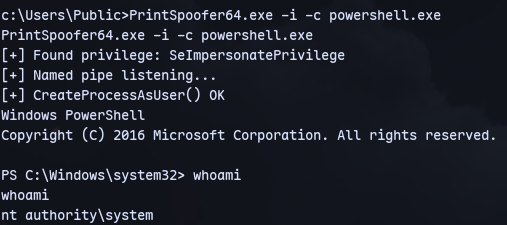

Bruteforcing directories:

We can access the smb share here.
We can upload an aspx reverse shell in the smb share and access it from here.



We get a shell:


We have `SeImpersonatePrivilege` privilege:


Running PrintSpoofer64.exe:
```
PrintSpoofer64.exe -i -c powershell.exe
```
