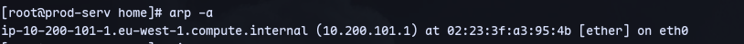
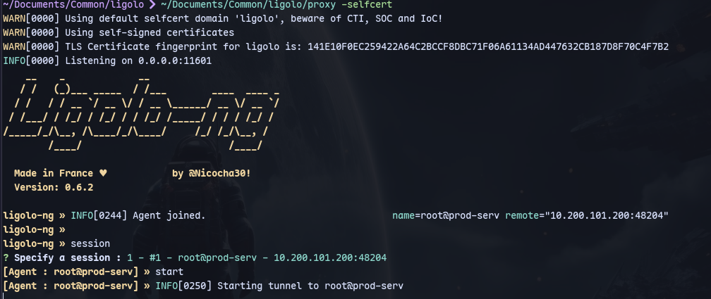

Now we can run `arp -a`:

We found another machine.

Now we can proxy with ligolo. Transfer agent to target:
```
scp -i id_rsa ~/Documents/Common/ligolo/agent root@thomaswreath.thm:/tmp/
```
Then in /tmp of target:
```
chmod +x agent
```

On kali:
```
~/Documents/Common/ligolo/proxy -selfcert
```
Now we can start a tunnel:

