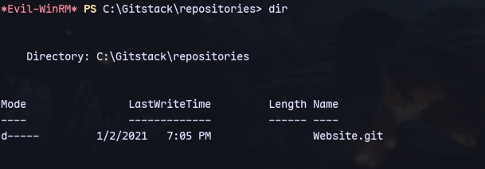
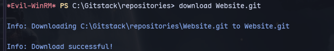

We find files for the server on port 80 in C:\\Gitstack We also find the git file:


Download the directory:

Now we can rename this directory to `.git`
```
mv Website.git .git      
```
Now run extractor.sh:
```
extractor.sh . Website
```

