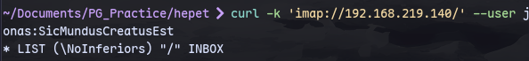
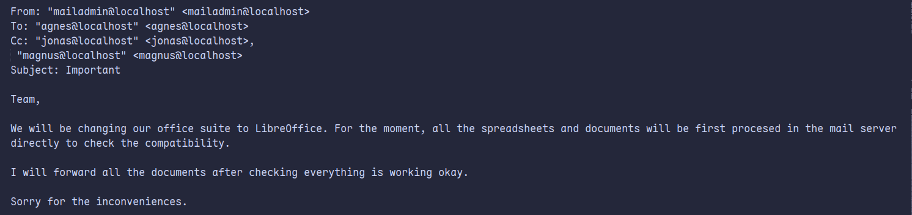

Using the credential from port [[8000(or)443]]
We can list mailboxes:
```
curl -k 'imap://192.168.219.140/' --user jonas:SicMundusCreatusEst
```


Then to check the message indices:
```
curl -k 'imap://192.168.219.140/INBOX?ALL' --user jonas:SicMundusCreatusEst
```


Now we can write a small bash script to retrieve all the mails:

We can run this to retrieve all the mails:
```
./showmails.sh > allmails.txt
```


Now we can send the infected .odt file through [[PG Practice/Hepet/25]]