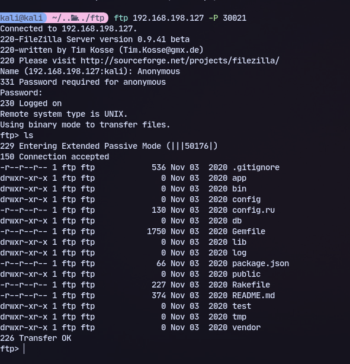
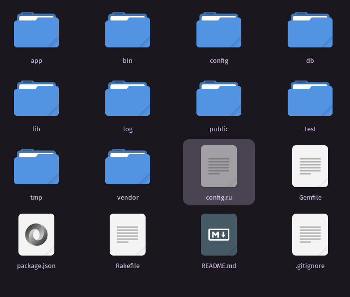
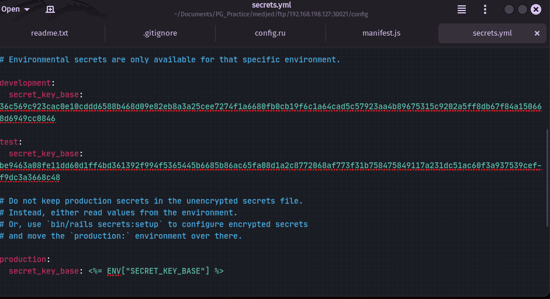
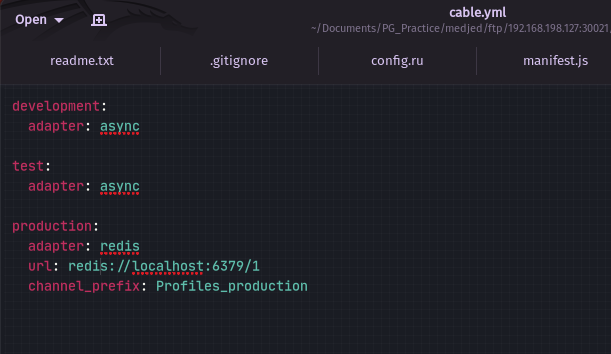

We have anonymous login and multiple files:
```
ftp 192.168.198.127 -P 30021
```


After recursively downloading all the files:
```
wget -r --user="anonymous" --password="anonymous" ftp://192.168.198.127:30021/
```


Might be useful


