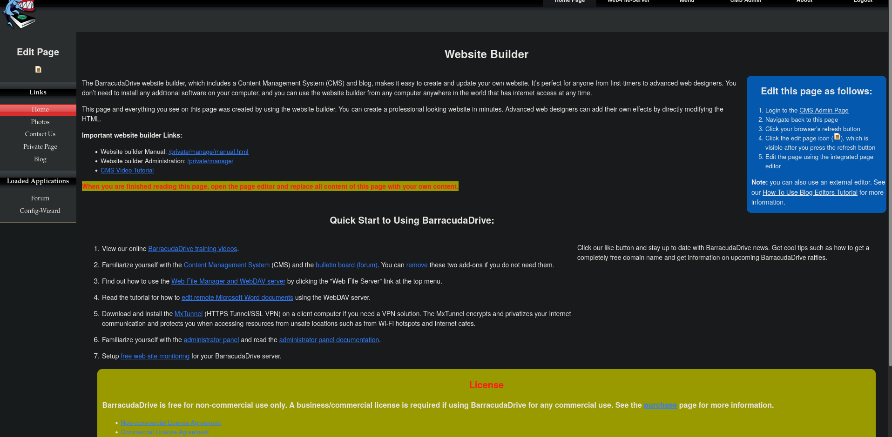
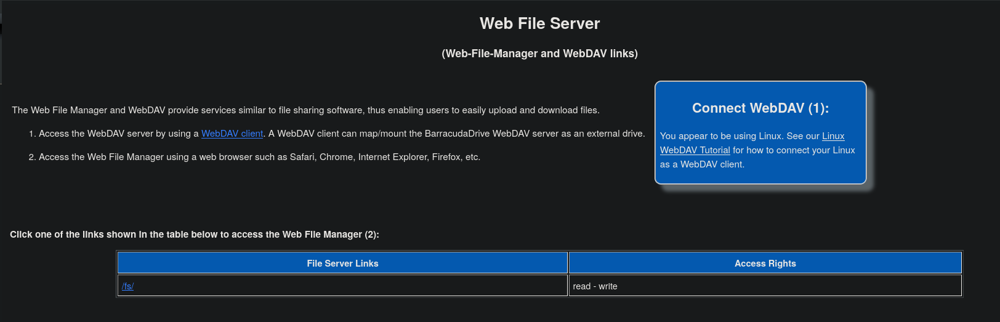
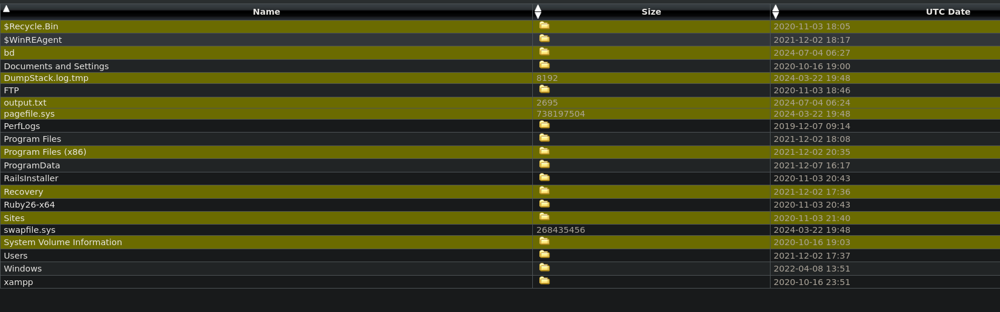
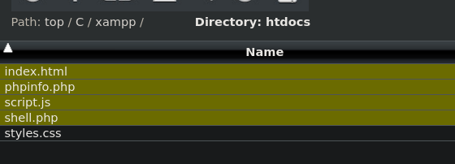
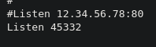

 
We can login using admin:admin123@ we created.

Now we can go the file server.

There are 2 directories:
Only C is accessible:
we can access the whole c directory.

Now navigating to c:/xampp/htdocs and uploading shell.php:

Now to access this we can check C:/xampp/apache/conf/httpd.conf

We have the port to go to.
